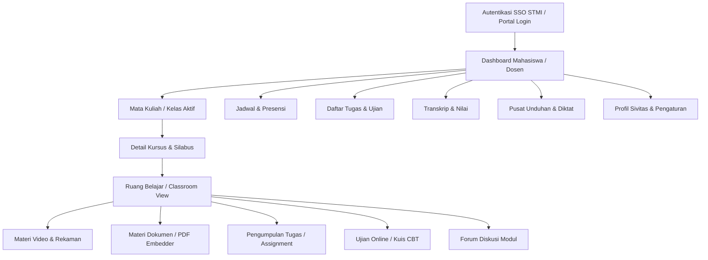

# LMS Design System — Politeknik STMI Jakarta

> **Dokumen Single Source of Truth (SSOT)** untuk desain dan pengembangan antarmuka Learning Management System (LMS) Politeknik STMI Jakarta.
> Seluruh panduan, token, komponen, dan interaksi dalam dokumen ini diturunkan langsung dari implementasi landing page dan sistem admin Politeknik STMI Jakarta agar tercipta kontinuitas produk yang kohesif.

---

## 1. Design Philosophy

LMS Politeknik STMI Jakarta dibangun dengan filosofi **"Academic Utility Meets Institutional Identity"**.

Sebagai sebuah institusi vokasi di bawah naungan Kementerian Perindustrian Republik Indonesia, identitas digital Politeknik STMI memancarkan citra formal, kredibel, modern, dan terstruktur. Landing page bertindak sebagai gerbang representasi publik (marketing & branding), sedangkan LMS bertindak sebagai **ruang kerja harian (learning workspace)** bagi mahasiswa dan dosen.

### Prinsip Transisi Pengguna (Landing Page → LMS)
Ketika mahasiswa atau dosen beralih dari portal publik `stmi.ac.id` ke sistem pembelajaran (LMS):
1. **Rasa Familiar Seketika (*Instant Recognition*):** Skema warna biru Kemenperin/STMI, tipografi Rubik yang bersih dan kokoh, serta struktur visual kartu dan navigasi tidak boleh mengalami diskontinuitas visual (*jarring effect*).
2. **Perubahan Mode dari Eksplorasi ke Fokus (*Focus & Utility*):** Jika landing page kaya akan banner visual dan ajakan bertindak (CTA), LMS mengeliminasi elemen dekoratif yang tidak perlu dan mengutamakan kenyamanan membaca materi, penyelesaian modul, dan kejelasan status tugas.
3. **Produk yang Berakar Sama (*Shared DNA*):** LMS bukan sekadar "aplikasi lain yang ditempeli logo STMI", melainkan perpanjangan alami (*natural extension*) dari platform digital Politeknik STMI Jakarta.

---

## 2. Design Principles

Prinsip-prinsip desain LMS dirumuskan langsung dari observasi implementasi aktual codebase landing page dan panel admin:

1. **Consistency over Novelty (Konsistensi di Atas Hal Baru)**
   Gunakan palet warna, tipografi, radius sudut, dan gaya bayangan yang sudah eksis di landing page dan sistem admin. Dilarang mengarang varian styling baru hanya untuk mengejar tren desain sesaat.
2. **Utility & Learning Flow First (Utamakan Alur Belajar)**
   Setiap piksel di layar pembelajaran harus mendukung penyerapan materi. Kontras teks terhadap latar belakang harus memenuhi standar WCAG AA/AAA. Hindari ornamen berat yang mengalihkan perhatian dari materi ajar.
3. **Structured & Predictable Layouts (Hierarki yang Rapi dan Terprediksi)**
   Gunakan grid sistem yang konsisten, jarak vertikal berirama kelipatan 4px/8px, dan pemisahan area fungsional (sidebar navigasi, kanvas materi, panel progres) yang teratur.
4. **Instant Visual State Feedback (Kejelasan Status Pembelajaran)**
   Status materi (Selesai, Sedang Berjalan, Terkunci, Terlambat) harus memiliki kode warna dan indikator visual semantik yang tegas dan konsisten dengan sistem badge landing page/admin.
5. **Component Reusability & Token Discipline (Disiplin Token dan Komponen)**
   Gunakan reusable design tokens (CSS custom properties) yang selaras dengan kelas Blocksy, Elementor, dan UI admin yang ada.

---

## 3. Brand Language

### 3.1 Brand Personality
* **Institusional & Kredibel:** Merefleksikan perguruan tinggi kedinasan vokasi industri Kemenperin RI.
* **Modern & Terstruktur:** Tampilan rapi, garis batas bersih (*clean borders*), tata letak simetris dan fungsional.
* **Ramah & Dapat Diakses (*Approachable*):** Tipografi sans-serif dengan proporsi ramah (*Rubik*), sudut tombol membulat halus, kontras warna yang nyaman di mata.

### 3.2 Visual Character & Density
* **Tingkat Kepadatan (*Visual Density*):** 
  - Halaman Dashboard & Katalog Kursus: *Comfortable density* (padding kartu 16px - 20px, gap 16px - 20px).
  - Halaman Belajar / Classroom View: *Content-focused density* (maksimalisasi area membaca & video, sidebar modul yang ramping).
  - Halaman Penilaian & Manajemen: *Compact/Data-dense* (tabel ringkas dengan padding vertikal 10px - 12px, konsisten dengan tabel admin STMI).
* **Penggunaan Whitespace:**
  - Whitespace digunakan untuk memisahkan hierarki informasi secara logis, bukan sekadar ruang kosong dekoratif.
  - Latar belakang abu-abu terang netral (`#f4f6f9` atau `#FAFBFC`) memberikan kontras lembut terhadap kartu putih murni (`#ffffff`).

---

## 4. Color System

Seluruh nilai warna diekstrak langsung dari implementasi aktual:
* Blocksy Global CSS: `--theme-palette-color-1` s/d `8`
* WPDM CSS: `--color-primary`, `--color-success`, `--color-warning`, `--color-danger`
* Admin STMI CSS: `--bg`, `--surface`, `--border`, `--text`, `--muted`, `--accent`, `--sidebar`

### 4.1 Primary Palette (STMI Institutional Blue)
Warna utama merepresentasikan almamater Politeknik STMI Jakarta dan Kemenperin RI:

| Token LMS | Nilai HEX | Sumber Implementasi | Penggunaan |
| :--- | :--- | :--- | :--- |
| `--color-primary` | `#2872fa` | Blocksy Palette 1 | Warna brand utama, tautan aktif, aksen fokus, progress bar |
| `--color-primary-hover` | `#1559ed` | Blocksy Palette 2 | State hover pada tombol primer dan tautan |
| `--color-primary-dark` | `#175d9b` | Admin CSS `--accent-dark` | State active/pressed pada tombol primer |
| `--color-primary-soft` | `#e8f1fa` | Admin CSS `--accent-soft` | Latar badge aktif, highlight baris tabel terpilih, icon box background |
| `--color-accent-subtle` | `#1e73be` | WPDM & Admin `--accent` | Tombol sekunder, tautan utilitas, tab aktif alternatif |

### 4.2 Neutral & Surface Palette

| Token LMS | Nilai HEX | Sumber Implementasi | Penggunaan |
| :--- | :--- | :--- | :--- |
| `--color-bg-app` | `#f4f6f9` | Admin CSS `--bg` | Latar belakang seluruh halaman aplikasi LMS |
| `--color-bg-page` | `#FAFBFC` | Blocksy Palette 7 | Latar belakang halaman berorientasi dokumen/artikel |
| `--color-surface` | `#ffffff` | Blocksy Palette 8 / Admin `--surface` | Latar kartu (*card*), modal dialog, popover, dropdown |
| `--color-surface-subtle`| `#f2f5f7` | Blocksy Palette 6 | Latar header tabel, strip modul tertutup, input non-aktif |
| `--color-border` | `#dfe3ea` | Admin CSS `--border` | Garis tepi (*border*) kartu, input, pembatas seksi tabel |
| `--color-border-subtle` | `#e1e8ed` | Blocksy Palette 5 | Garis pemisah internal, divider tipis |
| `--color-text-main` | `#192a3d` | Blocksy Palette 4 | Warna judul (*heading*), teks utama, label form |
| `--color-text-body` | `#1d2530` | Admin CSS `--text` | Teks paragraf, materi teks pelajaran |
| `--color-text-muted` | `#667085` | Admin CSS `--muted` | Teks pendukung, timestamp, placeholder, subtitle |
| `--color-sidebar` | `#16212e` | Admin CSS `--sidebar` | Latar navigasi sidebar desktop utama |
| `--color-sidebar-text` | `#c5ced9` | Admin CSS `--sidebar-text` | Teks dan ikon item navigasi sidebar |

### 4.3 Semantic & Status Palette

| Status | Main Color | Soft BG (10%-15%) | Border Color | Penggunaan di LMS |
| :--- | :--- | :--- | :--- | :--- |
| **Success** | `#1e7e45` (`#018e11`) | `#e7f6ec` | `#b7e2c4` | Modul selesai, kuis lulus, tugas terkirim tepat waktu |
| **Warning** | `#8a6100` (`#FFB236`) | `#fff6e0` | `#f5e1a4` | Tenggat waktu mendekat (< 24 jam), status draft, perlu revisi |
| **Danger / Error** | `#c0392b` (`#ff5062`) | `#fdecea` | `#f3c2bc` | Tugas terlewat (*overdue*), nilai di bawah KKM, pesan error |
| **Info** | `#2872fa` (`#2CA8FF`) | `#e8f1fa` | `#cbd8ee` | Pengumuman dosen, materi baru diunggah, notifikasi sistem |

### 4.4 Study Program Accent Gradients (Kategori Kursus / Sertifikasi)
Diambil langsung dari blok jurusan di beranda landing page (`post-490ff30.css`):
* **Teknik & Manajemen Otomotif (TMO):** `linear-gradient(90deg, #3F4ECD 0%, #2A378C 100%)`
* **Teknik Kimia Industri (TKI):** `linear-gradient(90deg, #009344 0%, #006C39 100%)`
* **Sistem Informasi Industri Otomotif (SIIO):** `linear-gradient(90deg, #EC008C 0%, #95268C 100%)`
* **Administrasi Bisnis Sektor Otomotif (ABSO):** `linear-gradient(90deg, #FFC53E 0%, #F7941E 100%)`
* **Teknologi Rekayasa Otomotif (TRO):** `linear-gradient(90deg, #F15728 0%, #ED2224 100%)`

*Aturan penggunaan:* Gunakan gradien ini secara eksklusif untuk badge kategori jurusan, header kartu kursus per program studi, atau kartu sertifikasi. Dilarang menggunakan gradien untuk latar belakang halaman utama atau tombol interaksi umum.

---

## 5. Typography

Sistem tipografi LMS mempertahankan font primer landing page (**Rubik**) untuk judul dan elemen antarmuka, serta fallback font sistem modern untuk performa tinggi pada pembacaan materi panjang.

### 5.1 Font Family Stacks
* **Primary Display & Headings:**
  ```css
  font-family: 'Rubik', -apple-system, BlinkMacSystemFont, "Segoe UI", Roboto, "Helvetica Neue", Arial, sans-serif;
  ```
* **Body / Application Text:**
  ```css
  font-family: -apple-system, BlinkMacSystemFont, "Segoe UI", Roboto, 'Rubik', "Helvetica Neue", Arial, sans-serif;
  ```
* **Monospace / Code / Terminal:**
  ```css
  font-family: SFMono-Regular, Consolas, "Liberation Mono", Menlo, monospace;
  ```

### 5.2 Typography Scale & Hierarchy

| Tingkat | Ukuran (Desktop) | Ukuran (Mobile) | Weight | Line Height | Penggunaan |
| :--- | :--- | :--- | :--- | :--- | :--- |
| **Display H1** | `32px` (2rem) | `26px` | 700 | 1.25 | Judul Kursus di halaman detail, judul sertifikat |
| **Heading H1** | `24px` (1.5rem) | `22px` | 700 | 1.3 | Judul Halaman Dashboard, Judul Modul Utama |
| **Heading H2** | `20px` (1.25rem) | `18px` | 600 | 1.35 | Judul Seksi (misal: "Tugas Mendatang", "Daftar Materi") |
| **Heading H3** | `16px` (1rem) | `15px` | 600 | 1.4 | Judul Kartu Kursus, Judul Sub-Modul |
| **Heading H4** | `14px` (0.875rem) | `14px` | 600 | 1.4 | Judul Item Tabel, Widget Sidebar Title |
| **Body Large** | `16px` (1rem) | `15px` | 400 | 1.65 | Teks bacaan materi pelajaran (*Lesson text reading*) |
| **Body Default**| `14px` (0.875rem) | `14px` | 400 | 1.5 | Teks default antarmuka, deskripsi, form input |
| **Body Small**  | `13px` (0.8125rem)| `13px` | 400 | 1.4 | Teks bantuan form, metadata instruktur, catatan kaki |
| **Caption/Meta**| `12px` (0.75rem) | `12px` | 500 / 600 | 1.3 | Tanggal, kategori, badge status, breadcrumb |
| **Overline**    | `11px` (0.6875rem)| `11px` | 600 (UPPERCASE) | 1.2 | Header kelompok navigasi, label kolom tabel (`letter-spacing: .06em`) |

---

## 6. Spacing

LMS mengadopsi skala spacing berbasis kelipatan 4px dan 8px yang konsisten dengan Blocksy dan Admin STMI:

```text
2px   (0.125rem) - Spacing ultra-micro (border-offset, dot indicator)
4px   (0.25rem)  - Spacing micro (gap badge icon, padding tombol sangat kecil)
6px   (0.375rem) - Spacing sub-compact (gap item navigasi, margin label)
8px   (0.5rem)   - Spacing compact (gap antar tombol form, padding input vertikal)
10px  (0.625rem) - Spacing standar form padding horizontal, table cell vertical
12px  (0.75rem)  - Spacing medium-small (gap kelompok filter, margin bawah judul subseksi)
16px  (1.0rem)   - Spacing dasar komponen (grid gap kartu, padding kartu ringkas)
20px  (1.25rem)  - Spacing kartu standar (padding kartu materi, margin bawah seksi)
24px  (1.5rem)   - Spacing seksi (padding container aplikasi, gap kolom editor)
32px  (2.0rem)   - Spacing makro (jarak antar seksi dashboard utama)
48px  (3.0rem)   - Spacing halaman (bottom padding halaman utama aplikasi)
```

---

## 7. Shape & Radius

Berdasarkan implementasi landing page dan admin:

| Elemen | Border Radius | Sumber Implementasi | Rationale |
| :--- | :--- | :--- | :--- |
| **Input & Select Field** | `6px` | Admin CSS (`border-radius: 6px`) | Standar form input interaktif modern |
| **Buttons (Default / Small)** | `6px` (`.btn`) | Admin CSS (`border-radius: 6px`) | Konsisten dengan tombol panel aplikasi |
| **Buttons (Brand Primary)** | `5px` | Elementor post-490 (`border-radius: 5px`) | Tombol aksi utama modul |
| **Cards & Containers** | `8px` (`--radius`) | Admin CSS (`--radius: 8px`) | Kartu kursus, kontainer tugas, modal |
| **Feature / Banner Cards** | `10px` | Elementor post-490 (`border-radius: 10px`) | Kartu preview kursus unggulan & gambar materi |
| **Badges & Status Pills** | `999px` | Admin CSS (`border-radius: 999px`) | Tag kategori dan label status penyelesaian |
| **Avatar Profile** | `50%` | Admin CSS (`border-radius: 50%`) | Foto profil mahasiswa dan dosen |
| **Dropdown Menus & Popover**| `6px` - `8px` | Blocksy & Admin CSS | Menu konteks dan listbox |

*Peringatan:* Tombol dengan radius asimetris Blocksy (`0px 5px 0px 20px`) di landing page HANYA digunakan untuk CTA branding di header luar. **JANGAN gunakan radius asimetris di dalam antarmuka LMS.** Gunakan radius simetris `6px`.

---

## 8. Elevation & Surface

LMS memprioritaskan pemisahan batas dengan **garis tepi 1px (`border`)** dibandingkan bayangan tebal. Hal ini menjaga kebersihan tampilan pada antarmuka yang sarat informasi (*data-dense*).

### 8.1 Elevation Scale
* **Level 0 (Flat):** 
  `box-shadow: none; border: 1px solid var(--color-border);`
  Digunakan pada panel modular, container tertutup, tabel.
* **Level 1 (Card & Widget Rest State):**
  `box-shadow: 0 1px 2px rgba(16, 24, 40, .06); border: 1px solid var(--color-border);`
  Digunakan pada seluruh kartu kursus, kartu statistik progres, kartu materi.
* **Level 2 (Hover & Focus State):**
  `box-shadow: 0 2px 8px rgba(16, 24, 40, .08); border-color: var(--color-primary);`
  Digunakan saat kartu kursus di-hover atau input di-fokuskan.
* **Level 3 (Dropdown & Floating Overlay):**
  `box-shadow: 0 10px 25px -5px rgba(16, 24, 40, 0.1), 0 8px 10px -6px rgba(16, 24, 40, 0.1);`
  Digunakan pada menu dropdown navigasi, notification drawer, popover jadwal.
* **Level 4 (Modal Dialogs):**
  `box-shadow: 0 20px 25px -5px rgba(16, 24, 40, 0.2), 0 10px 10px -5px rgba(16, 24, 40, 0.1);`
  Digunakan pada kotak modal kuis, konfirmasi pengumpulan tugas.

### 8.2 Surface Contrast
* Latar aplikasi utama: `#f4f6f9`
* Latar kartu/konten aktif: `#ffffff`
* Pembatas garis tepi: `#dfe3ea` (atau `#e1e8ed`)
* Latar item non-aktif/disabled: `#f2f5f7`

---

## 9. Icons

### 9.1 Icon Style & Standard
* **Sistem Ikon Utama:** Ikon garis vektor 24x24 viewBox dengan ketebalan garis seragam (`stroke-width: 1.8px`, `stroke-linecap: round`, `stroke-linejoin: round`, `fill: none`), mengikuti implementasi fungsi `admin_icon()` di codebase STMI (`application/helpers/admin_helper.php`).
* **Ukuran Ikon Standar:**
  - `16px` (`width="16" height="16"`): Ikon dalam tombol kecil, metadata kursus, bullet item.
  - `18px` (`width="18" height="18"`): Ikon navigasi sidebar, action icon di header tabel.
  - `20px` (`width="20" height="20"`): Ikon dalam kotak stat widget, tab menu.
  - `24px` (`width="24" height="24"`): Ikon fitur besar, empty state illustration icon.
* **Icon Box Pattern:**
  Untuk kartu ringkasan atau indikator tipe modul, tempatkan ikon di dalam kotak berukuran `40px × 40px` dengan sudut membulat `10px`, latar belakang warna lembut semantik (`var(--color-primary-soft)`), dan warna ikon kontras.

---

## 10. Layout System

### 10.1 App Shell Architecture
LMS Politeknik STMI menggunakan tata letak aplikasi **Persistent Collapsible Sidebar + Sticky Header + Scrollable Content Canvas**.

```
+-----------------------------------------------------------------------------------+
|  SIDEBAR (248px)  |  TOP BAR (Height: 64px)                                       |
|                   |  [Breadcrumbs]                  [Search] [Notif] [User Card]  |
|  [Logo STMI]      +---------------------------------------------------------------+
|  [Nav Items]      |  MAIN CONTENT CANVAS                                          |
|  - Dashboard      |  (Padding: 24px 32px 48px; Max-width: 1280px / Fluid)         |
|  - Mata Kuliah    |                                                               |
|  - Tugas & Kuis   |                                                               |
|  - Progres        |                                                               |
|  ---------------- |                                                               |
|  [User Footer]    |                                                               |
+-----------------------------------------------------------------------------------+
```

### 10.2 Layout Dimensions & Constraints
* **Sidebar Width:**
  - Expanded (Desktop): `248px` (lebar baku sidebar admin STMI).
  - Collapsed / Mobile: `0px` (tersembunyi secara off-canvas ke `left: -260px`, dibuka via toggle button dengan backdrop `rgba(16, 24, 40, .45)`).
* **Top Navigation Bar Height:** `64px` (sticky di puncak layar).
* **Maximum Content Width:**
  - Dashboard & List Pages: `1280px` (berakar dari `--theme-normal-container-max-width: 1290px` di landing page).
  - Lesson Reading View (Single column text): `780px` (berakar dari `--theme-narrow-container-max-width: 750px` untuk keterbacaan artikel ajar).
  - Classroom Video + Sidebar: Fluid width (`100%`) dengan rasio video `16:9` dan sidebar modul `360px`.
* **Grid System:**
  - Dashboard Stats Grid: `grid-template-columns: repeat(4, minmax(0, 1fr))` dengan gap `16px`.
  - Course Cards Grid: `grid-template-columns: repeat(auto-fill, minmax(280px, 1fr))` dengan gap `20px`.
  - Module Detail Split: Dua kolom `minmax(0, 1fr) 320px` dengan gap `24px`.

---

## 11. Responsive Design

LMS mengadopsi breakpoint resmi yang digunakan pada stylesheet landing page (`globalaa62.css` dan `post-490ff30.css`):

### 11.1 Breakpoints

| Breakpoint | Rentang Lebar | Karakteristik Perubahan Layout LMS |
| :--- | :--- | :--- |
| **Desktop Large** | `> 1200px` | Sidebar permanen (248px), stats grid 4 kolom, grid kursus 3-4 kolom. |
| **Desktop / Laptop**| `1000px - 1199px`| Sidebar permanen (248px), stats grid 2x2 kolom, grid kursus 3 kolom. |
| **Tablet** | `768px - 999px` | Sidebar menjadi off-canvas drawer (terbuka via hamburger button), stats grid 2 kolom, grid kursus 2 kolom, tabel beralih ke scroll horizontal (`table-wrap`). |
| **Mobile** | `< 767px` | Sidebar off-canvas penuh, padding layar `16px`, stats grid 1-2 kolom bertumpuk vertikal, grid kursus 1 kolom penuh, navigasi kuis beralih ke bottom sheet drawer. |

### 11.2 Concrete Responsive Rules
1. **Sidebar Behavior:**
   - Di atas `768px`: Sidebar menempel di sisi kiri (`position: sticky; top: 0; height: 100vh`).
   - Di bawah `768px`: Sidebar disembunyikan (`left: -260px`). Ketika tombol menu ditekan, sidebar bergeser masuk (`left: 0; transition: left .2s; z-index: 50`) disertai backdrop transparan gelap.
2. **Table Responsiveness:**
   - Gunakan wrapper `.table-wrap { overflow-x: auto; -webkit-overflow-scrolling: touch; }`.
   - Di layar sempit, kolom sekunder (seperti author, bobot sks) diberi kelas `.hide-sm` (`display: none;`), memprioritaskan Judul Materi, Status, dan Tombol Aksi.
3. **Classroom Split Screen:**
   - Desktop: Video/materi di sebelah kiri (`flex: 1`), daftar checklist modul di sebelah kanan (`320px`).
   - Mobile: Video memenuhi lebar atas (`100%`), daftar modul diposisikan di bawah video sebagai akordeon yang dapat dilipat.

---

## 12. Navigation

### 12.1 Sidebar Navigation Structure
Sidebar membagi menu menjadi kelompok logis berlabel huruf kapital kecil (*overline*):

* **Navigasi Mahasiswa:**
  - **Utama:** Dasbor (`admin_icon('dashboard')`)
  - **Akademik:**
    - Mata Kuliah Saya (`admin_icon('post')`)
    - Jadwal Kuliah & Presensi (`admin_icon('category')`)
    - Tugas & Ujian (`admin_icon('page')`)
    - Nilai & Transkrip (`admin_icon('link')`)
  - **Pustaka & Unduhan:**
    - Modul & Diktat Kuliah (`admin_icon('download')`)
    - Pustaka Digital (`admin_icon('media')`)
  - **Akun:**
    - Profil Mahasiswa (`admin_icon('profile')`)
    - Pengaturan Akun (`admin_icon('users')`)

* **Navigasi Dosen (Role-based):**
  - Mengajar (Daftar Kelas, Input Nilai, Bank Soal, Presensi Kelas).
  - Manajemen Materi & Tugas.

### 12.2 Top Bar Navigation
* **Sisi Kiri:** Tombol Toggle Menu (pada mobile) + Breadcrumbs navigasi hierarkis (`Home > Semester 3 > Sistem Informasi Industri > Modul 02`).
* **Sisi Kanan:**
  - Search Bar cepat (mencari materi atau tugas).
  - Tombol Notifikasi (dengan red dot indicator jika ada tugas mendekati deadline).
  - Quick User Profile Pill (avatar inisial 32px + Nama Panggilan + Dropdown).

---

## 13. Components

Format spesifikasi komponen siap implementasi:

### 13.1 Course Card (Kartu Mata Kuliah)
* **Purpose:** Menampilkan ringkasan mata kuliah yang diikuti atau tersedia.
* **Structure:**
  - Header: Gambar thumbnail (rasio 16:9) dengan badge semester/jurusan di sudut atas.
  - Body: Kode MK & Nama Dosen (text muted 13px), Judul Mata Kuliah (Heading H3 16px font-weight 600), Progress Bar persentase penyelesaian modul.
  - Footer: Badge status kehadiran/tugas dan Tombol CTA ("Masuk Kelas").
* **Variants:**
  - `enrolled`: Menampilkan progress bar dan tombol "Lanjutkan Belajar".
  - `completed`: Menampilkan badge hijau "Selesai" dan tombol "Review Materi".
  - `locked`: Menampilkan overlay gembok dan pesan prasyarat belum terpenuhi.
* **States:**
  - *Default:* Border `#dfe3ea`, shadow `0 1px 2px rgba(16,24,40,.06)`.
  - *Hover:* Border `#2872fa`, shadow `0 2px 8px rgba(16,24,40,.08)`, transformasi scale gambar thumbnail `1.02`.
* **Tokens:**
  - Background: `var(--color-surface)`
  - Radius: `8px` (kontainer luar), `6px` (gambar dalam)
  - Padding: `16px`

### 13.2 Module & Lesson Accordion (Pohon Materi Pembelajaran)
* **Purpose:** Menavigasi silabus, bab materi, kuis, dan tugas dalam mata kuliah.
* **Structure:**
  - Section Header: Judul Bab/Minggu ke-N, indikator progres bab (misal: "3 / 4 Selesai"), chevron icon.
  - Item List: Daftar materi per bab (ikon tipe materi: Video, Dokumen PDF, Kuis, Diskusi), durasi/bobot, checklist box.
* **States per Item:**
  - `completed`: Checklist hijau tercentang (`#1e7e45`), teks netral.
  - `current / active`: Latar belakang `var(--color-primary-soft)`, teks berwarna `var(--color-primary)`, font-weight 600, border kiri `3px solid var(--color-primary)`.
  - `pending`: Checklist lingkaran abu-abu kosong, teks dapat diklik.
  - `locked`: Checklist bergambar gembok, teks abu-abu pudar, kursor `not-allowed`.

### 13.3 Video Player Container
* **Purpose:** Menampilkan video materi kuliah rekaman atau YouTube streaming.
* **Structure:**
  - Kontainer rasio aspek `16:9` (`aspect-ratio: 16 / 9; width: 100%; border-radius: 8px; overflow: hidden; background: #000;`).
  - Player controls konsisten dengan warna aksen STMI Blue (`#2872fa`) pada slider playback.

### 13.4 Assignment / Submission Card (Kartu Tugas)
* **Purpose:** Menampilkan rincian tugas kuliah, deadline, format berkas, dan zona upload.
* **Structure:**
  - Info Box: Judul Tugas, Instruksi Tugas, Batas Waktu (*Deadline*).
  - Status Pill: "Belum Mengumpulkan" (kuning), "Terkirim" (hijau), "Terlambat" (merah).
  - File Dropzone: Kotak border putus-putus (`border: 2px dashed var(--color-border); border-radius: 8px; padding: 24px; text-align: center; background: #fafbfc;`), tombol "Pilih Berkas" (`.btn`), dan daftar berkas yang diunggah disertai ukuran byte.

### 13.5 Quiz & Question Component
* **Purpose:** Antarmuka pengerjaan kuis dan evaluasi berkala.
* **Structure:**
  - Top Bar: Nomor soal, timer hitung mundur (*countdown badge*), tombol ragu-ragu.
  - Question Body: Pertanyaan materi (dukungan teks, gambar diagram teknik, atau rumus matematika KaTeX).
  - Option Choices: Pilihan ganda radio button dalam kartu bertumpuk (`.pick-item` dari admin STMI: padding 12px 14px, radius 6px, border 1px solid `#dfe3ea`, hover border `#2872fa`).
  - Action Controls: Tombol "Sebelumnya", "Ragu-Ragu", dan "Selanjutnya / Selesai".

### 13.6 Progress Bar
* **Purpose:** Menggambarkan progres belajar modul atau mata kuliah.
* **Structure:**
  - Track: Tinggi `8px` (atau `6px` untuk kartu ringkas), radius `999px`, background `var(--color-border-subtle, #e1e8ed)`.
  - Fill: Background `var(--color-primary, #2872fa)` atau warna sukses `#1e7e45` jika telah 100%, radius `999px`, transisi `width 0.3s ease`.

### 13.7 Badges & Status Pills
* **Structure:** `display: inline-flex; align-items: center; gap: 4px; padding: 2px 8px; border-radius: 999px; font-size: 12px; font-weight: 600; line-height: 1.3;`
* **Variants:**
  - Default/Neutral: background `#eef1f5`, color `#667085`.
  - Success/Publish: background `#e7f6ec`, color `#1e7e45`.
  - Warning/Draft: background `#fff6e0`, color `#8a6100`.
  - Danger/Overdue: background `#fdecea`, color `#c0392b`.
  - Info/Semester: background `#e8f1fa`, color `#1e73be`.

### 13.8 Buttons
* **Base:** `font-family: inherit; font-size: 14px; font-weight: 500; border-radius: 6px; padding: 8px 14px; display: inline-flex; align-items: center; gap: 6px; cursor: pointer; transition: all .15s ease;`
* **Variants:**
  - `.btn-primary`: background `#2872fa`, border 1px solid `#2872fa`, text `#ffffff`. Hover: background `#1559ed`, border `#1559ed`.
  - `.btn-secondary` (Outline): background `#ffffff`, border 1px solid `#dfe3ea`, text `#192a3d`. Hover: border `#c4cad4`, background `#fafbfc`.
  - `.btn-danger`: background `#ffffff`, border 1px solid `#dfe3ea`, text `#c0392b`. Hover: background `#fdecea`, border `#c0392b`.
  - `.btn-link`: background none, border 0, text `#2872fa`, padding 0. Hover: underline.
  - `.btn-sm`: padding `4px 10px`, font-size `13px`.

### 13.9 Empty State
* **Structure:**
  - Kontainer padding `48px 24px`, teks rata tengah.
  - Ikon 48px dalam lingkaran soft background (`#eef1f5`).
  - Judul (Heading H3 18px font-weight 600).
  - Teks deskripsi (14px color `#667085`).
  - Tombol aksi primer opsional (misal: "Jelajahi Mata Kuliah").

---

## 14. LMS Information Architecture

Arsitektur informasi dirancang khusus untuk memenuhi kebutuhan sivitas akademika Politeknik STMI Jakarta:



### 14.1 Spesifikasi Fitur Inti
1. **Dashboard:** Ringkasan mata kuliah aktif semester berjalan, jadwal kuliah hari ini, tugas yang mendekati deadline (tenggat waktu 48 jam), dan kartu statistik kehadiran & IPK berjalan.
2. **Katalog & Detail Mata Kuliah:** Deskripsi mata kuliah, dosen pengampu, bobot SKS, daftar modul pertemuan 1 hingga 16, dan status prasyarat.
3. **Classroom View (Focus Mode):** Tata letak ruang belajar khusus tanpa distraksi. Sidebar kiri/kanan dapat diciutkan agar mahasiswa fokus pada materi teks, video penjelasan, atau pembaca dokumen PDF terintegrasi (*PDF Embedder* bawaan STMI).
4. **Tugas & Pengumpulan (*Assignments*):** Rincian tugas mandiri/kelompok, rubrik penilaian, riwayat unggahan berkas, nilai, dan umpan balik (*feedback*) dosen.
5. **Kuis & Ujian (CBT):** Sistem kuis berwaktu dengan navigasi nomor soal, proteksi tab blur, dan auto-submit saat waktu habis.
6. **Forum Diskusi:** Thread tanya jawab per pertemuan kuliah antara mahasiswa dan dosen.

---

## 15. Page Patterns

### 15.1 Dashboard Pattern
* **Header Bar:** Sapaan pengguna ("Selamat Datang, [Nama]"), info semester aktif (Ganjil/Genap 2026/2027), dan peran (Mahasiswa / Dosen).
* **Stat Bar (4 Grid Cards):**
  1. Mata Kuliah Aktif (ikon buku, jumlah mata kuliah).
  2. Tugas Menunggu (ikon jam/tugas, jumlah tugas pending).
  3. Kehadiran Kuliah (ikon kalender/user, persentase kehadiran).
  4. Rata-rata Nilai / IPK (ikon chart, indeks prestasi).
* **Two-Column Split Section:**
  - Kolom Utama (Lebar 65%): Kursus yang Sedang Dipelajari (dengan progress bar dan tombol lanjut).
  - Kolom Samping (Lebar 35%): Jadwal Kuliah Hari Ini & Pengumuman Akademik Terbaru.

### 15.2 Classroom / Learning View Pattern
* **Layout Khusus Pembelajaran:**
  - Memanfaatkan seluruh lebar layar (*fluid canvas*).
  - Top bar disederhanakan: Tombol "Kembali ke Silabus", Judul Modul yang sedang dibuka, tombol navigasi "Materi Sebelumnya" dan "Materi Selanjutnya".
  - Area konten tengah: Mengakomodasi dokumen PDF via viewer yang sudah teruji di landing page (`wp-block-pdfemb-pdf-embedder-viewer`), pemutar video, atau teks artikel berformat rapi.
  - Sisi kanan: Panel modul interaktif dengan status checklist penyelesaian.

---

## 16. Learning Experience

### 16.1 Distraction-Free Learning (Mode Fokus)
* Menyediakan toggle "Layar Penuh / Mode Fokus" yang menyembunyikan sidebar navigasi global dan top bar utama, menyisakan konten pembelajaran dan kontrol navigasi modul berikutnya.

### 16.2 Auto-Save & Draft Safety
* Pada pengerjaan kuis, isian jawaban teks panjang, dan forum diskusi: implementasikan mekanisme penyimpanan lokal otomatis (*auto-save*) setiap 30 detik ke `localStorage` untuk mencegah kehilangan data akibat kendala koneksi internet mahasiswa.

### 16.3 Feedback Pengumpulan Berkas
* Setelah berkas tugas berhasil diunggah:
  - Tampilkan nama berkas, ukuran, waktu unggah tepat, dan status "Berhasil Terkirim".
  - Berikan opsi unduh kembali untuk verifikasi isi berkas oleh mahasiswa.

---

## 17. Interaction & States

### 17.1 Interaksi Standar Elemen
* **Hover State:**
  - Kartu: Bergerak naik halus `transform: translateY(-2px)` dengan transisi `0.2s ease` dan peningkatan bayangan ke Level 2.
  - Tombol Primer: Menggelap dari `#2872fa` ke `#1559ed`.
  - Tautan Teks: Berubah warna ke `#1559ed` disertai dekorasi `underline`.
* **Active / Pressed State:**
  - Tombol Primer: Menggelap ke `#175d9b`, `transform: scale(0.98)`.
* **Focus-Visible State:**
  - Seluruh elemen interaktif wajib menampilkan cincin fokus: `outline: 2px solid var(--color-primary-soft); outline-offset: 2px; border-color: var(--color-primary);`.

### 17.2 Feedback Aksi Destruktif (Penghapusan / Pembatalan)
* Meniru pola modal konfirmasi admin STMI (`.confirm-modal` di `admin.css`):
  - Kotak modal berpusat di tengah dengan ikon peringatan bulat merah (`.confirm-icon`).
  - Penjelasan dampak tindakan (misal: "Apakah Anda yakin ingin membatalkan pengumpulan tugas ini? Tindakan ini tidak dapat diurungkan.").
  - Dua tombol aksi tegas: "Batal" (warna netral outline) dan "Ya, Hapus/Batalkan" (`.btn-danger` merah).

---

## 18. Forms

Standar form diturunkan langsung dari styling panel admin Politeknik STMI:

### 18.1 Elemen Form
```css
input[type=text], input[type=email], input[type=password], input[type=search], select, textarea {
    width: 100%;
    padding: 8px 10px;
    border: 1px solid var(--color-border);
    border-radius: 6px;
    font-family: inherit;
    font-size: 14px;
    background: #ffffff;
    color: var(--color-text-main);
    transition: border-color .15s, outline .15s;
}
input:focus, select:focus, textarea:focus {
    outline: 2px solid var(--color-primary-soft);
    border-color: var(--color-primary);
}
```

### 18.2 Label & Helper Hint
* **Label:** `font-size: 13px; font-weight: 600; margin-bottom: 6px; color: var(--color-text-main);`
* **Helper Hint:** `font-size: 12px; color: var(--color-text-muted); margin-top: 4px;`
* **Error Text:** `font-size: 12px; color: var(--color-danger); margin-top: 4px; font-weight: 500;`

---

## 19. Feedback & Notifications

### 19.1 In-Page Alerts
Mengikuti pola `.alert` di `admin.css`:
* **Alert Sukses:** Latar `#e7f6ec`, border `#b7e2c4`, teks `#1e7e45`.
* **Alert Bahaya / Error:** Latar `#fdecea`, border `#f3c2bc`, teks `#c0392b`.
* **Alert Peringatan:** Latar `#fff6e0`, border `#f5e1a4`, teks `#8a6100`.
* **Alert Info:** Latar `#e8f1fa`, border `#cbd8ee`, teks `#1e73be`.
* **Padding:** `12px 16px`, border-radius: `6px`, margin-bottom: `16px`.

### 19.2 Toast Notifications (Transient)
* Posisi: Sudut kanan atas layar (`top: 24px; right: 24px; z-index: 100`).
* Durasi default: `4000ms`, dapat ditutup manual via tombol silang (*close*).

---

## 20. Accessibility (a11y)

1. **Rasio Kontras Warna (WCAG 2.1 AA):**
   - Teks normal pada latar belakang putih harus memiliki rasio kontras minimal `4.5:1` (Teks utama `#192a3d` memiliki rasio `14.2:1`).
   - Warna teks muted (`#667085`) pada latar belakang putih memiliki rasio `4.6:1` (memenuhi standar teks kecil).
2. **Aksesibilitas Keyboard:**
   - Seluruh modul, kuis, dan tombol dapat diakses menggunakan tombol `Tab`, `Enter`, dan `Space`.
   - Skip to main content link: `<a class="skip-link screen-reader-text" href="#main">Lewati ke konten utama</a>` di bagian paling atas dokumen.
3. **Screen Reader Support:**
   - Gunakan atribut ARIA pada akordeon modul: `aria-expanded="true/false"`, `aria-controls="module-panel-1"`.
   - Ikon yang bersifat dekoratif diberi `aria-hidden="true"`.
   - Indikator proses pemuatan (*spinner*) wajib menyertakan fallback teks tersembunyi: `<span class="sr-only">Memuat...</span>`.

---

## 21. Motion & Animation

Animasi di LMS ditujukan untuk memberikan kepastian interaksi (*micro-interaction*), bukan dekorasi spektakuler yang memperlambat kinerja belajar.

* **Durasi Transisi:** `150ms` untuk perubahan warna hover tombol/tautan; `250ms` untuk pergeseran sidebar atau expand/collapse akordeon.
* **Easing Function:** `cubic-bezier(0.4, 0, 0.2, 1)` (standar ease-in-out modern).
* **Respect Reduced Motion:**
  ```css
  @media (prefers-reduced-motion: reduce) {
      *, ::before, ::after {
          animation-duration: 0.01ms !important;
          animation-iteration-count: 1 !important;
          transition-duration: 0.01ms !important;
          scroll-behavior: auto !important;
      }
  }
  ```

---

## 22. Anti-Inconsistency Rules

Aturan keras (*strict prohibitions*) untuk mencegah LMS menyimpang dari identitas produk Politeknik STMI:

1. **Dilarang Menambahkan Font Baru:** Jangan menggunakan font lain seperti Inter, Open Sans, Montserrat, atau Poppins. Gunakan **Rubik** untuk headings dan sistem fallback bawaan STMI.
2. **Dilarang Mengubah Nilai Hex Primer:** Warna biru primer harus `#2872fa` (dengan turunan `#1559ed` dan `#175d9b` / `#1e73be`). Jangan menggantinya dengan sembarang warna biru lain (misal: Indigo Tailwind `#6366f1` atau Blue `#3b82f6`).
3. **Dilarang Menghilangkan Border Pemisah:** Jangan membuat kartu "borderless" dengan shadow mengambang tebal seperti gaya SaaS startup. LMS STMI mengandalkan border `1px solid #dfe3ea` untuk struktur yang bersih.
4. **Dilarang Menggunakan Border Radius Ekstrem:** Dilarang menggunakan sudut membulat berlebihan (`rounded-2xl` 16px/24px) pada kartu dan form. Maksimal radius kartu adalah `8px` - `10px`.
5. **Dilarang Menggunakan Gradien Dekoratif Bebas:** Gradien HANYA diizinkan pada badge penanda jurusan/kursus spesifik sesuai token resmi bab 4.4. Dilarang membuat latar belakang seksi atau kartu yang seluruhnya bergradasi ungu/pink neon.
6. **Dilarang Menggunakan Gaya Ikon Bertabrakan:** Jangan mencampuradukkan ikon fill warna-warni 3D dengan outline ikon garis monokrom. Pertahankan ikon garis netral `stroke-width: 1.8px`.
7. **Dilarang Meniru Mentah Layout Brosur Landing Page:** LMS adalah aplikasi kerja. Jangan meletakkan banner gambar carousel besar di dalam dashboard harian mahasiswa.

---

## 23. Implementation Guidelines

### 23.1 Mapping Landing Page & Admin → LMS Components

| Elemen Sumber (Landing Page / Admin) | Implementasi di LMS |
| :--- | :--- |
| **Blocksy Header (Logo Kemenperin-STMI)** | Header atas LMS & logo sidebar dengan brand-mark biru "S" |
| **Admin Sidebar (`.sidebar`, `#admin-sidebar`)** | Struktur navigasi utama aplikasi LMS |
| **Blocksy Entry Card (`.entry-card`)** | Komponen Kartu Mata Kuliah / Diktat Kuliah |
| **Admin Stats Widget (`.grid-stats`, `.stat`)** | Widget ringkasan progres belajar, kehadiran, tugas |
| **WPDM Download Card (`.link-template-default`)** | Komponen materi unduhan & berkas lampiran modul |
| **Admin Form Controls (`input`, `select`, `.field`)** | Form pengumpulan tugas, pencarian kursus, pengaturan akun |
| **Admin Badge (`.badge.publish`, `.badge.draft`)** | Badge status pengumpulan tugas ("Terkirim", "Pending") |
| **Blocksy Breadcrumbs (`.ct-breadcrumbs`)** | Breadcrumbs hirarki navigasi kelas dan modul |
| **Admin Confirm Modal (`.confirm-modal`)** | Modal konfirmasi kirim tugas dan akhiri ujian |
| **PDF Embedder Integration** | Penampil modul diktat kuliah langsung dalam halaman |

### 23.2 CSS Custom Properties Root Reference (Copy-Paste Ready)
```css
:root {
    /* Brand Primary */
    --color-primary: #2872fa;
    --color-primary-hover: #1559ed;
    --color-primary-dark: #175d9b;
    --color-primary-soft: #e8f1fa;
    --color-accent-subtle: #1e73be;

    /* Neutrals & Surfaces */
    --color-bg-app: #f4f6f9;
    --color-bg-page: #FAFBFC;
    --color-surface: #ffffff;
    --color-surface-subtle: #f2f5f7;
    --color-border: #dfe3ea;
    --color-border-subtle: #e1e8ed;
    
    /* Typography Colors */
    --color-text-main: #192a3d;
    --color-text-body: #1d2530;
    --color-text-muted: #667085;
    
    /* Sidebar Specific */
    --color-sidebar: #16212e;
    --color-sidebar-text: #c5ced9;
    
    /* Semantics */
    --color-success: #1e7e45;
    --color-success-soft: #e7f6ec;
    --color-warning: #8a6100;
    --color-warning-soft: #fff6e0;
    --color-danger: #c0392b;
    --color-danger-soft: #fdecea;
    --color-info: #2872fa;
    --color-info-soft: #e8f1fa;

    /* Radii */
    --radius-sm: 4px;
    --radius-md: 6px;
    --radius-lg: 8px;
    --radius-xl: 10px;
    --radius-pill: 999px;

    /* Shadows */
    --shadow-sm: 0 1px 2px rgba(16, 24, 40, .06);
    --shadow-md: 0 2px 8px rgba(16, 24, 40, .08);
    --shadow-lg: 0 10px 25px -5px rgba(16, 24, 40, 0.1);

    /* Fonts */
    --font-heading: 'Rubik', -apple-system, BlinkMacSystemFont, "Segoe UI", Roboto, sans-serif;
    --font-body: -apple-system, BlinkMacSystemFont, "Segoe UI", Roboto, 'Rubik', sans-serif;
    --font-mono: SFMono-Regular, Consolas, "Liberation Mono", monospace;
}
```

---

## 24. Design Decisions / [NEEDS_DECISION]

Berikut adalah keputusan arsitektur dan kebutuhan spesifik LMS yang memerlukan konfirmasi lebih lanjut saat implementasi teknis:

1. **[NEEDS_DECISION] Kebijakan Dark Mode di LMS:**
   - *Status Saat Ini:* Landing page dan panel admin Politeknik STMI beroperasi 100% pada light mode (`#ffffff`, `#f4f6f9`).
   - *Pertimbangan LMS:* Mahasiswa sering belajar di malam hari. Apakah LMS akan menyediakan toggle Dark Mode dengan membalikkan palet (latar `#12161f`, surface `#1a222d`), atau tetap terkunci pada Light Mode untuk menjamin 100% identitas yang identik dengan portal publik?
   - *Rekomendasi:* Rilis Fase 1 mempertahankan Light Mode murni agar identik dengan portal resmi. Opsi Dark Mode dievaluasi pada Fase 2.
2. **[NEEDS_DECISION] Mekanisme Single Sign-On (SSO):**
   - *Status Saat Ini:* Landing page menautkan tombol "Pendaftaran" ke portal JARVIS (`jarvis.stmi.ac.id`), sedangkan admin internal menggunakan autentikasi database lokal CI3.
   - *Pertimbangan LMS:* Apakah login mahasiswa terhubung langsung dengan sistem akun kampus terpusat (LDAP/OAuth/SIAKAD STMI) atau memiliki tabel kredensial independen?
3. **[NEEDS_DECISION] Standar Engine Video Streaming:**
   - *Status Saat Ini:* Landing page menyematkan YouTube embed (`widget-video`).
   - *Pertimbangan LMS:* Apakah seluruh video materi di-hosting pada YouTube (Unlisted), Google Drive kampus, atau dedicated video server (Mux/Vimeo/Cloudflare Stream) yang membutuhkan kontrol pemutaran khusus?
4. **[NEEDS_DECISION] Sistem Skala Penilaian Huruf (Grading Scale):**
   - Perlu penyesuaian dengan standar akademik Politeknik STMI Jakarta (rentang nilai A, A-, B+, B, B-, C+, C, D, E) untuk rendering warna visual pada transkrip progres mahasiswa.

---

## 25. Katalog Course & Toolbar Kontrol (Digital Learn Platform MVP)

Berikut adalah spesifikasi toolbar kontrol dan daftar 5 course unggulan yang merepresentasikan platform pembelajaran digital general-purpose sesuai dokumen BRD MVP Digital Learn Platform:

### 25.1 Toolbar Kontrol Katalog (Search & Filter Dropdown)
* **Search Input Field (`ck7ro`):**
  - *Dimensi:* Lebar 620px (tinggi 48px), radius `10px`, border `1px solid var(--color-border)`.
  - *Ikon:* Magnifying Glass (`phosphor:magnifying-glass`, 18x18px, `#667085`).
  - *Placeholder:* "Cari topik course, keahlian, atau nama instruktur..." (`#667085`, `Plus Jakarta Sans` 14px).
* **Dropdown Filter Kategori (`l7RiD`):**
  - *Tinggi:* 48px, radius `10px`, background `#ffffff`, border `1px solid var(--color-border)`.
  - *Ikon Kiri:* Funnel filter (`phosphor:funnel`, 16x16px, `#2872fa`).
  - *Label Pilihan Aktif:* "Kategori : Semua Course" (`#192a3d`, `Plus Jakarta Sans` semi-bold 14px).
  - *Ikon Kanan:* Caret Down (`phosphor:caret-down`, 14x14px, `#667085`).
* **Dropdown Urutan (`V1NMG`):**
  - *Tinggi:* 48px, radius `10px`, background `#ffffff`, border `1px solid var(--color-border)`.
  - *Label:* "Urutan: Terbaru" (`#475467`, `Plus Jakarta Sans` medium 14px).
  - *Ikon Kanan:* Caret Down (`phosphor:caret-down`, 14x14px, `#667085`).

### 25.2 Daftar 5 Course Digital Unggulan (General Scope)

| No | Kategori | Kode | Judul Course Unggulan | Durasi & Modul | Instruktur | Aksi CTA |
| :---: | :--- | :---: | :--- | :--- | :--- | :--- |
| 1 | **PRODUCT MANAGEMENT** | `DP-101` | *Digital Product Fundamentals* | 5 Modul • 15 Jam | Andi Setiawan, S.Kom. (Senior Product Manager) | Lihat Detail Course |
| 2 | **DATA SCIENCE** | `DA-201` | *Data Analytics Essentials* | 6 Modul • 18 Jam | Dian Pratama, M.Sc. (Lead Data Analyst) | Lihat Detail Course |
| 3 | **DESIGN** | `UI-301` | *UI/UX Design Principles* | 5 Modul • 14 Jam | Siti Rahmawati, M.Ds. (Product Design Specialist) | Lihat Detail Course |
| 4 | **DEVELOPMENT** | `WD-102` | *Web Development Basics* | 7 Modul • 21 Jam | Rina Sulistiawati, M.Kom. (Full Stack Software Engineer) | Lihat Detail Course |
| 5 | **BUSINESS & MANAGEMENT** | `DM-204` | *Digital Marketing & Growth* | 6 Modul • 16 Jam | Ahmad Fauzi, S.E., M.M. (Digital Growth Strategist) | Lihat Detail Course |

---

## 26. Spesifikasi Komponen Pagination Katalog Kursus (`Course Catalog Pagination Toolbar`)

Komponen pagination (`tG1GV`) diletakkan di bawah baris kedua katalog kursus di dalam container vertikal `ewV8d` (`Catalog Container`), menyatu mulus dengan latar section `#fafbfc`:

```
[ Catalog Header: "Katalog Course Digital" ]
[ Catalog Search and Filter Toolbar: Search (620px) | Kategori : Semua Course (48px) | Urutan (48px) ]
[ Course Double-Bezel Grid (Row 1): 3 Course (Product Management, Data Science, Design) ]
[ Course Catalog Row 2 (Row 2): 2 Course (Development, Business & Management) ]
[ Centered Pagination Buttons: < Sebelumnya | 1 | 2 | 3 | ... | 5 | Selanjutnya > ]
```

### Detail Komponen & Styling

| Sub-Komponen | Node ID | Tipe | Dimensi & Layout | Styling & Visual Identity | Deskripsi & Interaksi |
| :--- | :--- | :--- | :--- | :--- | :--- |
| **Toolbar Container** | `tG1GV` | `frame` | `1280px x 56px`, `justifyContent: space_around` | Background `#fafbfc` (seamless tanpa border/shadow tebal) | Menyajikan navigasi nomor halaman berpusat secara bersih dan minimal |
| **Grup Navigasi** | `VVR5G` | `frame` | Horizontal flex, `gap: 6px`, `alignItems: center` | Kontrol nomor halaman | Menampung tombol navigasi dan nomor halaman |
| **Tombol "Sebelumnya"** | `gXQ3H` | `frame` | Height `36px`, `padding: [0, 12]`, radius `8px`, `gap: 6px` | Background `#f8fafc`, border `#eaecf0` (1px), opacity `0.6`, text & icon `caret-left` `#98a2b3` | State non-aktif (disabled) pada halaman awal (Page 1) |
| **Tombol Page 1 (Active)** | `spIv0` | `frame` | `36px x 36px`, radius `8px` | Background `#2872fa` (Brand Blue), text `#ffffff` 13px weight 700, shadow `0 2px 4px rgba(40,114,250,0.2)` | Status halaman aktif saat ini |
| **Tombol Page 2, 3, 5** | `mkMLi`, `QmKBM`, `VFek8` | `frame` | `36px x 36px`, radius `8px` | Background `#ffffff`, border `#e2e8f0` (1px), text `#334155` 13px weight 600 | Halaman tersedia untuk navigasi langsung |
| **Pemisah Ellipsis** | `j7tnOV` | `frame` | `24px x 36px` | Text `...` 13px weight 600, color `#94a3b8` | Indikator jeda nomor halaman |
| **Tombol "Selanjutnya"** | `laen2` | `frame` | Height `36px`, `padding: [0, 12]`, radius `8px`, `gap: 6px` | Background `#ffffff`, border `#dfe3ea` (1px), text `#192a3d` 12px weight 600, icon `caret-right` `#2872fa` | State interaktif aktif untuk melangkah ke halaman berikutnya |

---

## 27. Spesifikasi Hero Section Modern Split Layout (`Hero Modern Split Container`)

Tata letak asimetris 2 kolom (*two-column split layout*) terintegrasi dengan identitas Digital Learn Platform, skema warna modern, dan tipografi `Plus Jakarta Sans`:

```
+-------------------------------------------------------------------------------------------------------+
| Main Academic Navbar Header (R8qHF - 1440px x 74px)                                                   |
+-------------------------------------------------------------------------------------------------------+
| Hero Section High-End (XmrXu - 1440px x 760px, bg: #FAFBFC)                                           |
|   Hero Modern Split Container (obDlP - 1280px x 600px)                                                |
|   +---------------------------------------+  +----------------------------------------------------+   |
|   | Kolom Kiri (fJjmu - 620px):           |  | Kolom Kanan Komposisi Visual (dgEX0 - 600px):       |   |
|   | 1. Expressive Headline (AwRIY):       |  | 1. Frame Foto Belajar (o6UUW - 470px x 540px)      |   |
|   |    "Kuasai Keahlian Baru"             |  | 2. Floating Pill 1 (j9seMC - Belajar Bertahap)     |   |
|   |    "Secara Terstruktur"               |  | 3. Floating Pill 2 (mphHI - Sertifikat Verifikasi) |   |
|   |    "di Digital Learn"                 |  | 4. Floating Blue Card (UPy9x - 100% Sertifikat)    |   |
|   | 2. Subtitle Description (a5ZIC)       |  | 5. Floating Skills Card (A6pKu - PM, UI/UX, Data)  |   |
|   | 3. CTAs: "Mulai Belajar — Gratis!" &  |  | 6. Floating Blue Card (m8vcl - 500+ Modul)         |   |
|   |    "Jelajahi Course ↓" (AP3Na)        |  +----------------------------------------------------+   |
|   | 4. Key Metrics Row (n1t6J):           |                                                           |
|   |    50+ Course | 3.500+ Peserta        |                                                           |
|   +---------------------------------------+                                                           |
+-------------------------------------------------------------------------------------------------------+
```

### 27.1 Kolom Kiri: Tipografi, Copywriting & Metrik Kredibilitas

1. **Headline Tipografi Dinamis (`AwRIY`)**:
   - Baris 1: `"Kuasai Keahlian Baru"` (48px, weight 800, `#192a3d`).
   - Baris 2: `"Secara "` + kata `"Terstruktur"` (italic aksen Brand Blue `#2872fa`).
   - Baris 3: `"di Digital Learn"` (48px, weight 800, `#192a3d`).
2. **Deskripsi Pendukung (`a5ZIC`)**:
   - Teks: *"Pelajari materi secara bertahap lewat modul interaktif, ikuti evaluasi ujian akhir, dan raih sertifikat digital resmi yang dapat diverifikasi keasliannya."* (16px, line-height 1.6, `#667085`).
3. **Action Buttons (`AP3Na`)**:
   - Primary: *"Mulai Belajar — Gratis!"* (fill `#2872fa`, text putih, pill 999, soft glow shadow).
   - Secondary: *"Jelajahi Course ↓"* (fill `#ffffff`, border `#dfe3ea`, icon `arrow-down` `#2872fa`).
4. **Key Metrics Row (`n1t6J`)**:
   - `50+` — Course Pilihan
   - `3.500+` — Peserta Aktif

### 27.2 Kolom Kanan: Visual Composition & Floating Cards

1. **Hero Main Student Frame (`o6UUW`)**:
   - Dimensi `470px × 540px`, radius sudut `32px`, clip true, gambar `people.png` yang menampilkan pembelajar modern dengan laptop.
2. **Floating Pills (Kanan Atas)**:
   - `j9seMC`: Pill putih dengan icon check circle `#2872fa`, teks *"Pembelajaran Bertahap"*.
   - `mphHI`: Pill putih dengan icon check circle `#2872fa`, teks *"Sertifikat Terverifikasi"*.
3. **Floating Card Kiri (Tengah - `UPy9x`)**:
   - Card warna Brand Blue `#2872fa`, radius `20px`, drop shadow biru.
   - Angka stat `100%` (bold putih 32px), label *"Sertifikat Digital Terverifikasi"*.
4. **Floating Skills Card (Bawah Kiri - `A6pKu`)**:
   - Card putih dengan border `#e2e8f0`, radius `20px`, deep drop shadow.
   - Judul: *"Kategori Course Pilihan"*.
   - Tag kapsul: `+ Product Management`, `+ UI/UX Design`, `+ Data Analytics` (border & teks `#2872fa`).
5. **Floating Card Kanan (Bawah - `m8vcl`)**:
   - Card warna Brand Blue `#2872fa`, radius `20px`, drop shadow biru.
   - Angka stat `500+` (bold putih 32px), label *"Modul & Materi Pembelajaran"*.

---

## 28. Spesifikasi Navbar Header (`Main Academic Navbar Header`)

Top navbar penuh (*full-width header*) yang menyatu secara struktural dengan grid `1280px`, mengusung estetika *clean & focused*:

```
+-------------------------------------------------------------------------------------------------------------------------+
| Main Academic Navbar Header (R8qHF - 1440px x 74px, border-bottom: #dfe3ea, bg: #ffffff)                                |
|   Navbar Inner 1280 Container (yK7UW - 1280px x 74px, justifyContent: space_between)                                     |
|   +-------------------------------+  +-------------------------------------+  +-------------------------------------+   |
|   | 1. Brand Logo Group (i1qjA):  |  | 2. Academic Nav Links (brZrr):      |  | 3. Header Right Actions (FIK6L):    |   |
|   |    - DL Emblem Box (B8dYof)   |  |    - Beranda (Active - #2872fa)     |  |    - Divider Line (yen5x)           |   |
|   |    - Digital Learn Platform   |  |    - Katalog Kursus (#344054)       |  |    - Tombol "Login" (oGzEs)         |   |
|   |                               |  |                                     |  |      (Fill: #2872fa, icon: sign-in) |   |
|   +-------------------------------+  +-------------------------------------+  +-------------------------------------+   |
+-------------------------------------------------------------------------------------------------------------------------+
```

### 28.1 Detail Komponen & Desain Sistem

| Sub-Komponen | Node ID | Tipe | Dimensi & Layout | Styling & Visual Identity | Deskripsi & Interaksi |
| :--- | :--- | :--- | :--- | :--- | :--- |
| **Header Wrapper** | `R8qHF` | `frame` | `1440px x 74px`, `padding: [0, 80]` | Background `#ffffff`, border bawah `#dfe3ea` (1px), shadow halus `0 1px 3px rgba(16,24,40,0.04)` | Membentang penuh di bagian teratas layar |
| **Inner Container** | `yK7UW` | `frame` | `1280px x 74px`, `justifyContent: space_between` | Layout horizontal presisi | Menjaga keselarasan garis vertikal 1280px dengan Hero dan Katalog di bawahnya |
| **DL Emblem Box** | `B8dYof` | `frame` | `42px x 42px`, radius `10px` | Fill `#2872fa`, teks `"DL"` putih tebal (900), shadow `0 4px 10px rgba(40,114,250,0.25)` | Brand-mark platform pembelajaran digital |
| **Brand Identity** | `B3xgb` | `frame` | Layout vertikal, `gap: 2px` | Judul: `"Digital Learn Platform "` (14px, 800) | Identitas platform general-purpose |
| **Tautan Navigasi** | `KlNJI`, `dHEvP` | `frame` | `padding: [8, 14]`, radius `8px` | Beranda (`#2872fa`, weight 700), Katalog Kursus (`#344054`, weight 600) | Menu navigasi ringkas dan esensial tanpa distraksi |
| **Tombol Login** | `oGzEs` | `frame` | Height `38px`, `padding: [0, 16]`, radius `8px` | Fill `#2872fa`, teks `"Login"` putih 13px 700, icon `sign-in`, shadow `0 3px 10px rgba(40,114,250,0.24)` | Pintu masuk autentikasi pengguna |

---

## 29. Ringkasan Karakteristik & Desain Token Terkini

1. **Brand Authority & Skema Warna:**
   - Primary Brand Color: `#2872fa` dengan hover `#1559ed` dan glow shadow `rgba(40, 114, 250, 0.25)`.
   - Surface Color: `#ffffff` untuk kartu formulir, `#FAFBFC` / `#fafbfc` untuk latar belakang halaman.
   - Border Color: `#dfe3ea` (1px solid) untuk input field, pemisah kartu, dan kontainer.
   - Text Colors: `#192a3d` (judul/label utama), `#344054` / `#475467` (teks antarmuka/tombol netral), `#667085` (placeholder, subjudul, petunjuk).

2. **Tipografi & Hierarki:**
   - Font Family: `Plus Jakarta Sans` digunakan di seluruh halaman (Display 48px, Heading 36px, Card Title 17-20px, Body 14-16px, Label 12-13px, Caption 10-11px).
   - Monogram: `"DL"` (weight 900) pada emblem.

3. **Komponen Form & Tombol:**
   - Input Field: Tinggi 44-48px, border radius `10px`, background `#ffffff`, border `#dfe3ea`, icon Phosphor kiri, placeholder abu-abu netral.
   - Tombol Aksi Utama: Tinggi 40-48px, border radius `8px` / `10px` / `999px`, background `#2872fa`, teks putih tebal (700).

---

## 30. Spesifikasi Halaman Sign In (`Sign In Page - Digital Learn Platform` / Node ID: `tsv7W`)

Arsitektur visual *50/50 split-screen container* (1440px × 960px, koordinat canvas `x: 1520, y: 0`) yang menyajikan antarmuka autentikasi email & password yang aman dan terfokus:

```
+-------------------------------------------------------------------------------------------------------------------------+
| Sign In Page - Digital Learn Platform (tsv7W - 1440px x 960px)                                                          |
| +-------------------------------------------------------+  +----------------------------------------------------------+ |
| | Panel Formulir Kiri (Iu83q - 720px, bg: #ffffff)       |  | Panel Showcase Kanan (PCAXI - 720px, bg: city.png + navy) | |
| |                                                       |  |                                                          | |
| | 1. Navigasi Atas (lbd2y):                             |  | 1. Top Platform Badge (ILBww):                           | |
| |    ← Kembali ke Beranda (UrLO6)                       |  |    ⭐ Platform Pembelajaran Digital Terstruktur          | |
| |                                                       |  |                                                          | |
| | 2. Header Brand & Judul (b1GgL):                      |  | 2. Glassmorphism Testimonial Card (P9heU):               | |
| |    "Masuk ke Akun Anda"                               |  |    "Digital Learn Platform memudahkan saya mempelajari...| |
| |    "Gunakan email dan kata sandi Anda..."             |  |    [Avatar] Aditya Pratama                               | |
| |                                                       |  |             Peserta Kursus • Certified Digital Product   | |
| | 3. Form Inputs (qmhMQ - 480px uniform):               |  |                                                          | |
| |    - Alamat Email (vjvws):                            |  | 3. Showcase Metrics Footer (FCXjz):                      | |
| |      [✉] nama@email.com atau username (hy9VI)         |  |    100%                 50+                  100%      | |
| |    - Kata Sandi (nFsQ6):                              |  |    Modul                Course               Sertifikat| |
| |      [🔒] ••••••••••••                        [👁]    |  |    Terstruktur          Pilihan              Verifikasi| |
| |      "Lupa kata sandi?" (amZfC)                       |  |                                                          | |
| |    - Checkbox: [✓] Ingat saya selama 30 hari (ZDwAQ)  |  |                                                          | |
| |    - Primary CTA: Masuk Sekarang → (RfAHZ - #2872fa)  |  |                                                          | |
| |    - Switcher: Belum memiliki akun? Daftar Akun Baru  |  |                                                          | |
| |                                                       |  |                                                          | |
| | 4. Hak Cipta: © 2026 Digital Learn Platform (a5hSq2)  |  |                                                          | |
| +-------------------------------------------------------+  +----------------------------------------------------------+ |
+-------------------------------------------------------------------------------------------------------------------------+
```

---

## 31. Spesifikasi Halaman Sign Up (`Sign Up Page - Digital Learn Platform` / Node ID: `ouCKj`)

Arsitektur visual *50/50 split-screen container* (1440px × 960px, koordinat canvas `x: 3040, y: 0`) dengan formulir 4 field wajib per BRD:

```
+-------------------------------------------------------------------------------------------------------------------------+
| Sign Up Page - Digital Learn Platform (ouCKj - 1440px x 960px)                                                          |
| +-------------------------------------------------------+  +----------------------------------------------------------+ |
| | Panel Formulir Kiri (tdAn0 - 720px, bg: #ffffff)       |  | Panel Showcase Kanan (syi9o - 720px, bg: city.png + navy) | |
| |                                                       |  |                                                          | |
| | 1. Navigasi Atas (KyUgn):                             |  | 1. Platform Badge (t0XVCV):                              | |
| |    ← Kembali ke Beranda (Kfn1A)                       |  |    🛡️ Akses Pembelajaran Digital Mandiri & Terstruktur    | |
| |                                                       |  |                                                          | |
| | 2. Header Brand & Judul (exvs8):                      |  | 2. Keuntungan Pembelajaran Card (I5qUyn):                | |
| |    "Daftar Akun Baru" (kjPld)                         |  |    "Keuntungan Belajar di Digital Learn Platform"        | |
| |    "Lengkapi data berikut untuk membuat akun..."      |  |    ✓ Akses puluhan modul course praktis kapan saja       | |
| |                                                       |  |    ✓ Sistem pembelajaran bertahap (progressive learning) | |
| | 3. Form 4 Fields (G1Kqtw - 480px uniform):            |  |    ✓ Ujian evaluasi akhir dengan attempt terukur         | |
| |    - 1. Nama Lengkap (yFYul)                          |  |    ✓ Sertifikat digital resmi dengan verifikasi publik   | |
| |    - 2. Alamat Email (M7um2m)                         |  |                                                          | |
| |    - 3. Kata Sandi (s7JVJ)                            |  | 3. Showcase Metrics Footer (t2BBn):                      | |
| |    - 4. Konfirmasi Kata Sandi (z27gI1)                |  |    3.500+               50+                  100%      | |
| |                                                       |  |    Peserta              Course               Sertifikat| |
| | 4. Persetujuan & Aksi:                                |  |    Terdaftar            Tersedia             Verifikasi| |
| |    - Checkbox: [✓] Syarat & Ketentuan (NlOfu)         |  |                                                          | |
| |    - Primary CTA: Daftar Akun Baru → (F9btU - #2872fa)|  |                                                          | |
| |    - Switcher: Sudah memiliki akun? Masuk di sini     |  |                                                          | |
| |                                                       |  |                                                          | |
| | 5. Hak Cipta: © 2026 Digital Learn Platform (Y3WjqU)  |  |                                                          | |
| +-------------------------------------------------------+  +----------------------------------------------------------+ |
+-------------------------------------------------------------------------------------------------------------------------+
```

---

## 32. Spesifikasi Halaman Dashboard User (`User Dashboard - Digital Learn Platform` / Node ID: `GNm6d`)

Arsitektur ruang kerja belajar (*learning workspace*) desktop penuh (1440px × 1080px, koordinat canvas `x: 1520, y: 1085`) yang mengimplementasikan pengalaman belajar bertahap (progressive learning), monitoring progres, ujian evaluasi, dan sertifikasi digital:

```
+-------------------------------------------------------------------------------------------------------------------------+
| User Dashboard - Digital Learn Platform (GNm6d - 1440px x 1080px, bg: #f8fafc)                                         |
| +---------------------+  +--------------------------------------------------------------------------------------------+ |
| | SIDEBAR (TPXUm)     |  | TOP NAVIGATION BAR (wKYlM - 1180px x 70px, bg: #ffffff)                                    | |
| | Width: 260px        |  | [🔍 Cari course, modul pembelajaran, atau materi...]                             [🔔 (1)] | |
| | bg: #ffffff         |  +--------------------------------------------------------------------------------------------+ |
| |                     |  | MAIN CONTENT CANVAS (NrPlD - 1180px x 1010px, padding: 22px 32px)                           | |
| | 1. Header Brand:    |  |                                                                                            | |
| |    [DL] Digital     |  | 1. Welcome & Alert Banner (EuMeU - 1116px):                                                | |
| |         Learn       |  |    "Selamat Datang Kembali, Muhammad Raihan! 👋" | [⚠️ Ujian Tersedia: UI/UX Principles]        | |
| |    Platform Belajar |  |                                                                                            | |
| |                     |  | 2. Key Stats Cards Row (iUYHl - 4 Cards Grid):                                             | |
| | 2. MENU UTAMA:      |  |    +------------------+ +------------------+ +------------------+ +------------------+     | |
| |    [■] Dashboard (★)|  |    | 3 Course         | | 1 Ujian          | | 68%              | | 1 Terbit         |     | |
| |    [📚] Course Saya |  |    | 2 Proses • 1 Sls | | 3 Attempt        | | 14/21 Modul Sls  | | DL-2026-000001   |     | |
| |    [🧭] Katalog     |  |    +------------------+ +------------------+ +------------------+ +------------------+     | |
| |    [✓] Ujian & Eval |  |                                                                                            | |
| |    [🎖️] Sertifikat   |  | 3. Two-Column Split Workspace (aAl0J):                                                     | |
| |                     |  |    +------------------------------------------+  +---------------------------------------+ | |
| | 3. AKUN & BANTUAN:  |  |    | KOLOM UTAMA COURSE (p06mGj - 696px):     |  | KOLOM WIDGET SAMPING (r6894 - 404px): | | |
| |    [📈] Progres     |  |    | Header: Course yang Sedang Diikuti       |  |                                       | | |
| |    [📄] Tersimpan   |  |    | Filter: [Semua (3)] [Berjalan (2)] [Sls] |  | 1. Aktivitas Belajar Berjalan (qbuqR):| | |
| |    [❓] Bantuan     |  |    |                                          |  |    - Digital Product (Modul 4 Aktif)  | | |
| |                     |  |    | Card 1: Digital Product Fundamentals     |  |    - Data Analytics (Modul 6 Terbuka) | | |
| | 4. User Profile:    |  |    |         Progres 60% [======----] Modul 4 |  |                                       | | |
| |    [Foto] M. Raihan |  |    |         Next: User Journey | [Lanjut →]  |  | 2. Ujian & Evaluasi Akhir (VUfel): | | |
| |    Peserta Belajar  |  |    |                                          |  |    - Final Exam UI/UX (Mulai Ujian)| | |
| |    [↪ Sign Out]     |  |    | Card 2: Data Analytics Essentials        |  |    - Pop-up Quiz Modul 4 (Jawab)   | | |
| |                     |  |    |         Progres 83% [========--] Modul 6 |  |                                       | | |
| |                     |  |    |         Next: Visualization | [Lanjut →] |  | 3. Pintasan Belajar Cepat (JH300): | | |
| |                     |  |    |                                          |  |    [Katalog Course] [Verifikasi]   | | |
| |                     |  |    | Card 3: UI/UX Design Principles          |  |    [Riwayat Nilai Ujian]           | | |
| |                     |  |    |         Progres 100% [==========] Selesai|  |                                       | | |
| |                     |  |    |         Next: Final Exam | [Ikuti Ujian] |  |                                       | | |
| +---------------------+  +----+------------------------------------------+--+---------------------------------------+-+ |
+-------------------------------------------------------------------------------------------------------------------------+
```

---

## 33. Spesifikasi Halaman Course Saya (`My Courses Page - Digital Learn Platform` / Node ID: `j8saW4`)

Arsitektur ruang kerja pengelolaan course (*enrolled course workspace*) desktop penuh (1440px × 1080px, koordinat canvas `x: 3040, y: 1085`) yang menyajikan monitoring course terdaftar dalam format **3-Column Grid Kartu Pendek**, terintegrasi langsung dengan tombol aksi *Resume CTA* / *Review Course*:

```
+-------------------------------------------------------------------------------------------------------------------------+
| My Courses Page - Digital Learn Platform (j8saW4 - 1440px x 1080px, bg: #f8fafc)                                       |
| +---------------------+  +--------------------------------------------------------------------------------------------+ |
| | SIDEBAR (S6Hlz)     |  | TOP NAVIGATION BAR (PJtlp - 1180px x 70px, bg: #ffffff)                                    | |
| | Width: 260px        |  | [🔍 Cari course, modul pembelajaran, atau materi...]                             [🔔 (1)] | |
| | bg: #ffffff         |  +--------------------------------------------------------------------------------------------+ |
| |                     |  | MAIN CONTENT CANVAS (COVDy - 1180px x 1010px, padding: 22px 32px)                          | |
| | 1. Header Brand:    |  |                                                                                            | |
| |    [DL] Digital     |  | 1. Header Row (a9Pu49 - 1116px):                                                           | |
| |         Learn       |  |    "Course Saya" | Subtitle progres materi  | [3 Course Aktif] [+ Katalog Course]           | |
| |    Platform Belajar |  |                                                                                            | |
| |                     |  | 2. Filter & Search Toolbar (J7LHoD - 1116px x 40px):                                       | |
| | 2. MENU UTAMA:      |  |    [Semua (3) ★] [Sedang Berjalan (2)] [Selesai (1)]  |  [🔍 Cari di course...] [Urutan: v]    | |
| |    [■] Dashboard    |  |                                                                                            | |
| |    [📚] Course Saya |  | 3. Enrolled Courses 3-Column Grid (xIaJL - 1116px, gap: 24px, layout: horizontal):        | |
| |         (Active ★)  |  |    +------------------------+  +------------------------+  +------------------------+  | |
| |    [🧭] Katalog     |  |    | CARD 1: DP-101 (60%)   |  | CARD 2: DA-201 (83%)   |  | CARD 3: UI-301 (100%)  |  | |
| |    [✓] Ujian & Eval |  |    | - Thumb: mountain.png  |  | - Thumb: mountain.png  |  | - Thumb: mountain.png  |  | |
| |    [🎖️] Sertifikat   |  |    |   [PRODUCT MANAGEMENT] |  |   [DATA SCIENCE]        |  |   [DESIGN]             |  | |
| |                     |  |    |   [Sedang Berjalan]    |  |   [Sedang Berjalan]      |  |   [Selesai & Lulus]    |  | |
| | 3. AKUN & BANTUAN:  |  |    | - Details Column:      |  | - Details Column:      |  | - Details Column:      |  | |
| |    [📈] Progres     |  |    |   Digital Product      |  |   Data Analytics        |  |   UI/UX Principles     |  | |
| |    [📄] Tersimpan   |  |    |   Andi Setiawan, S.Kom |  |   Dian Pratama, M.Sc.   |  |   Siti Rahmawati, M.Ds |  | |
| |    [❓] Bantuan     |  |    |   Progres: 60% (3/5)   |  |   Progres: 83% (5/6)    |  |   Progres: 100% (5/5)  |  | |
| |                     |  |    |   [Next: Modul 4 Box]  |  |   [Next: Modul 6 Box]   |  |   [Ujian Lulus: 85]    |  | |
| | 4. User Profile:    |  |    |   [Lanjutkan Modul 4 →]|  |   [Lanjutkan Modul 6 →] |  |   [📖 Review Course]   |  | |
| |    [Foto] M. Raihan |  |    +------------------------+  +------------------------+  +------------------------+  | |
| |    Peserta Belajar  |  |                                                                                            | |
| |    [↪ Sign Out]     |  | 4. Discovery Catalog Banner (Anij8 - 1116px x 68px):                                       | |
| |                     |  |    [🧭] "Ingin menguasai keahlian digital lainnya?" • Jelajahi 50+ course [Buka Katalog →] | |
| +---------------------+  +----+---------------------------------------------------------------------------------------+-+ |
+-------------------------------------------------------------------------------------------------------------------------+
```

### 33.1 Struktur Detail Node Halaman Course Saya (3-Column Grid)

| Komponen | Node ID | Tipe | Dimensi & Layout | Styling & Visual Identity | Keterangan & Interaksi |
| :--- | :--- | :--- | :--- | :--- | :--- |
| **Frame Layar** | `j8saW4` | `frame` | `1440px × 1080px`, `layout: horizontal` | Background `#f8fafc`, `clip: true` | Koordinat canvas `x: 3040, y: 1085` |
| **Sidebar Workspace** | `S6Hlz` | `frame` | `260px × 1080px`, `padding: 24px 16px`, `layout: vertical` | Background `#ffffff`, border kanan `#dfe3ea` | Sidebar navigasi tetap dengan menu **"Course Saya"** (`reYio`) berstatus aktif (`#e8f1fa`) |
| **Main Content Canvas** | `COVDy` | `frame` | `1180px × 1010px`, `padding: [22, 32]`, `layout: vertical`, `gap: 18` | Background `#f8fafc` | Area kerja terfokus dengan lebar konten efektif 1116px |
| **Header Row** | `a9Pu49` | `frame` | `1116px`, `justifyContent: space_between` | Teks judul 28px 800 (`#192a3d`), subtitle 14px (`#667085`) | Heading halaman dengan badge count dan tombol pintasan `Katalog Course` |
| **Toolbar Filter & Search** | `J7LHoD` | `frame` | `1116px × 40px`, `justifyContent: space_between` | Tab aktif `#2872fa` (Semua Course 3), tab outline (Sedang Berjalan 2, Selesai 1), Search box 270px, Dropdown urutan | Filter status dan pencarian materi instan |
| **3-Column Grid Container** | `xIaJL` | `frame` | `1116px`, `layout: horizontal`, `gap: 24px` | Kontainer grid 3 kolom horizontal yang memuat 3 kartu pendek berdampingan |
| **Card 1: Digital Product** | `DWPgf` | `frame` | `356px × 460px`, radius `14px`, `layout: vertical` | Background `#ffffff`, border `#dfe3ea`, thumbnail `mountain.png` (155px) | Progres 60% (3/5 Modul), note langkah berikutnya Modul 4 |
| **Card 1 Resume Button** | `p8WMxm` | `frame` | `320px × 40px`, radius `8px` | Fill `#2872fa`, teks putih 13px 700, icon `arrow-right` | Tombol CTA Resume terintegrasi di dalam Details Column |
| **Card 2: Data Analytics** | `l9TPi8` | `frame` | `356px × 460px`, radius `14px`, `layout: vertical` | Background `#ffffff`, border `#dfe3ea`, thumbnail `mountain.png` (155px) | Progres 83% (5/6 Modul), status *Sedang Berjalan*, note Modul 6 |
| **Card 2 Resume Button** | `UJk8U` | `frame` | `320px × 40px`, radius `8px` | Fill `#2872fa`, teks putih 13px 700, icon `arrow-right` | Tombol CTA Resume terintegrasi di dalam Details Column |
| **Card 3: UI/UX Principles** | `ZmHjs` | `frame` | `356px × 460px`, radius `14px`, `layout: vertical` | Background `#ffffff`, border `#dfe3ea`, progress bar hijau `#10b981` (100%) | Status *Selesai & Lulus*, Ujian Lulus (Skor 85), note sertifikat resmi |
| **Card 3 Review Button** | `nt25l` | `frame` | `320px × 40px`, radius `8px` | Fill `#ffffff`, stroke `#2872fa` (1.5px), teks `#2872fa` 13px 700, icon `book-open` | Tombol khusus **"Review Course"** untuk course yang telah selesai |
| **Discovery Banner** | `Anij8` | `frame` | `1116px × 68px`, radius `12px`, padding `[0, 20]` | Background Soft Blue `#f0f6fe`, border `#d0e1fd`, icon kompas `#2872fa` | CTA promosi eksplorasi katalog course digital untuk pengguna |

---

## 34. Spesifikasi Halaman Katalog Course (`Course Catalog Page - Digital Learn Platform` / Node ID: `x1TeKK`)

Arsitektur ruang kerja katalog eksplorasi pembelajaran (*course discovery workspace*) desktop penuh (1440px × 1080px, koordinat canvas `x: 4560, y: 1085`) yang menyajikan direktori lengkap course digital, filter kategori, status enrollment pengguna, dan tombol aksi terarah:

```
+-------------------------------------------------------------------------------------------------------------------------+
| Course Catalog Page - Digital Learn Platform (x1TeKK - 1440px x 1080px, bg: #f8fafc)                                   |
| +---------------------+  +--------------------------------------------------------------------------------------------+ |
| | SIDEBAR (du0r2)     |  | TOP NAVIGATION BAR (F02lh - 1180px x 70px, bg: #ffffff)                                    | |
| | Width: 260px        |  | [🔍 Cari course, modul pembelajaran, atau materi...]                             [🔔 (1)] | |
| | bg: #ffffff         |  +--------------------------------------------------------------------------------------------+ |
| |                     |  | MAIN CONTENT CANVAS (qps3Q - 1180px x 1010px, padding: 22px 32px)                          | |
| | 1. Header Brand:    |  |                                                                                            | |
| |    [DL] Digital     |  | 1. Header Row (yiRLU - 1116px):                                                            | |
| |         Learn       |  |    "Katalog Course Digital" | Subtitle eksplorasi | [6 Course] [5 Bidang Keahlian]          | |
| |    Platform Belajar |  |                                                                                            | |
| |                     |  | 2. Toolbar Filter & Search (VTqJe - 1116px x 44px):                                        | |
| | 2. MENU UTAMA:      |  |    [🔍 Cari topik course, keahlian...]  |  [⏚ Kategori : Semua Course v] [Urutan: Terpopuler v]| |
| |    [■] Dashboard    |  |                                                                                            | |
| |    [📚] Course Saya |  | 3. Catalog Cards Grid (z02BDM - 1116px, 2 Rows x 3 Columns = 6 Cards):                     | |
| |    [🧭] Katalog     |  |    ROW 1 (ZUoVx):                                                                          | |
| |         (Active ★)  |  |    +------------------------+  +------------------------+  +------------------------+  | |
| |    [✓] Ujian & Eval |  |    | CARD 1: DP-101 (60%)   |  | CARD 2: DA-201 (83%)   |  | CARD 3: UI-301 (100%)  |  | |
| |    [🎖️] Sertifikat   |  |    | - Status: Berjalan     |  | - Status: Berjalan     |  | - Status: Lulus        |  | |
| |                     |  |    | - Andi Setiawan, S.Kom |  | - Dian Pratama, M.Sc.  |  | - Siti Rahmawati, M.Ds |  | |
| | 3. AKUN & BANTUAN:  |  |    | - Progres: 60% Selesai |  | - Progres: 83% Selesai |  | - Skor 85 (Sertifikat) |  | |
| |    [📈] Progres     |  |    |   [Lanjutkan Belajar →]|  |   [Lanjutkan Belajar →]|  |   [📖 Review Course]   |  | |
| |    [📄] Tersimpan   |  |    +------------------------+  +------------------------+  +------------------------+  | |
| |    [❓] Bantuan     |  |    ROW 2 (iD0ig):                                                                          | |
| |                     |  |    +------------------------+  +------------------------+  +------------------------+  | |
| | 4. User Profile:    |  |    | CARD 4: WD-102 (New)   |  | CARD 5: DM-204 (New)   |  | CARD 6: BE-305 (New)   |  | |
| |    [Foto] M. Raihan |  |    | - Status: Tersedia     |  | - Status: Tersedia     |  | - Status: Tersedia     |  | |
| |    Peserta Belajar  |  |    | - Rina Sulistiawati    |  | - Ahmad Fauzi, S.E.    |  | - Budi Hartono, M.T.   |  | |
| |    [↪ Sign Out]     |  |    | - Desc: HTML5/CSS/JS   |  | - Desc: Funnel/Growth  |  | - Desc: Backend/API    |  | |
| |                     |  |    |   [Daftar Course +]    |  |   [Daftar Course +]    |  |   [Daftar Course +]    |  | |
| |                     |  |    +------------------------+  +------------------------+  +------------------------+  | |
| |                     |  |                                                                                            | |
| |                     |  | 4. Pagination Toolbar (U3y7H - 1116px x 40px):                                             | |
| |                     |  |    "Menampilkan 1-6 dari 6 course pilihan"    [< Sebelumnya] [1 ★] [2] [Selanjutnya >]      | |
| +---------------------+  +----+---------------------------------------------------------------------------------------+-+ |
+-------------------------------------------------------------------------------------------------------------------------+
```

### 34.1 Struktur Detail Node Halaman Katalog Course

| Komponen | Node ID | Tipe | Dimensi & Layout | Styling & Visual Identity | Keterangan & Atribut |
| :--- | :--- | :--- | :--- | :--- | :--- |
| **Frame Layar** | `x1TeKK` | `frame` | `1440px × 1080px`, `layout: horizontal` | Background `#f8fafc`, `clip: true` | Koordinat canvas `x: 4560, y: 1085` (di sebelah kanan Halaman Course Saya) |
| **Sidebar Workspace** | `du0r2` | `frame` | `260px × 1080px`, `padding: 24px 16px`, `layout: vertical` | Background `#ffffff`, border kanan `#dfe3ea` | Sidebar navigasi tetap dengan menu **"Katalog Course"** (`wUgLr`) berstatus aktif (`#e8f1fa`) |
| **Main Content Canvas** | `qps3Q` | `frame` | `1180px × 1010px`, `padding: [22, 32]`, `layout: vertical`, `gap: 14` | Background `#f8fafc` | Area kerja katalog dengan lebar konten efektif 1116px |
| **Header Row** | `yiRLU` | `frame` | `1116px`, `justifyContent: space_between` | Judul: *"Katalog Course Digital"* (28px 800), subtitle 14px, badge count `6 Course Tersedia` & `5 Bidang Keahlian` | Heading eksplorasi course dengan indikator ketersediaan |
| **Toolbar Pencarian & Filter**| `VTqJe` | `frame` | `1116px × 44px`, `justifyContent: space_between` | Search box (560px, radius 10px), Dropdown Filter Kategori (`hha5s`, icon `funnel` `#2872fa`, "Kategori : Semua Course"), Dropdown Urutan (`aytgT`, "Urutan: Terpopuler") | Mengadopsi pola dropdown filter dari Landing Page untuk pengalaman pencarian & filtering yang konsisten |
| **Grid Kontainer (2 Baris)**| `z02BDM` | `frame` | `1116px`, `layout: vertical`, `gap: 14` | Menampung `Catalog Row 1` (`ZUoVx`) dan `Catalog Row 2` (`iD0ig`) | Grid 3-kolom horizontal per baris |
| **Card 1: Digital Product** | `Mq1k6` | `frame` | `356px × 345px`, radius `14px`, `layout: vertical` | Background `#ffffff`, border `#dfe3ea`, status `Sedang Berjalan` (60%), CTA *"Lanjutkan Belajar →"* | Course yang sedang diikuti peserta |
| **Card 2: Data Analytics** | `SzOE5` | `frame` | `356px × 345px`, radius `14px`, `layout: vertical` | Background `#ffffff`, border `#dfe3ea`, status `Sedang Berjalan` (83%), CTA *"Lanjutkan Belajar →"* | Course yang sedang diikuti peserta |
| **Card 3: UI/UX Principles** | `OCPmf` | `frame` | `356px × 345px`, radius `14px`, `layout: vertical` | Background `#ffffff`, border `#dfe3ea`, status `Selesai & Lulus` (100%), CTA *"Review Course"* (outline) | Course yang telah selesai & bersertifikat |
| **Card 4: Web Dev Basics** | `W5rW03` | `frame` | `356px × 345px`, radius `14px`, `layout: vertical` | Background `#ffffff`, border `#dfe3ea`, status `Tersedia`, deskripsi 2 baris, CTA *"Daftar Course +"* | Course baru siap didaftarkan |
| **Card 5: Digital Marketing**| `r1cLMn` | `frame` | `356px × 345px`, radius `14px`, `layout: vertical` | Background `#ffffff`, border `#dfe3ea`, status `Tersedia`, deskripsi 2 baris, CTA *"Daftar Course +"* | Course baru siap didaftarkan |
| **Card 6: Backend API** | `npxOE` | `frame` | `356px × 345px`, radius `14px`, `layout: vertical` | Background `#ffffff`, border `#dfe3ea`, status `Tersedia`, deskripsi 2 baris, CTA *"Daftar Course +"* | Course baru siap didaftarkan |
| **Pagination Toolbar** | `U3y7H` | `frame` | `1116px × 40px`, `justifyContent: space_between` | Text info `"Menampilkan 1-6 dari 6 course pilihan"` + Tombol navigasi nomor halaman | Navigasi halaman katalog terstandarisasi |

---

## 35. Spesifikasi Halaman Detail Course (`Course Detail Page - Digital Learn Platform` / Node ID: `w8nyqP`)

Arsitektur ruang kerja pembelajaran terinci (*comprehensive single-column course workspace*) desktop penuh (1440px × 1366px, koordinat canvas `x: 6080, y: 1085`) yang mengimplementasikan **Progressive Learning** sesuai spesifikasi BRD MVP Digital Learn Platform. Menampilkan status peserta yang telah terdaftar (*enrolled*) dengan progres 60%, visualisasi modul bertahap (Modul 1-3 Selesai, Modul 4 Aktif dengan rincian materi & pop-up quiz checkpoint, Modul 5 Terkunci), serta seksi khusus Ujian Akhir (Final Exam) dan Sertifikat Digital yang terkunci secara kondisional:

```
+-------------------------------------------------------------------------------------------------------------------------+
| Course Detail Page - Digital Learn Platform (w8nyqP - 1440px x 1366px, bg: #f8fafc)                                    |
| +---------------------+  +--------------------------------------------------------------------------------------------+ |
| | SIDEBAR (vOiiG)     |  | TOP NAVIGATION BAR (KE4js - 1180px x 70px, bg: #ffffff)                                    | |
| | Width: 260px        |  | [🔍 Cari course, modul pembelajaran, atau materi...]                             [🔔 (1)] | |
| | bg: #ffffff         |  +--------------------------------------------------------------------------------------------+ |
| |                     |  | MAIN CONTENT CANVAS (lZg7s - 1180px x 1296px, padding: 18px 32px)                          | |
| | 1. Header Brand:    |  |                                                                                            | |
| |    [DL] Digital     |  | 1. Breadcrumb & Status Row (kDo9D - 1116px):                                               | |
| |         Learn       |  |    ← Kembali ke Course Saya • Katalog • DP-101    [PRODUCT MANAGEMENT] [● Berjalan (60%)]   | |
| |    Platform Belajar |  |                                                                                            | |
| |                     |  | 2. Course Header Summary Card (I2Pg9 - 1116px x 250px, bg: #ffffff):                       | |
| | 2. MENU UTAMA:      |  |    +--------------------------------------------------------------------------------------+ | |
| |    [■] Dashboard    |  |    | [Thumb mountain.png] | Digital Product Fundamentals                                   | | |
| |    [📚] Course Saya |  |    | (190px x 110px)      | Kuasai kerangka kerja produk digital end-to-end...             | | |
| |         (Active ★)  |  |    |                      | [👤 Andi Setiawan] [📚 5 Modul] [⏱️ 15 Jam] [❓ 6 Quiz]          | | |
| |    [🧭] Katalog     |  |    |                      | [✓ Ujian Akhir (Passing 70)] [🎖️ Sertifikat Terverifikasi]     | | |
| |    [✓] Ujian & Eval |  |    |--------------------------------------------------------------------------------------| | |
| |    [🎖️] Sertifikat   |  |    | TARGET & TUJUAN PEMBELAJARAN (2 Kolom Grid):                                         | | |
| |                     |  |    | • Memahami siklus produk & MVP         • Merancang User Journey & Persona             | | |
| | 3. AKUN & BANTUAN:  |  |    | • Wireframing & Usability Testing      • Metrik & Evaluasi Produk (KPI/OKR)           | | |
| |    [📈] Progres     |  |    +--------------------------------------------------------------------------------------+ | |
| |    [📄] Tersimpan   |  |                                                                                            | |
| |    [❓] Bantuan     |  | 3. Single-Column Kurikulum Canvas (aXdki - 1116px, layout: vertical, gap: 14px):            | |
| |                     |  |    +--------------------------------------------------------------------------------------+ | |
| | 4. User Profile:    |  |    | 1. Progress Overview Banner (bV6sa - 1116px):                                        | | |
| |    [Foto] M. Raihan |  |    |    Progres: 60% Selesai (3/5 Modul • 8/14 Materi)       [Lanjut Belajar: Modul 4 →] | | |
| |    Peserta Belajar  |  |    |    [========================--------------------]                                    | | |
| |    [↪ Sign Out]     |  |    |    Selanjutnya: Modul 4 - Desain Produk & Validasi Ide (Materi 4.1 Video)            | | |
| |                     |  |    |--------------------------------------------------------------------------------------| | |
| |                     |  |    | 2. Header Kurikulum (PYiX0 - 1116px):                                                | | |
| |                     |  |    |    "Kurikulum & Modul Pembelajaran"           [5 Modul • 14 Materi • 1 Ujian Akhir]  | | |
| |                     |  |    |    Alur belajar bertahap: selesaikan materi berurutan untuk membuka materi berikutnya| | |
| |                     |  |    |--------------------------------------------------------------------------------------| | |
| |                     |  |    | 3. Modul 1 (XMo13): Selesai ✓ (3 Materi • 3 Jam)                    [Akses Ulang]    | | |
| |                     |  |    | 4. Modul 2 (gKB3t): Selesai ✓ (3 Materi + 1 Quiz • 3.5 Jam)         [Akses Ulang]    | | |
| |                     |  |    | 5. Modul 3 (PP91y): Selesai ✓ (2 Materi + 1 Quiz • 3 Jam)           [Akses Ulang]    | | |
| |                     |  |    |--------------------------------------------------------------------------------------| | |
| |                     |  |    | 6. Modul 4 (k0vzZ - AKTIF / EXPANDED):                                               | | |
| |                     |  |    |    [⚡ Sedang Berjalan • 3/6 Selesai] Desain Produk & Validasi Solusi                 | | |
| |                     |  |    |    - 4.1 Video: Konsep Dasar User Journey Mapping (18:00)       [Ditonton 98% ✓]     | | |
| |                     |  |    |    - 4.2 Pop-up Quiz: Checkpoint Pemahaman (3 Soal)             [Dijawab Benar ✓]    | | |
| |                     |  |    |    - 4.3 Dokumen: Template & Panduan User Journey (12 Hlm)      [Selesai Dibaca ✓]   | | |
| |                     |  |    |    - 4.4 Video: Merancang Wireframe dari Journey (22:00)        [▶ Lanjut Nonton 45%]| | |
| |                     |  |    |    - 4.5 Pop-up Quiz: Validasi Wireframe                        [Terkunci 🔒]        | | |
| |                     |  |    |    - 4.6 Artikel: Handover Dokumen ke Developer                 [Terkunci 🔒]        | | |
| |                     |  |    |--------------------------------------------------------------------------------------| | |
| |                     |  |    | 7. Modul 5 (U4rOfv): Usability Testing & Peluncuran MVP (3 Mat • 2.5 Jam) [Terkunci]| | |
| |                     |  |    |--------------------------------------------------------------------------------------| | |
| |                     |  |    | 8. Seksi Ujian Akhir (Udofg):                                                        | | |
| |                     |  |    |    [🔒 Terkunci - Selesaikan Modul 1-5 Terlebih Dahulu]                              | | |
| |                     |  |    |    [25 Soal PG] [Durasi 45 Menit (Auto-Submit)] [Passing 70] [Maks 3 Attempt]        | | |
| |                     |  |    |--------------------------------------------------------------------------------------| | |
| |                     |  |    | 9. Seksi Sertifikat Digital (iwcr0):                                                 | | |
| |                     |  |    |    [🔒 Belum Terbit - Diterbitkan Otomatis Pasca Ujian Lulus]                        | | |
| |                     |  |    |    [Certificate ID Unik: DL-2026-XXXXXX] [Verifikasi Publik QR Tanpa Login]          | | |
| |                     |  |    +--------------------------------------------------------------------------------------+ | |
| +---------------------+  +--------------------------------------------------------------------------------------------+ |
+-------------------------------------------------------------------------------------------------------------------------+
```

### 35.1 Struktur Detail Node Halaman Detail Course

| Komponen | Node ID | Tipe | Dimensi & Layout | Styling & Visual Identity | Keterangan & Karakteristik BRD |
| :--- | :--- | :--- | :--- | :--- | :--- |
| **Frame Layar** | `w8nyqP` | `frame` | `1440px × 1366px`, `layout: horizontal` | Background `#f8fafc`, `clip: true` | Koordinat canvas `x: 6080, y: 1085` (di sebelah kanan Halaman Katalog Course) |
| **Sidebar Workspace** | `vOiiG` | `frame` | `260px × 1366px`, `padding: 24px 16px`, `layout: vertical` | Background `#ffffff`, border kanan `#dfe3ea` | Sidebar navigasi terstandarisasi dengan menu **"Course Saya"** aktif |
| **Main Content Canvas** | `lZg7s` | `frame` | `1180px × 1296px`, `padding: [18, 32]`, `layout: vertical`, `gap: 14` | Background `#f8fafc` | Area kerja terpusat dengan lebar konten efektif 1116px (single-column tanpa sidebar aksi terpisah sesuai feedback user) |
| **Breadcrumb & Status** | `kDo9D` | `frame` | `1116px`, `justifyContent: space_between` | Navigasi breadcrumb `Kembali ke Course Saya • Katalog • DP-101` + Tag Kategori `PRODUCT MANAGEMENT` & Badge Progres `● Sedang Berjalan (60%)` | Memudahkan peserta kembali ke daftar course atau katalog |
| **Course Header Summary Card**| `I2Pg9` | `frame` | `1116px × 250px`, `padding: [16, 20]`, `layout: vertical`, `gap: 12` | Background `#ffffff`, border `#dfe3ea`, radius `14px`, shadow soft | Mengintegrasikan thumbnail `mountain.png` (190px × 110px), judul course, 6 pil metadata, dan **Tujuan Pembelajaran** (2 kolom grid) dalam satu kartu terpadu |
| **Header Top Row** | `p3G6T` | `frame` | `1076px`, `layout: horizontal`, `gap: 16` | Thumbnail gambar `mountain.png` + kolom teks informasi judul & pil metadata | Baris atas kartu ringkasan header |
| **Target Pembelajaran** | `f4FIX` | `frame` | `1076px`, `layout: vertical`, `gap: 8` | Latar terintegrasi di bawah divider halus `#f1f5f9`, heading 11px uppercase bold `#64748b` | 4 sasaran kompetensi konkret peserta yang ditata dalam 2 kolom grid dengan checklist hijau |
| **Progress Overview Banner** | `bV6sa` | `frame` | `1116px`, `padding: [14, 18]`, `layout: vertical`, `gap: 10` | Background `#ffffff`, border `#dfe3ea`, radius `12px`, track bar abu-abu dengan fill biru 60% | Menampilkan status 3 dari 5 modul selesai, materi aktif berikutnya, dan tombol pintasan `Lanjut Belajar →` |
| **Kurikulum Header** | `PYiX0` | `frame` | `1116px × 73px`, `justifyContent: space_between` | Judul: *"Kurikulum & Modul Pembelajaran"* (16px 800) + Badge `5 Modul • 14 Materi • 1 Ujian Akhir` | Penegasan aturan belajar bertahap (*progressive learning*): tidak bisa melompat-lompat |
| **Modul 1 (Completed)** | `XMo13` | `frame` | `1116px`, `padding: [11, 16]`, radius `10px` | Background `#ffffff`, border `#dfe3ea`, ikon `check-circle` hijau `#10b981`, badge `Selesai ✓`, tombol `Akses Ulang` | *Pengantar Produk Digital & Mindset PM* (3 Materi • 3 Jam • Selesai 28 Sep) |
| **Modul 2 (Completed)** | `gKB3t` | `frame` | `1116px`, `padding: [11, 16]`, radius `10px` | Background `#ffffff`, border `#dfe3ea`, ikon `check-circle` hijau `#10b981`, badge `Selesai ✓`, tombol `Akses Ulang` | *Market Research & Problem Validation* (3 Materi + 1 Pop-up Quiz • 3.5 Jam • Selesai 30 Sep) |
| **Modul 3 (Completed)** | `PP91y` | `frame` | `1116px`, `padding: [11, 16]`, radius `10px` | Background `#ffffff`, border `#dfe3ea`, ikon `check-circle` hijau `#10b981`, badge `Selesai ✓`, tombol `Akses Ulang` | *Product Strategy & Roadmapping* (2 Materi + 1 Pop-up Quiz • 3 Jam • Selesai 02 Okt) |
| **Modul 4 (ACTIVE / OPEN)**| `k0vzZ` | `frame` | `1116px`, radius `12px`, `layout: vertical`, border `#2872fa` (1.5px) | Header bar biru muda `#f0f7ff` + Badge `Sedang Berjalan ⚡` | **Accordion Terbuka** menyajikan 6 sub-materi: 4.1 Video 98% Ditonton ✓, 4.2 Pop-up Quiz Benar ✓, 4.3 Dokumen PDF Selesai ✓, 4.4 Video Sedang Aktif (45% [▶ Lanjutkan Menonton]), 4.5 Pop-up Quiz Terkunci 🔒, 4.6 Artikel Handover Terkunci 🔒 |
| **Modul 5 (LOCKED)** | `U4rOfv` | `frame` | `1116px`, `padding: [11, 16]`, radius `10px`, opacity `0.8` | Background `#fafbfc`, border `#e2e8f0`, ikon `lock` `#94a3b8`, badge `Terkunci 🔒` | *Usability Testing & Peluncuran MVP* (3 Materi • 2.5 Jam • Terkunci hingga Modul 4 tuntas) |
| **Seksi Ujian Akhir** | `Udofg` | `frame` | `1116px`, `padding: [12, 16]`, radius `12px`, border `#dfe3ea` | Background `#ffffff`, ikon `check-square-offset`, badge `Terkunci 🔒` kuning | Parameter BRD: 25 Soal Pilihan Ganda, Durasi 45 Menit (auto-submit saat habis), Passing Grade 70, Maks 3 Attempt (nilai tertinggi yang dipakai) |
| **Seksi Sertifikat Digital**| `iwcr0` | `frame` | `1116px`, `padding: [12, 16]`, radius `12px`, border `#dfe3ea` | Background `#ffffff`, ikon `medal` biru `#2872fa`, badge `Belum Terbit 🔒` | Syarat BRD: Diterbitkan otomatis hanya jika seluruh modul selesai dan ujian lulus; menyertakan Certificate ID unik (`DL-2026-XXXXXX`) dan verifikasi publik via QR |

---

## 36. Spesifikasi Halaman Materi Video Pembelajaran (`Video Material Page - Konsep Dasar User Journey` / Node ID: `am1Jw`)

Arsitektur antarmuka ruang belajar interaktif materi video (*dedicated video learning theater workspace*) desktop penuh (1440px × 1000px, koordinat canvas `x: 7600, y: 1085`) yang dirancang khusus untuk mematuhi **Aturan Completion Materi Video BRD MVP Digital Learn Platform** (ditonton minimal 95% dari total durasi) serta integrasi **Pop-up Quiz Checkpoint** di titik checkpoint menit 14:00.

```
+-------------------------------------------------------------------------------------------------------------------------+
| Video Material Page - Konsep Dasar User Journey (am1Jw - 1440px x 1000px, bg: #f8fafc)                                  |
| +---------------------------------------------------------------------------------------------------------------------+ |
| | TOP HEADER BAR (f5Mpy - 1440px x 60px, bg: #ffffff, border-b: #dfe3ea)                                               | |
| | [← Kembali ke Detail Course]  [DL] Digital Product Fundamentals (DP-101)  [Modul 4: User Journey Mapping]   [👤 MR]   | |
| +---------------------------------------------------------------------------------------------------------------------+ |
| | MAIN LEARNING AREA (AQAg3 - 1440px x 940px, padding: 16px 24px, layout: horizontal, gap: 20px)                     | |
| | +-------------------------------------------------+  +------------------------------------------------------------+ | |
| | | DRAWER PLAYLIST KURIKULUM (y1Mrz - 396px):      |  | KOLOM PEMUTAR VIDEO & KONTEN MATERI (gMSRe - 976px):       | | |
| | |                                                 |  |                                                            | | |
| | | 1. Header Playlist (TiVEI - 364px):             |  | 1. Video Player Container (CULi3 - 976px x 480px, dark):   | | |
| | |    "Kurikulum Modul 4"     [3 dari 6 Selesai]   |  |    +-----------------------------------------------------+ | | |
| | |    User Journey Mapping & Wireframing           |  |    | Player Top Overlay (jegmd):                         | | | |
| | |    [==================-----------------]        |  |    | [VIDEO MATERI] 1. Konsep Dasar User Journey Map...  | | | |
| | |                                                 |  |    |                      [✓ Syarat 95%: Ditonton 98%]   | | | |
| | | 2. Kotak Panduan Belajar (W23x48 - 364px):      |  |    |-----------------------------------------------------| | | |
| | |    ℹ Belajar Bertahap: Video min. 95% &         |  |    | Slide Visual Mockup (gloMy - 820px x 280px):        | | | |
| | |      Kuis wajib benar                           |  |    | "Customer Journey Mapping: 4 Tahapan Utama"         | | | |
| | |                                                 |  |    | [FASE 1: Awareness]    [FASE 2: Consideration]      | | | |
| | | 3. Daftar Playlist Materi (wE87x - 364px):      |  |    | [FASE 3: Decision]     [FASE 4: Retention]          | | | |
| | |    - 1. Konsep User Journey Mapping (18:45m)    |  |    | [🎙️ Andi Setiawan • Senior Product Manager]         | | | |
| | |          [▶ Diputar]                            |  |    |-----------------------------------------------------| | | |
| | |    - 2. Pop-up Quiz Checkpoint 1                |  |    | Video Controls Bar (hrq23 - 976px x 52px):          | | | |
| | |          [Benar ✓]                              |  |    | [Scrubber: 98% Ditonton | ❓ Checkpoint @ 14:00 ✓]   | | | |
| | |    - 3. Template Customer Journey Map (PDF 14H) |  |    | [▶/❚❚] 18:15 / 18:45  [1.0x] [1080p HD]             | | | |
| | |          [Selesai ✓]                            |  |    +-----------------------------------------------------+ | | |
| | |    - 4. Praktik Wireframe Low-Fidelity (Video)  |  |                                                            | | |
| | |          [45% ⏱️]                               |  | 2. Video Title & Action Row (oEnMg - 976px):               | | |
| | |    - 5. Pop-up Quiz Checkpoint 2                |  |    "1. Konsep Dasar User Journey Mapping"                  | | |
| | |          [Terkunci 🔒]                          |  |    [← Materi Sebelumnya (Disabled)] [Lanjut: Quiz 1 →]     | | |
| | |    - 6. Handover Desain ke Engineering          |  |                                                            | | |
| | |          [Terkunci 🔒]                          |  | 3. Ringkasan Materi Tab & Content (T9l9ii - 976px):        | | |
| | |                                                 |  |    Penjelasan strategis customer journey mapping &         | | |
| | | 4. Modul Berikutnya Teaser (T5NdPi - 364px):    |  |    relevansi MVP sebelum masuk ke tahap wireframing        | | |
| | |    [🔒 Modul 5: Usability Testing & Peluncuran] |  |                                                            | | |
| | +-------------------------------------------------+  +------------------------------------------------------------+ | |
| +---------------------------------------------------------------------------------------------------------------------+ |
+-------------------------------------------------------------------------------------------------------------------------+
```

---

## 37. Spesifikasi Halaman Kuis Checkpoint 1 (`Quiz Checkpoint 1 - Pemahaman User Journey` / Node ID: `qZ1cP`)

Arsitektur ruang kerja kuis interaktif checkpoint (*focused pop-up checkpoint quiz workspace*) desktop penuh (1440px × 1000px, koordinat canvas `x: 9120, y: 1085`) yang mengimplementasikan secara presisi **Aturan BRD Pop-up Quiz: Mode Tanpa Attempt (Mengulang Bebas Sampai Benar)**.

Kuis checkpoint ini bertindak sebagai gerbang evaluasi pemahaman materi video sebelumnya (menit 14:00) mengenai konsep *4 Tahapan Customer Journey Map*. Sesuai aturan BRD, kuis ini tidak dapat dilewati atau ditutup oleh peserta, dan seluruh soal wajib dijawab dengan benar untuk membuka akses materi selanjutnya (*Materi 3: Template Customer Journey Map*).

```
+-------------------------------------------------------------------------------------------------------------------------+
| Quiz Checkpoint 1 - Pemahaman User Journey (qZ1cP - 1440px x 1000px, bg: #f8fafc)                                      |
| +---------------------------------------------------------------------------------------------------------------------+ |
| | TOP HEADER BAR (qz_f5Mpy - 1440px x 60px, bg: #ffffff, border-b: #dfe3ea)                                           | |
| | [← Kembali ke Detail Course]  [DL] Digital Product Fundamentals (DP-101)  [Materi 2 dari 6 (Kuis)]  [👤 MR]           | |
| +---------------------------------------------------------------------------------------------------------------------+ |
| | MAIN LEARNING AREA (qz_AQAg3 - 1440px x 940px, padding: 16px 24px, layout: horizontal, gap: 20px)                   | |
| | +-------------------------------------------------+  +------------------------------------------------------------+ | |
| | | DRAWER PLAYLIST KURIKULUM (qz_y1Mrz - 396px):   |  | QUIZ WORKSPACE COLUMN (qz_col - 976px):                    | | |
| | |                                                 |  |                                                            | | |
| | | 1. Header Playlist (qz_TiVEI):                  |  | 1. Quiz Header Card (qz_head_card - 976px):                | | |
| | |    "Kurikulum Modul 4"     [1 dari 6 Selesai]   |  |    - Category: MODUL 4 • CHECKPOINT KUIS 1 (MATERI 2/6)    | | |
| | |    User Journey Mapping & Wireframing           |  |    - Judul: "2. Quiz Checkpoint 1: Pemahaman User Journey" | | |
| | |    [====-------------------------------] (16%)  |  |    - Stepper: [Soal 1 (Aktif)] [Soal 2] [Soal 3]           | | |
| | |                                                 |  |    - BRD Rule Banner (Hijau):                              | | |
| | | 2. Rule Box (qz_W23x48):                        |  |      🛡️ Mode: Tanpa Attempt (Mengulang Bebas Sampai Benar) | | |
| | |    ℹ Belajar Bertahap: Kuis wajib dijawab benar |  |      Wajib dijawab benar sebelum membuka Materi 3 (PDF).   | | |
| | |      untuk membuka materi berikutnya.           |  |    - Progress Bar Kuis: 33% Fill [======-------------]     | | |
| | |                                                 |  |                                                            | | |
| | | 3. Daftar Playlist Materi (qz_wE87x):           |  | 2. Main Question Card (qz_quest_card - 976px):             | | |
| | |    - 1. Konsep User Journey Mapping (Video 18m) |  |    - Meta: Pertanyaan 1 dari 3 • Pilihan Ganda Tunggal     | | |
| | |          [Selesai ✓ (Hijau)]                    |  |    - Klip Relevan: 🎬 Video Menit 14:00 (Fase Journey)     | | |
| | |    - 2. Pop-up Quiz Checkpoint 1                |  |    - Soal: "Dalam pemetaan Customer Journey Map untuk      | | |
| | |          [Aktif ✍️ (Biru Highlight)]             |  |      perancangan produk MVP, pada tahapan manakah calon     | | |
| | |    - 3. Template Customer Journey Map (PDF 14H) |  |      pengguna pertama kali menyadari adanya problem/        | | |
| | |          [Terkunci 🔒]                          |  |      kebutuhan dan mulai mencari informasi alternatif       | | |
| | |    - 4. Praktik Wireframe Low-Fidelity (Video)  |  |      solusi digital?"                                      | | |
| | |          [Terkunci 🔒]                          |  |    - Pilihan Jawaban (A, B, C, D):                         | | |
| | |    - 5. Pop-up Quiz Checkpoint 2                |  |      (A) Consideration                                     | | |
| | |          [Terkunci 🔒]                          |  |      (B) [●] Awareness [Pilihan Anda (Benar ✓)]            | | |
| | |    - 6. Handover Desain ke Engineering          |  |      (C) Decision / Trial                                  | | |
| | |          [Terkunci 🔒]                          |  |      (D) Retention                                         | | |
| | |                                                 |  |    - Feedback Edukatif Box (Hijau Zamrud):                 | | |
| | | 4. Modul Berikutnya Teaser (qz_T5NdPi):         |  |      ✓ Jawaban Anda Benar! (100% Akurat)                   | | |
| | |    [🔒 Modul 5: Usability Testing & Peluncuran] |  |      Penjelasan rinci titik sentuh awal calon pengguna...  | | |
| | |                                                 |  |                                                            | | |
| | |                                                 |  | 3. Action Bar (qz_action_bar - 976px):                     | | |
| | |                                                 |  |    [← Kembali ke Video Materi]                             | | |
| | |                                                 |  |    Soal 1 dari 3 terjawab benar (Progres: 33%)             | | |
| | |                                                 |  |    [Lanjut ke Soal 2 →] (Primary Blue Button)              | | |
| | |                                                 |  |                                                            | | |
| | |                                                 |  | 4. Rules Helper Box (qz_helper_box - 976px):               | | |
| | |                                                 |  |    🔄 Tanpa Batas Percobaan | 🔒 Materi 3 Terbuka Pasca 3  | | |
| | |                                                 |  |    Soal Benar | ✓ Hasil Kuis Otomatis Tersimpan            | | |
| | +-------------------------------------------------+  +------------------------------------------------------------+ | |
| +---------------------------------------------------------------------------------------------------------------------+ |
+-------------------------------------------------------------------------------------------------------------------------+
```

### 37.1 Struktur Detail Node Halaman Kuis Checkpoint 1

| Komponen | Node ID | Tipe | Dimensi & Layout | Styling & Visual Identity | Keterangan & Karakteristik BRD |
| :--- | :--- | :--- | :--- | :--- | :--- |
| **Frame Layar** | `qZ1cP` | `frame` | `1440px × 1000px`, `layout: vertical` | Background `#f8fafc`, `clip: true` | Koordinat canvas `x: 9120, y: 1085` (di sebelah kanan Halaman Materi Video) |
| **Top Header Bar** | `qz_f5Mpy` | `frame` | `1440px × 60px`, `padding: [0, 24]`, `justifyContent: space_between` | Background `#ffffff`, border bawah `#dfe3ea` | Tombol `← Kembali ke Detail Course`, logo DL, judul course, pill materi aktif `Materi 2 dari 6 (Kuis)`, dan avatar `MR` |
| **Main Learning Area** | `qz_AQAg3` | `frame` | `1440px × 940px`, `padding: [16, 24]`, `gap: 20` | Default flex horizontal | Menyelaraskan Playlist Drawer (396px) di kiri dan Quiz Workspace (976px) di kanan |
| **Curriculum Drawer** | `qz_y1Mrz` | `frame` | `396px × 880px`, `padding: [14, 16]`, radius `12px` | Background `#ffffff`, border `#dfe3ea` | Menampilkan progres 1/6 (16%), Item 1 bertanda `Selesai ✓`, Item 2 bertanda `Aktif ✍️` berlatar biru `#eff6ff` dengan border `#2872fa`, dan Item 3-6 terkunci |
| **Quiz Workspace Column**| `qz_col` | `frame` | `976px`, `layout: vertical`, `gap: 12` | Width tetap 976px | Area utama pengerjaan kuis checkpoint yang terfokus bebas distraksi |
| **Quiz Header Card** | `qz_head_card` | `frame` | `976px`, `padding: [14, 18]`, radius `12px`, border `#dfe3ea` | Background `#ffffff`, shadow halus | Memuat breadcrumb tag, judul kuis, stepper nomor soal (Soal 1 Aktif), banner aturan mode tanpa attempt, dan progress bar (33%) |
| **Banner Aturan BRD** | `qz_head_rule` | `frame` | `940px`, `padding: [8, 12]`, radius `8px`, bg `#f0fdf4`, border `#bbf7d0` | Ikon perisai hijau `#059669` | Menegaskan aturan BRD: *Mode Tanpa Attempt (Mengulang Bebas)* dan kewajiban menjawab benar seluruh soal sebelum dapat membuka materi berikutnya |
| **Main Question Card** | `qz_quest_card` | `frame` | `976px`, `padding: [16, 20]`, radius `12px`, border `#dfe3ea` | Background `#ffffff` | Memuat meta soal, tautan klip video menit 14:00, teks pertanyaan berbobot, 4 opsi pilihan ganda, dan kotak feedback interaktif |
| **Teks Pertanyaan** | `qz_prompt_txt` | `text` | `fixed-width: 936px`, `fontSize: 15px`, `fontWeight: 700` | Fill `#192a3d`, line height 1.45 | Pertanyaan esensial mengenai tahapan *Awareness* pada siklus Customer Journey Map produk MVP |
| **Opsi Jawaban B (Benar)**| `qz_opt_b` | `frame` | `936px × 48px`, `padding: [0, 14]`, radius `8px` | Background `#eff6ff`, border `#2872fa` (1.5px) | Opsi yang dipilih dan terverifikasi benar: Lingkaran huruf B biru, teks tebal, dan badge hijau `Pilihan Anda (Benar ✓)` |
| **Feedback Edukatif Box**| `qz_feedback_box`| `frame` | `936px`, `padding: [10, 14]`, radius `8px`, bg `#f0fdf4`, border `#86efac` | Ikon `check-circle` hijau `#16a34a` | Memberikan penjelasan komprehensif mengapa fase Awareness tepat, menghubungkannya langsung dengan instruksi materi video menit 14:00 |
| **Action Bar** | `qz_action_bar` | `frame` | `976px`, `padding: [10, 16]`, radius `12px`, border `#dfe3ea` | Background `#ffffff`, `justifyContent: space_between` | Tombol `← Kembali ke Video Materi`, status progres kuis (33%), dan tombol utama `Lanjut ke Soal 2 →` |
| **Rules Helper Box** | `qz_helper_box` | `frame` | `976px`, `padding: [10, 16]`, radius `10px`, bg `#f8fafc`, border `#e2e8f0` | 3 pilar horizontal dengan divider vertikal | Memberikan ketenangan bagi peserta: Percobaan tanpa batas, pembukaan materi berikutnya pasca 3 soal benar, dan penyimpanan progres otomatis |

---
## 38. Spesifikasi Halaman Materi Dokumen PDF (`PDF Material Page - Template & Framework Journey Map` / Node ID: `Z8TwQg`)

Arsitektur antarmuka ruang belajar terintegrasi materi dokumen (*integrated document/PDF learning workspace*) desktop penuh (1440px × 1000px, koordinat canvas `x: 10640, y: 1085`) yang dirancang untuk mematuhi **Aturan Completion Materi Dokumen/PDF BRD MVP Digital Learn Platform** (dibuka dan dibaca hingga halaman terakhir / bagian akhir).

Materi ini menyajikan toolkit praktis berformat PDF (*14 Halaman*) berisi framework Customer Journey Map yang memetakan fase interaksi pengguna (*Awareness, Consideration, Decision, Retention*), titik sentuh (*touchpoints*), emosi/kendala pengguna, serta matriks perumusan fitur MVP.

```
+-------------------------------------------------------------------------------------------------------------------------+
| PDF Material Page - Template & Framework Journey Map (Z8TwQg - 1440px x 1000px, bg: #f8fafc)                            |
| +---------------------------------------------------------------------------------------------------------------------+ |
| | TOP HEADER BAR (JuTW6 - 1440px x 60px, bg: #ffffff, border-b: #dfe3ea)                                              | |
| | [← Kembali ke Detail Course]  [DL] Digital Product Fundamentals (DP-101)                                            | |
| +---------------------------------------------------------------------------------------------------------------------+ |
| | MAIN LEARNING AREA (INDyl - 1440px x 940px, padding: 16px 24px, layout: horizontal, gap: 20px)                     | |
| | +-------------------------------------------------+  +------------------------------------------------------------+ | |
| | | DRAWER PLAYLIST KURIKULUM (IziNU - 396px):      |  | PDF WORKSPACE COLUMN (sKIJQ - 976px):                      | | |
| | |                                                 |  |                                                            | | |
| | | 1. Header Playlist (F4AEu - 364px):             |  | 1. PDF Header Card (mC9rl - 976px):                        | | |
| | |    "Kurikulum Modul 4"     [2 dari 6 Selesai]   |  |    - Category: MODUL 4 • MATERI 3 DARI 6 (DOKUMEN PDF)     | | |
| | |    User Journey Mapping & Wireframing           |  |    - Judul: "3. Template & Framework Customer Journey Map" | | |
| | |    [=======----------------------------] (33%)  |  |    - Meta: [PDF • 14 Halaman] [Ukuran: 3.4 MB]             | | |
| | |                                                 |  |            [✓ Syarat BRD Terpenuhi: Dibaca 14/14 Hlm]      | | |
| | | 2. Daftar Playlist Materi (JuOxl - 364px):      |  |    - Tombol Unduh: [⬇ Unduh Template PDF]                  | | |
| | |    - 1. Konsep User Journey Mapping (Video 18m) |  |                                                            | | |
| | |          [Selesai ✓ (Hijau)]                    |  | 2. Integrated PDF Viewer (FwHBK - 976px x 640px, Dark):    | | |
| | |    - 2. Pop-up Quiz Checkpoint 1                |  |    +-----------------------------------------------------+ | | |
| | |          [Benar ✓ (Hijau)]                      |  |    | PDF Toolbar (BvWkh - 44px, dark #0f172a):           | | | |
| | |    - 3. Template & Framework Customer Journey   |  |    | [📄 Customer-Journey-Map-Template-v2.pdf]           | | | |
| | |          [Dibaca 📖 (Biru Highlight)]           |  |    | [<] Halaman 14 dari 14 (Selesai ✓) [>]  [[-] 100% [+][⛶]| | |
| | |    - 4. Praktik Wireframe Low-Fidelity (Video)  |  |    |-----------------------------------------------------| | | |
| | |          [Terkunci 🔒]                          |  |    | Canvas Lembar Dokumen (gVxZQ - 596px):              | | | |
| | |    - 5. Pop-up Quiz Checkpoint 2                |  |    | +-------------------------------------------------+ | | | |
| | |          [Terkunci 🔒]                          |  |    | | Lembar PDF Mockup (REavO - 740px x 564px, White)| | | | |
| | |    - 6. Handover Desain ke Engineering          |  |    | | DIGITAL LEARN PLATFORM • PM TOOLKIT #04         | | | | |
| | |          [Terkunci 🔒]                          |  |    | | "Customer Journey Map: Framework & Matriks MVP" | | | | |
| | |                                                 |  |    | | Matriks Tabel 4 Kolom:                          | | | | |
| | | 3. Modul Berikutnya Teaser (mdkyj - 364px):     |  |    | | 1. Awareness   | Ads/Search | Bingung tools     | | | | |
| | |    [🔒 Modul 5: Usability Testing & Peluncuran] |  |    | | 2. Consideration| Catalog    | Takut mahal       | | | | |
| | |    Terkunci sampai seluruh Modul 4 diselesaikan |  |    | | 3. Decision    | Sign Up    | Malas form        | | | | |
| | |                                                 |  |    | | 4. Retention   | Dashboard  | Lupa login        | | | | |
| | |                                                 |  |    | | 💡 Rekomendasi Modul: Acuan untuk Materi 4      | | | | |
| | |                                                 |  |    | | Halaman 14 dari 14 (Selesai)                    | | | | |
| | |                                                 |  |    | +-------------------------------------------------+ | | | |
| | |                                                 |  |    +-----------------------------------------------------+ | | |
| | |                                                 |  |                                                            | | |
| | |                                                 |  | 3. Action Bar (h9HD4a - 976px):                            | | |
| | |                                                 |  |    [← Kembali ke Kuis Checkpoint 1]                        | | |
| | |                                                 |  |    Dokumen selesai dibaca hingga halaman 14 (Selesai ✓)   | | |
| | |                                                 |  |    [Lanjut: Materi 4 (Video) →] (Primary Blue Button)      | | |
| | +-------------------------------------------------+  +------------------------------------------------------------+ | |
| +---------------------------------------------------------------------------------------------------------------------+ |
+-------------------------------------------------------------------------------------------------------------------------+
```

### 38.1 Struktur Detail Node Halaman Materi Dokumen PDF

| Komponen | Node ID | Tipe | Dimensi & Layout | Styling & Visual Identity | Keterangan & Karakteristik BRD |
| :--- | :--- | :--- | :--- | :--- | :--- |
| **Frame Layar** | `Z8TwQg` | `frame` | `1440px × 1000px`, `layout: vertical` | Background `#f8fafc`, `clip: true` | Koordinat canvas `x: 10640, y: 1085` (di sebelah kanan Halaman Kuis Checkpoint 1) |
| **Top Header Bar** | `JuTW6` | `frame` | `1440px × 60px`, `padding: [0, 24]`, `justifyContent: space_between` | Background `#ffffff`, border bawah `#dfe3ea` | Tombol `← Kembali ke Detail Course`, logo/badge DL, dan judul course terstandarisasi |
| **Main Learning Area** | `INDyl` | `frame` | `1440px × 940px`, `padding: [16, 24]`, `gap: 20` | Flex horizontal | Tata letak 2 kolom: Playlist Kurikulum (396px) di kiri dan PDF Workspace (976px) di kanan |
| **Curriculum Drawer** | `IziNU` | `frame` | `396px × 880px`, `padding: [14, 16]`, radius `12px` | Background `#ffffff`, border `#dfe3ea` | Menampilkan progres 2/6 (33.3%), Item 1 `Selesai ✓`, Item 2 `Benar ✓`, Item 3 `Dibaca 📖` (latar biru `#eff6ff`), dan Item 4-6 terkunci |
| **PDF Workspace Column** | `sKIJQ` | `frame` | `976px`, `layout: vertical`, `gap: 12` | Width tetap 976px | Kolom kerja utama pembaca dokumen PDF yang fokus |
| **PDF Header Card** | `mC9rl` | `frame` | `976px`, `padding: [14, 18]`, radius `12px`, border `#dfe3ea` | Background `#ffffff`, shadow halus | Judul materi dokumen, pil metadata (14 Halaman, 3.4 MB), badge status kepatuhan BRD `Dibaca 14/14 Hlm ✓`, dan tombol `Unduh Template PDF` |
| **Tombol Unduh PDF** | `hh9kR` | `frame` | Padding `[8, 14]`, radius `8px`, bg `#eff6ff`, border `#bfdbfe` | Ikon `download-simple` biru `#2872fa` | Memungkinkan peserta mengunduh berkas template asli untuk digunakan secara offline dalam proyek nyata |
| **Integrated PDF Viewer**| `FwHBK` | `frame` | `976px × 640px`, radius `12px`, border `#334155`, `clip: true` | Background `#1e293b` (dark slate canvas) | Wadah penampil dokumen PDF lengkap dengan toolbar dan kanvas pembacaan lembar dokumen |
| **PDF Toolbar** | `BvWkh` | `frame` | `976px × 44px`, bg `#0f172a`, border bawah `#334155`, padding `[0, 16]` | Layout horizontal terbagi 3 seksi | Nama berkas berformat PDF merah, kontrol paginasi halaman (Halaman 14 dari 14), tombol zoom (100%), dan ikon fullscreen |
| **Canvas Lembar Dokumen**| `gVxZQ` | `frame` | `976px × 596px`, bg `#334155`, center/center | Shadow realistis | Area kanvas yang menengahkan lembar PDF dokumen |
| **Lembar PDF Mockup** | `REavO` | `frame` | `740px × 564px`, bg `#ffffff`, radius `6px`, padding `[22, 28]` | Shadow tebal (#00000040), border halus | Menampilkan isi konkret dokumen framework Customer Journey Map dengan tabel matriks 4 tahapan |
| **Tabel Matriks Journey**| `S7rEs` | `frame` | `684px`, `layout: vertical`, `gap: 6` | Alternating row zebra `#f8fafc` & `#ffffff` | Memetakan 4 fase (Awareness, Consideration, Decision, Retention), touchpoints, kendala emosional, dan ide fitur MVP terverifikasi |
| **Kotak Catatan Modul** | `D1PRO` | `frame` | `684px`, padding `[8, 12]`, radius `6px`, bg `#f0f9ff`, border `#bae6fd` | Ikon lampu bohlam `#0369a1` | Memberikan catatan implementasi bahwa framework ini menjadi acuan langsung pada Materi 4 (Wireframing) |
| **Action Bar** | `h9HD4a` | `frame` | `976px`, padding `[10, 16]`, radius `12px`, border `#dfe3ea` | Background `#ffffff`, `justifyContent: space_between` | Tombol `← Kembali ke Kuis Checkpoint 1`, status teks pemenuhan syarat membaca BRD, dan tombol utama `Lanjut: Materi 4 (Video) →` |

---
## 39. Spesifikasi Halaman Materi Teks & Artikel (`Article Material Page - Handover Desain ke Engineering` / Node ID: `k5KcIm`)

Arsitektur antarmuka ruang belajar terintegrasi materi bacaan artikel/teks (*integrated article reading workspace*) desktop penuh (1440px × 1000px, koordinat canvas `x: 12160, y: 1085`) yang dirancang untuk mematuhi **Aturan Completion Materi Teks/Artikel BRD MVP Digital Learn Platform** (pembaca mencapai bagian akhir artikel).

Materi ini adalah materi penutup (Materi ke-6) pada **Modul 4: User Journey Mapping & Wireframing**. Dengan terselesaikannya materi ini, seluruh 6 materi pada Modul 4 dinyatakan selesai 100%, sehingga status Modul 4 beralih menjadi **COMPLETED (Selesai ✓)** dan gerbang menuju **Modul 5: Usability Testing & Peluncuran MVP** terbuka secara otomatis sesuai prinsip *Progressive Learning*.

```
+-------------------------------------------------------------------------------------------------------------------------+
| Article Material Page - Handover Desain ke Engineering (k5KcIm - 1440px x 1000px, bg: #f8fafc)                          |
| +---------------------------------------------------------------------------------------------------------------------+ |
| | TOP HEADER BAR (cX86X - 1440px x 60px, bg: #ffffff, border-b: #dfe3ea)                                              | |
| | [← Kembali ke Detail Course]  [DL] Digital Product Fundamentals (DP-101)                                            | |
| +---------------------------------------------------------------------------------------------------------------------+ |
| | MAIN LEARNING AREA (rCwe4 - 1440px x 940px, padding: 16px 24px, layout: horizontal, gap: 20px)                     | |
| | +-------------------------------------------------+  +------------------------------------------------------------+ | |
| | | DRAWER PLAYLIST KURIKULUM (MTLM5 - 396px):      |  | ARTICLE WORKSPACE COLUMN (KjNN1 - 976px):                  | | |
| | |                                                 |  |                                                            | | |
| | | 1. Header Playlist (y4u9PE - 364px):            |  | 1. Article Header Card (mq9b1 - 976px):                    | | |
| | |    "Kurikulum Modul 4" [6 dari 6 Selesai (100%)]|  |    - Category: MODUL 4 • MATERI 6 DARI 6 (ARTIKEL TEKS)    | | |
| | |    User Journey Mapping & Wireframing           |  |    - Judul: "6. Handover Desain ke Engineering"            | | |
| | |    [===================================] (100%) |  |    - Badge Kepatuhan BRD (Hijau):                          | | |
| | |                                                 |  |      ✓ Selesai Dibaca (Hingga Akhir Artikel)               | | |
| | | 2. Daftar Playlist Materi (B6KZS - 364px):      |  |                                                            | | |
| | |    - 1. Konsep User Journey Mapping (Video 18m) |  | 2. Article Reader Container (S1u6SD - 976px x 640px, White):| | |
| | |          [Selesai ✓ (Hijau)]                    |  |    +-----------------------------------------------------+ | | |
| | |    - 2. Pop-up Quiz Checkpoint 1                |  |    | Cover Banner (q29Ri6 - 105px, dark #0f172a):        | | | |
| | |          [Benar ✓ (Hijau)]                      |  |    | DOKUMENTASI PRODUK & KOLABORASI TIM • MODUL 4.6     | | | |
| | |    - 3. Template & Framework Customer Journey   |  |    | "Panduan Praktis Handover Desain MVP ke Engineering"| | | |
| | |          [Selesai ✓ (Hijau)]                    |  |    | Ditulis oleh Andi Setiawan (Senior PM) • 10 Menit   | | | |
| | |    - 4. Praktik Wireframe Low-Fidelity (Video)  |  |    |-----------------------------------------------------| | | |
| | |          [Selesai ✓ (Hijau)]                    |  |    | Article Body (MZQYp - 535px, bg: #ffffff):          | | | |
| | |    - 5. Pop-up Quiz Checkpoint 2                |  |    | 1. Mengapa Handover Desain Menjadi Titik Kritis?    | | | |
| | |          [Benar ✓ (Hijau)]                      |  |    |    Penjelasan ambiguitas spesifikasi desain...      | | | |
| | |    - 6. Handover Desain ke Engineering          |  |    | 2. Checklist Esensial Sebelum Sesi Walkthrough:     | | | |
| | |          [Dibaca 📖 (Biru Highlight)]           |  |    |    [1] Design Token & Komponen di Figma             | | | |
| | |                                                 |  |    |    [2] User Story & Kriteria Penerimaan (Acceptance)| | | |
| | |                                                 |  |    |    [3] Dokumentasi Edge Cases & Exception Flow      | | | |
| | |                                                 |  |    | 💡 Insight PM: Jadwalkan Walkthrough 30 Menit       | | | |
| | |                                                 |  |    |-----------------------------------------------------| | | |
| | |                                                 |  |    | ✓ Anda telah mencapai akhir artikel (Syarat BRD Ok) | | | |
| | |                                                 |  |    | [Modul 4 Selesai 100% ✓]                            | | | |
| | |                                                 |  |    +-----------------------------------------------------+ | | |
| | |                                                 |  |                                                            | | |
| | |                                                 |  | 3. Action Bar (KHvml - 976px):                             | | |
| | |                                                 |  |    [← Kembali ke Pop-up Quiz 2]                            | | |
| | |                                                 |  |    [Selesaikan Modul 4 & Buka Modul 5 →] (Primary Blue)    | | |
| | +-------------------------------------------------+  +------------------------------------------------------------+ | |
| +---------------------------------------------------------------------------------------------------------------------+ |
+-------------------------------------------------------------------------------------------------------------------------+
```

### 39.1 Struktur Detail Node Halaman Materi Teks & Artikel

| Komponen | Node ID | Tipe | Dimensi & Layout | Styling & Visual Identity | Keterangan & Karakteristik BRD |
| :--- | :--- | :--- | :--- | :--- | :--- |
| **Frame Layar** | `k5KcIm` | `frame` | `1440px × 1000px`, `layout: vertical` | Background `#f8fafc`, `clip: true` | Koordinat canvas `x: 12160, y: 1085` (di sebelah kanan Halaman Dokumen PDF) |
| **Top Header Bar** | `cX86X` | `frame` | `1440px × 60px`, `padding: [0, 24]`, `justifyContent: space_between` | Background `#ffffff`, border bawah `#dfe3ea` | Tombol `← Kembali ke Detail Course`, logo/badge DL, dan judul course terstandarisasi |
| **Main Learning Area** | `rCwe4` | `frame` | `1440px × 940px`, `padding: [16, 24]`, `gap: 20` | Flex horizontal | Tata letak 2 kolom: Playlist Kurikulum (396px) di kiri dan Article Workspace (976px) di kanan |
| **Curriculum Drawer** | `MTLM5` | `frame` | `396px × 880px`, `padding: [14, 16]`, radius `12px` | Background `#ffffff`, border `#dfe3ea` | Menampilkan progres **6 dari 6 Selesai (100%)** dengan fill bar penuh 364px; Item 1-5 `Selesai ✓`, dan Item 6 disorot aktif `Dibaca 📖` |
| **Article Workspace Col**| `KjNN1` | `frame` | `976px`, `layout: vertical`, `gap: 12` | Width tetap 976px | Kolom kerja utama pembaca artikel teks yang fokus bebas distraksi |
| **Article Header Card** | `mq9b1` | `frame` | `976px`, `padding: [14, 18]`, radius `12px`, border `#dfe3ea` | Background `#ffffff`, `justifyContent: space_between` | Judul artikel teks, tag `MODUL 4 • MATERI 6 DARI 6`, dan badge status kepatuhan BRD `Selesai Dibaca (Hingga Akhir Artikel) ✓` |
| **Badge Selesai Baca** | `St2mA` | `frame` | Padding `[8, 14]`, radius `8px`, bg `#f0fdf4`, border `#bbf7d0` | Ikon `check-circle` hijau `#10b981` | Memvalidasi pemenuhan syarat BRD artikel teks: pembaca telah mencapai bagian akhir artikel |
| **Article Reader Box** | `S1u6SD` | `frame` | `976px × 640px`, radius `12px`, border `#dfe3ea`, `clip: true` | Background `#ffffff` | Wadah artikel elegan berstandar medium/editorial pembelajaran teknologi |
| **Article Cover Banner** | `q29Ri6` | `frame` | `976px × 105px`, bg `#0f172a`, padding `[16, 24]` | Latar gelap modern | Menampilkan tag modul, judul artikel tebal putih 18px, serta metadata penulis Andi Setiawan & estimasi baca 10 menit |
| **Article Body Container**| `MZQYp` | `frame` | `976px × 535px`, padding `[18, 24]`, layout vertikal, gap 12px | Teks warna `#475467` & heading `#192a3d` | Memuat esai pembelajaran komprehensif mengenai kolaborasi PM, UI/UX Designer, dan Software Engineer |
| **3 Checklist Cards** | `D97uSJ` | `frame` | `928px`, layout vertikal, gap 6px | 3 Kotak abu-abu `#f8fafc` dengan nomor lingkaran biru | Merinci 3 pilar handover: (1) Design Token & Status Komponen, (2) User Story & Kriteria Penerimaan, (3) Edge Cases & Exception Flow |
| **Insight Callout Box** | `AtvQW` | `frame` | `928px`, padding `[10, 14]`, radius `8px`, bg `#f0fdf4`, border `#bbf7d0` | Ikon lampu bohlam `#16a34a` | Rekomendasi taktis PM untuk selalu menyelenggarakan sesi walkthrough 30 menit demi memangkas 70% kesalahpahaman teknis |
| **End of Article Bar** | `ym5XY` | `frame` | `928px`, padding `[8, 12]`, radius `6px`, bg `#f8fafc`, border `#dfe3ea` | Ikon checklist hijau + badge hijau zamrud | Penanda visual bahwa peserta telah mencapai akhir artikel dan **Modul 4 Selesai 100% ✓** |
| **Action Bar** | `KHvml` | `frame` | `976px`, padding `[10, 16]`, radius `12px`, border `#dfe3ea` | Background `#ffffff`, `justifyContent: space_between` | Tombol `← Kembali ke Pop-up Quiz 2` di kiri dan tombol kelulusan modul `Selesaikan Modul 4 & Buka Modul 5 →` di kanan |

---

## 40. Spesifikasi Halaman Ujian Akhir (Final Exam Page)

Halaman Ujian Akhir (*Final Assessment / Exam Workspace*) dirancang khusus untuk memfasilitasi evaluasi kelulusan komprehensif setelah peserta menuntaskan seluruh materi modul (Modul 1 s.d. 5). Berbeda dengan materi belajar biasa, panel samping kiri tidak lagi menampilkan daftar playlist kurikulum (*Curriculum Playlist Drawer*), melainkan digantikan secara fungsional oleh **Grid Palet Navigasi Nomor Soal Pilihan Ganda (5×5 Matrix)** yang memungkinkan peserta berpindah nomor soal secara instan dengan indikasi status warna yang tegas.

### 40.1 Kepatuhan Aturan Bisnis & Evaluasi (BRD MVP Digital Learn Platform)

1. **Struktur Ujian & Passing Grade:**
   * Terdiri dari **25 Soal Pilihan Ganda** dengan bobot seimbang (4 poin per soal = total 100 poin).
   * **Passing Grade:** Ditetapkan minimal **70 / 100** (peserta wajib menjawab benar minimal 18 soal untuk dinyatakan lulus).
2. **Batas Waktu (Countdown Timer) & Auto-Submit:**
   * Durasi ujian: **45 Menit**.
   * Countdown timer interaktif ditampilkan pada kartu header dengan indikator visual merah lembut saat waktu berjalan.
   * **Aturan BRD:** Apabila timer menyentuh `00:00`, sistem secara otomatis mengunci seluruh pilihan dan mengumpulkan (*auto-submit*) lembar jawaban peserta.
3. **Maksimum Percobaan (Attempts) & Kebijakan Nilai Tertinggi:**
   * Peserta diberikan jatah maksimal **3 Attempt** (tampilan aktif menunjukkan *Attempt 1 dari 3*).
   * Nilai yang diakui sebagai syarat penerbitan sertifikat resmi adalah **skor tertinggi** di antara seluruh attempt yang dilakukan.
4. **Mekanisme Navigasi Nomor Soal & 4 Status Warna:**
   * **Terjawab (18 Soal):** Latar hijau lembut (`#f0fdf4`), border `#86efac`, teks hijau `#16a34a` dengan simbol checklist (`✓`).
   * **Aktif (1 Soal):** Latar biru solid (`#2872fa`), teks putih `#ffffff` tebal (menandakan nomor yang sedang dibuka di layar kerja, saat ini Soal No. 14).
   * **Ragu-ragu (1 Soal):** Latar kuning lembut (`#fefce8`), border oranye/emas `#fde047`, teks cokelat keemasan `#ca8a04` dengan ikon bendera (`⚐`), aktif untuk Soal No. 15 setelah peserta menekan tombol *Tandai Ragu-ragu*.
   * **Belum Dijawab (5 Soal):** Latar abu-abu netral (`#f8fafc`), border `#e2e8f0`, teks `#475467` untuk Soal No. 19 s.d. 25.
5. **Autosave Cloud & Ketiadaan Immediate Feedback:**
   * Berbeda dengan *Pop-up Quiz Checkpoint* di tengah video yang memberikan umpan balik langsung (Benar/Salah), lembar Ujian Akhir tidak membocorkan kunci jawaban saat pengerjaan. Pilihan peserta otomatis tersimpan (*auto-saved*) ke cloud secara *real-time*, dan peserta bebas merevisi jawaban sampai ujian diserahkan secara final.

---

### 40.2 Visual Wireframe ASCII Layout (Final Exam Page)

```
+-------------------------------------------------------------------------------------------------------------------------+
| Player Top Bar (f8JfWo - 1440px x 60px, bg: #ffffff, border-bottom: #dfe3ea)                                           |
| [← Kembali ke Detail Course]  |  [DL] Digital Product Fundamentals (DP-101)                                             |
+-------------------------------------------------------------------------------------------------------------------------+
| Main Learning Area (YLGM4 - 1440px x 940px, padding: [16, 24], gap: 20px, bg: #f8fafc)                                  |
|                                                                                                                         |
| +-------------------------------------------------+  +------------------------------------------------------------+ |
| | Palet Navigasi Nomor Soal (DWZ8C - 396px):      |  | Exam Workspace Column (ZxfSk - 976px):                     | |
| |                                                 |  |                                                            | |
| | 1. Nav Header & Progres (AHjX3):                |  | 1. Exam Header Card (si03I - 976px):                       | |
| |    "Daftar Soal Ujian Akhir"     18/25 Terjawab |  |    EVALUASI AKHIR KELULUSAN & SERTIFIKASI                  | |
| |    Passing Grade: 70% (Min. 18 Benar)           |  |    "Final Assessment: Digital Product Management"          | |
| |    [=========================--------] (72%)    |  |    +--------------------------------------------------+    | |
| |                                                 |  |    | ⏱ Sisa Waktu: 24:18 (Otomatis Dikumpulkan Habis)  |    | |
| | 2. Legend Status Bar (UW00Y):                   |  |    +--------------------------------------------------+    | |
| |    ● Terjawab (18)  ● Aktif (1)                 |  |                                                            | |
| |    ● Ragu (1)       ● Belum (5)                 |  | 2. Exam Question Card (livsL - 976px):                     | |
| |                                                 |  |    [Soal Nomor 14 dari 25 • Bobot: 4 Poin] [⚑ Tandai Ragu] | |
| | 3. 5x5 Question Number Grid (rtFAY - 364px):    |  |                                                            | |
| |    +------+ +------+ +------+ +------+ +------+ |  |    "Tim Anda sedang memprioritaskan fitur MVP untuk        | |
| |    | 01 ✓ | | 02 ✓ | | 03 ✓ | | 04 ✓ | | 05 ✓ | |  |    peluncuran perdana aplikasi e-learning. Berdasarkan      | |
| |    +------+ +------+ +------+ +------+ +------+ |  |    framework RICE Scoring (Reach, Impact, Confidence,      | |
| |    | 06 ✓ | | 07 ✓ | | 08 ✓ | | 09 ✓ | | 10 ✓ | |  |    Effort), Fitur A memiliki skor RICE 450 dengan estimasi  | |
| |    +------+ +------+ +------+ +------+ +------+ |  |    effort 2 sprint, sedangkan Fitur B skor RICE 600..."    | |
| |    | 11 ✓ | | 12 ✓ | | 13 ✓ | | [14] | | 15 ⚐ | |  |                                                            | |
| |    +------+ +------+ +------+ +------+ +------+ |  |    [A] Memilih Fitur B karena memiliki skor absolut..."     | |
| |    | 16 ✓ | | 17 ✓ | | 18 ✓ | |  19  | |  20  | |  |    [B] Memilih Fitur A untuk MVP karena efisiensi rasio...  | |
| |    +------+ +------+ +------+ +------+ +------+ |  |        (Pilihan Anda - Tersimpan ✓) [Active Blue Frame]     | |
| |    |  21  | |  22  | |  23  | |  24  | |  25  | |  |    [C] Menunda tanggal peluncuran MVP hingga sprint 5...    | |
| |    +------+ +------+ +------+ +------+ +------+ |  |    [D] Mengabaikan skor RICE dan memilih fitur acak...     | |
| |                                                 |  |                                                            | |
| | 4. Exam Parameters Summary (c3nKe):             |  |    ☁ Jawaban otomatis tersimpan di cloud (Bebas ubah)       | |
| |    Kesempatan Ujian:             Attempt 1 dari 3|  |                                                            | |
| |    Aturan Skor:           Nilai Tertinggi Dipakai|  | 3. Action Navigation Bar (Xm6aN - 976px):                  | |
| |    Passing Grade:                        70 / 100|  |    [← Soal Sebelumnya (No. 13)]                            | |
| |                                                 |  |    18 dari 25 Soal Terjawab • 7 Soal Belum Diisi           | |
| | 5. Direct Submit CTA (OF2IZ):                   |  |    [Soal Berikutnya (No. 15) →] (Primary Blue)             | |
| |    [✓ Kumpulkan Ujian Sekarang] (Emerald #059669)|  |                                                            | |
| +-------------------------------------------------+  +------------------------------------------------------------+ |
+-------------------------------------------------------------------------------------------------------------------------+
```

---

### 40.3 Rincian Struktur Node & Token Styling Halaman Ujian Akhir

| Komponen | Node ID | Tipe | Dimensi & Layout | Styling & Visual Identity | Keterangan & Karakteristik BRD |
| :--- | :--- | :--- | :--- | :--- | :--- |
| **Root Frame Layar** | `o4asa` | `frame` | `1440px × 1000px`, `layout: vertical` | Background `#f8fafc`, `clip: true` | Koordinat canvas `x: 13680, y: 1085` (di sebelah kanan Halaman Teks Modul 4) |
| **Top Player Bar** | `f8JfWo` | `frame` | `1440px × 60px`, `padding: [0, 24]`, `justifyContent: space_between` | Background `#ffffff`, border bawah `#dfe3ea` | Tombol `← Kembali ke Detail Course` (`mEATk`), logo/badge DL, dan judul course terstandarisasi |
| **Main Learning Area** | `YLGM4` | `frame` | `1440px × 940px`, `padding: [16, 24]`, `gap: 20` | Flex horizontal | Tata letak 2 kolom: Palet Navigasi Nomor Soal (396px) di kiri dan Workspace Ujian (976px) di kanan |
| **Question Number Drawer**| `DWZ8C` | `frame` | `396px × 880px`, `padding: [14, 16]`, radius `12px` | Background `#ffffff`, border `#dfe3ea` | Wadah navigasi nomor soal pengganti drawer playlist kurikulum sesuai instruksi pengguna |
| **Drawer Header & Progres**| `AHjX3` | `frame` | `364px`, layout vertikal, gap 4px | Progres bar `#059669` (lebar 262px / 72%) | Menampilkan judul "Daftar Soal Ujian Akhir", tag "18/25 Terjawab", dan passing grade 70% |
| **Legend Row Status** | `UW00Y` | `frame` | `364px`, horizontal flex, `justifyContent: space_between` | 4 Indikator dot warna | Merinci 4 arti warna: Terjawab (18), Aktif (1), Ragu (1), dan Belum Diisi (5) |
| **5×5 Number Grid Box** | `rtFAY` | `frame` | `364px`, 5 baris horizontal berjarak 6px | Tiap tombol berdimensi `68px × 40px`, radius 8px | Grid interaktif 25 nomor soal untuk perpindahan cepat antar butir pertanyaan |
| **- Tombol Terjawab** | `Y4kQuy`..| `frame` | `68px × 40px`, radius 8px | Bg `#f0fdf4`, border `#86efac`, teks hijau 12px `01 ✓` | Mengindikasikan soal telah dijawab dan tersimpan aman di cloud |
| **- Tombol Aktif** | `eHBTw` | `frame` | `68px × 40px`, radius 8px | Bg `#2872fa`, shadow biru lembut, teks putih 13px `14` | Menandai posisi soal yang sedang aktif ditampilkan di layar kerja utama |
| **- Tombol Ragu-ragu** | `QJKhc` | `frame` | `68px × 40px`, radius 8px | Bg `#fefce8`, border `#fde047`, teks emas 12px `15 ⚐` | Menandai soal nomor 15 yang ditandai ragu untuk ditinjau kembali sebelum dikumpulkan |
| **- Tombol Belum Diisi** | `m3AeH`..| `frame` | `68px × 40px`, radius 8px | Bg `#f8fafc`, border `#e2e8f0`, teks abu-abu 12px `19` s.d. `25` | Soal yang belum pernah dibuka/diberi pilihan jawaban |
| **Exam Params Box** | `c3nKe` | `frame` | `364px`, padding `[10, 14]`, radius 8px, bg `#f8fafc` | Border `#dfe3ea`, 3 baris metadata | Menampilkan Attempt 1 dari 3, Aturan Skor Tertinggi Dipakai, dan Passing Grade 70/100 |
| **Tombol Submit Sidebar** | `OF2IZ` | `frame` | `364px × 46px`, radius 8px, bg `#059669` | Text putih 13px weight 700 + ikon checklist | Tombol primer langsung untuk menyerahkan seluruh lembar jawaban ujian akhir ke sistem |
| **Exam Workspace Column**| `ZxfSk` | `frame` | `976px`, layout vertikal, gap 12px | Width tetap 976px | Kolom lembar kerja soal ujian beresolusi tinggi tanpa distraksi |
| **Exam Header Card** | `si03I` | `frame` | `976px`, padding `[14, 18]`, radius 12px, border `#dfe3ea` | Background `#ffffff`, `justifyContent: space_between` | Memuat judul evaluasi akhir dan kotak countdown timer interaktif |
| **Countdown Timer Box** | `rGOCl` | `frame` | Padding `[8, 14]`, radius 8px, bg `#fef2f2`, border `#fecaca` | Ikon jam merah + teks merah `#dc2626` | Indikasi sisa waktu **24:18** dengan peringatan *"Otomatis Dikumpulkan Saat Habis"* |
| **Main Question Card** | `livsL` | `frame` | `976px`, padding `[18, 24]`, radius 12px, border `#dfe3ea` | Background `#ffffff`, layout vertikal, gap 14px | Kartu display soal skenario studi kasus Product Management |
| **Pill Nomor & Bobot** | `Vz2PL` | `frame` | Padding `[4, 10]`, radius 999px, bg `#f1f5f9` | Teks abu-abu gelap 12px weight 700 | Label *"Soal Nomor 14 dari 25 • Bobot: 4 Poin"* |
| **Tombol Tandai Ragu** | `ZcW0c` | `frame` | Padding `[4, 10]`, radius 6px, bg `#fefce8`, border `#fef08a` | Ikon bendera oranye + teks emas 11px | Fitur penanda bagi peserta untuk mereview ulang soal sebelum submit |
| **Question Prompt** | `uk62m` | `text` | 14px, weight 700, line-height 1.45, `#192a3d` | Skenario prioritisasi RICE framework | Kasus pemilihan Fitur A vs Fitur B dalam peluncuran MVP rilis 2 sprint |
| **4 Opsi Pilihan Ganda**| `wX76c` | `frame` | Layout vertikal, gap 8px | 4 Container berdimensi `928px × 50px` | Opsi A, B, C, D dengan nomor lingkaran dan tipografi presisi |
| **- Opsi B Terpilih** | `gOlbc` | `frame` | Bg `#eff6ff`, border `#2872fa` (1.5px), radius 8px | Lingkaran B biru solid + badge *"Pilihan Anda (Tersimpan ✓)"* | State interaktif jawaban yang dipilih peserta |
| **Autosave Cloud Bar** | `a1IZ8` | `frame` | Padding `[8, 12]`, radius 6px, bg `#f8fafc`, border `#e2e8f0` | Ikon awan `#059669` + teks hijau/abu-abu 11px | Memberikan konfirmasi bahwa jawaban telah tersimpan di cloud secara instan |
| **Action Navigation Bar**| `Xm6aN` | `frame` | `976px`, padding `[10, 16]`, radius 12px, border `#dfe3ea` | Background `#ffffff`, `justifyContent: space_between` | Tombol `← Soal Sebelumnya (No. 13)`, status ringkasan pengerjaan, dan tombol `Soal Berikutnya (No. 15) →` |

---

## 41. Spesifikasi Halaman Sertifikat Digital & Verifikasi Publik (Certificate & Public Verification Page)

Halaman Sertifikat Digital & Verifikasi Publik (*Certificate & Public Credential Verification Page*) merupakan simpul penutup dari seluruh perjalanan pembelajaran (*learner journey*) pada Digital Learn Platform MVP. Halaman ini berfungsi ganda: sebagai ruang kebanggaan peserta untuk melihat dan mengunduh sertifikat resmi setelah dinyatakan lulus ujian akhir, sekaligus sebagai **halaman verifikasi publik (*Public Verification Portal*)** yang dapat diakses secara terbuka oleh siapa pun tanpa harus login (seperti tim rekruter HRD, perusahaan mitra, dan institusi akademik) guna memvalidasi keaslian dokumen secara instan dan permanen.

### 41.1 Kepatuhan Aturan Bisnis & Spesifikasi BRD MVP

1. **Aturan Penerbitan Otomatis (*Automated Issuance Trigger*):**
   * Sertifikat **HANYA** terbit otomatis apabila peserta telah menyelesaikan 100% modul kurikulum (Modul 1 s.d. 5) **DAN** memperoleh nilai Ujian Akhir sama dengan atau di atas passing grade (≥ 70 / 100).
   * Pada skenario ini, peserta atas nama **Budi Santoso, S.T.** telah menuntaskan seluruh 5 modul dan meraih skor ujian akhir **85 / 100** pada *Attempt 1 dari 3*, sehingga sertifikat diterbitkan dengan status *Valid & Sah*.
2. **Kelengkapan 7 Komponen Wajib Sertifikat Sesuai BRD:**
   * **Nama Peserta:** Diambil langsung dari profil pengguna (*Budi Santoso, S.T.*).
   * **Nama Course & Kode:** *Digital Product Fundamentals (DP-101)*.
   * **Institusi Penerbit:** *Digital Learn Platform & Politeknik STMI Jakarta*.
   * **Tanggal Terbit:** *14 Oktober 2026, 14:35 WIB*.
   * **Certificate ID Unik:** Mengikuti pola identitas standar BRD (*DL-2026-000001*).
   * **QR Code Dinamis:** Kode matriks 2D scannable yang langsung mengarahkan kamera ponsel ke tautan verifikasi.
   * **URL Verifikasi Publik Resmi:** Tautan verifikasi langsung (*learn.stmi.ac.id/verify/DL-2026-000001*).
3. **Aksesibilitas Publik Tanpa Login (*Zero-Friction Public Verification*):**
   * Rekruter atau pihak ketiga tidak diwajibkan mendaftar (*sign up*) ataupun masuk (*login*) untuk melihat data validasi kredensial.
   * Status keabsahan disajikan secara transparan melalui *Verification Hero Banner* hijau zamrud dengan badge *KREDENSIAL RESMI DIVERIFIKASI ✓*.
4. **Fitur Distribusi Kredensial & Portofolio Karir:**
   * **Unduh PDF Resmi (`EFlxW`):** Mengunduh berkas PDF beresolusi tinggi siap cetak yang memuat tanda tangan digital instruktur dan hologram cap verifikasi.
   * **Salin Link (`ubQIK`):** Menyalin tautan verifikasi publik untuk dicantumkan pada resume/CV.
   * **Bagikan ke LinkedIn (`HDYgO`):** Tombol integrasi satu-klik untuk menambahkan sertifikasi resmi ke profil LinkedIn peserta.
5. **Kebijakan Akses Seumur Hidup (*Alumni Lifelong Learning Access*):**
   * Di bagian bawah layar disediakan *Course Revisit Footer Bar* yang menegaskan bahwa peserta yang telah lulus tetap memiliki hak akses seumur hidup untuk membuka dan meninjau kembali seluruh materi modul 1 s.d. 5 tanpa batasan waktu.

---

### 41.2 Visual Wireframe ASCII Layout (Certificate & Public Verification Page)

```
+-------------------------------------------------------------------------------------------------------------------------+
| Public Navbar Header (r9gjf - 1440px x 74px, bg: #ffffff, border-bottom: #dfe3ea)                                       |
| [DL] Digital Learn Platform • STMI    Katalog Course   [✓ Verifikasi Publik]   Bantuan     [🌐 Akses Publik] [BS Budi]   |
+-------------------------------------------------------------------------------------------------------------------------+
| Main Content Column (EJJC9 - 1280px x auto, padding: [20, 0], gap: 20px, bg: #f8fafc)                                  |
|                                                                                                                         |
| 1. Verification Hero Banner (bHyYD - 1280px x 88px, bg: #f0fdf4, border: #86efac):                                      |
|    +-----------------------------------------------------------------------+  +---------------------------------------+ |
|    | [🛡️] KREDENSIAL RESMI DIVERIFIKASI ✓ • ID: DL-2026-000001               |  | [📥 Unduh PDF] [📋 Salin] [in LinkedIn]| |
|    |      "Sertifikat Kelulusan Sah & Terdaftar di Basis Data Digital Learn"|  +---------------------------------------+ |
|    |      Diterbitkan otomatis pada 14 Oktober 2026 • Validitas Seumur Hidup|                                            |
|    +-----------------------------------------------------------------------+                                            |
|                                                                                                                         |
| 2. Two-Column Split Workspace (mnB34 - 1280px, gap: 24px):                                                              |
|    +-------------------------------------------------------------+  +-------------------------------------------------+ |
|    | Certificate Showcase Canvas (lC9MW - 780px x 640px, White): |  | Verification Sidebar Column (ApZTy - 476px):    | |
|    |  +-------------------------------------------------------+  |  |                                                 | |
|    |  | Inner Bezel (uUy7X - 732px x 592px, border: #cbd5e1): |  |  | 1. Credential Metadata Card (BZsOT - 476px):    | |
|    |  |                                                       |  |  |    🛡️ Informasi Validasi Kredensial             | |
|    |  | [DL] DIGITAL LEARN PLATFORM • STMI  NO: DL-2026-000001|  |  |    ----------------------------------------     | |
|    |  |                                                       |  |  |    Nama Penerima    : Budi Santoso, S.T.        | |
|    |  |              SERTIFIKAT KELULUSAN RESMI               |  |  |    Nomor Registrasi : DL-2026-000001 (Biru)     | |
|    |  |     Certificate of Completion & Professional Mastery  |  |  |    Status Sertifikat: [Aktif & Sah ✓] (Hijau)   | |
|    |  |                                                       |  |  |    Tanggal Terbit   : 14 Oktober 2026, 14:35    | |
|    |  |             Diberikan dengan bangga kepada:           |  |  |    Hasil Ujian Akhir: 85 / 100 (Passing: 70)    | |
|    |  |                   Budi Santoso, S.T.                  |  |  |    Status Percobaan : Attempt 1 dari 3 (Tertinggi| |
|    |  |                  --------------------                 |  |  |    Kelulusan Modul  : 5 dari 5 Modul (100%) ✓   | |
|    |  |                                                       |  |  |                                                 | |
|    |  | Telah berhasil menyelesaikan seluruh kurikulum modul  |  |  | 2. Competencies Card (t4QZU - 476px):           | |
|    |  | dan dinyatakan LULUS evaluasi Ujian Akhir program:    |  |  |    Kompetensi yang Telah Divalidasi:            | |
|    |  |          Digital Product Fundamentals (DP-101)        |  |  |    ✓ User Journey Mapping & Empathy Framework   | |
|    |  | [Passing: 70 • Skor: 85/100 (Sangat Memuaskan) • 15h] |  |  |    ✓ Low-Fidelity Wireframing & Prototyping     | |
|    |  |                                                       |  |  |    ✓ RICE Prioritization Scoring Matrix         | |
|    |  |                                                       |  |  |    ✓ Product Handover to Engineering Protocol   | |
|    |  | Andi Setiawan          +---------+      [QR] Pindai   |  |  |                                                 | |
|    |  | -----------------      | 🛡️ GOLD |      learn.stmi... |  |  | 3. Public Access Notice (T0FQK - 476px, Blue):  | |
|    |  | Andi Setiawan, S.Kom.  | VERIFIED|      Status: Asli✓ |  |  |    🌐 Verifikasi Publik Terbuka Tanpa Login     | |
|    |  | Lead Instructor & PM   +---------+                    |  |  |    Dapat diakses instansi/HRD tanpa login resmi.| |
|    |  +-------------------------------------------------------+  |  |                                                 | |
|    +-------------------------------------------------------------+  +-------------------------------------------------+ |
|                                                                                                                         |
| 3. Course Revisit Footer Bar (eO5lK - 1280px x 60px, bg: #ffffff, border: #dfe3ea):                                    |
|    📖 Sebagai alumni yang telah lulus, Anda memiliki akses seumur hidup...       [Detail Course] [Buka Review Modul 1 →] |
+-------------------------------------------------------------------------------------------------------------------------+
```

---

### 41.3 Rincian Struktur Node & Token Styling Halaman Sertifikat & Verifikasi

| Komponen | Node ID | Tipe | Dimensi & Layout | Styling & Visual Identity | Keterangan & Karakteristik BRD |
| :--- | :--- | :--- | :--- | :--- | :--- |
| **Root Frame Layar** | `D3PHbK` | `frame` | `1440px × 1080px`, `layout: vertical`, `alignItems: center` | Background `#f8fafc`, `clip: true` | Koordinat canvas `x: 15200, y: 1085` (di sebelah kanan Halaman Final Exam) |
| **Public Navbar Header** | `r9gjf` | `frame` | `1440px × 74px`, `justifyContent: center` | Background `#ffffff`, border bawah `#dfe3ea` | Navbar publik standar berkelas yang memfasilitasi navigasi pengunjung umum maupun alumni |
| **- Inner Nav Container**| `Xtg4X` | `frame` | `1280px × 74px`, `justifyContent: space_between` | Flex horizontal, `alignItems: center` | Kontainer sentral 1280px pembatas lebar navigasi desktop |
| **- Brand Logo Group** | `asQfP` | `frame` | Horizontal flex, `gap: 12`, `alignItems: center` | Logo box `#2872fa` 40px + tipografi identitas | Logo Digital Learn Platform & Politeknik STMI Jakarta |
| **- Public Nav Links** | `mkpQi` | `frame` | Horizontal flex, `gap: 24`, `alignItems: center` | Menu tautan teks 13px weight 600 `#475467` | Tautan Katalog, Bantuan, dan tab aktif `Verifikasi Publik` (`Q2qONB`) dengan latar biru `#eff6ff` |
| **- Nav Right Actions** | `G70SUm` | `frame` | Horizontal flex, `gap: 12`, `alignItems: center` | Pill akses publik + User chip 999 | Menegaskan status portal kredensial terbuka sekaligus mengonfirmasi akun login peserta |
| **Main Content Column** | `EJJC9` | `frame` | `1280px`, `layout: vertical`, `gap: 20`, padding `[20, 0]` | Latar netral `#f8fafc` | Kolom utama yang menampung Hero Banner, Workspace 2-Kolom, dan Footer Revisit |
| **Verification Banner** | `bHyYD` | `frame` | `1280px × 88px`, radius 14px, bg `#f0fdf4`, border `#86efac` | Padding `[0, 24]`, `justifyContent: space_between` | Banner penegasan keabsahan kredensial publik dengan aksen hijau emerald `#059669` |
| **- Shield Icon Box** | `N2lCsP` | `frame` | `48px × 48px`, radius 12px, bg `#dcfce7`, border `#86efac` | Ikon `shield-check` emerald 26px (`GSUx3`) | Simbol visual kredensial resmi terakreditasi |
| **- Banner Text Column** | `Iymnl` | `frame` | Layout vertikal, gap 3px | Badge hijau `KREDENSIAL RESMI DIVERIFIKASI ✓` + ID `DL-2026-000001` | Judul tebal 16px `#064e3b` dan keterangan masa berlaku seumur hidup |
| **- Action Buttons** | `YjymB` | `frame` | Horizontal flex, gap 10px | 3 Tombol aksi primer, sekunder, dan sosial | `Unduh PDF Resmi` (Hijau `#059669`), `Salin Link` (Putih border), `LinkedIn` (Biru `#0a66c2`) |
| **Two-Column Workspace** | `mnB34` | `frame` | `1280px`, layout horizontal, `gap: 24`, `alignItems: flex_start` | Split layout 780px (kiri) & 476px (kanan) | Tata letak harmonis menampilkan kanvas sertifikat fisik dan metadata digital |
| **Cert Showcase Card** | `lC9MW` | `frame` | `780px × 640px`, radius 16px, bg `#ffffff`, border `#dfe3ea` | Shadow `0 10px 25px rgba(0,0,0,0.06)`, padding `[20, 24]` | Kartu pembungkus representasi visual sertifikat fisik beresolusi tinggi |
| **Cert Inner Bezel** | `uUy7X` | `frame` | `732px × 592px`, radius 12px, border `2px solid #cbd5e1` | Background `#ffffff`, padding `[24, 32]` | Bingkai ganda formal (*double-bezel credential border*) dengan susunan vertikal presisi |
| **- Cert Top Header** | `JapGs` | `frame` | `668px`, horizontal flex, `justifyContent: space_between` | Badge mini DL biru + Teks instansi resmi | Di kanan memuat nomor registrasi sertifikat `NO: DL-2026-000001` |
| **- Cert Center Body** | `vxfDj` | `frame` | `668px`, layout vertikal, `alignItems: center`, gap 10px | Tipografi terpusat (*centered formal typography*) | Judul sertifikat, nama penerima 28px tebal, garis aksen, nama course 20px, dan pill nilai kelulusan |
| **- Score Metadata Pill**| `ulMhA` | `frame` | Padding `[6, 16]`, radius 999px, bg `#eff6ff`, border `#bfdbfe` | Teks biru `#1d4ed8` 11px weight 700 | Mencatat Passing Grade 70, Nilai 85/100 (Sangat Memuaskan), dan total 15 jam belajar |
| **- Cert Foot Row** | `Dmobg` | `frame` | `668px`, horizontal flex, `justifyContent: space_between` | Penyelarasan bagian bawah (*alignItems: flex_end*) | Tanda tangan instruktur di kiri, cap hologram di tengah, dan QR Code di kanan |
| **- Signature Column** | `zu980` | `frame` | Layout vertikal, gap 3px | Teks tanda tangan digital `Andi Setiawan` + Garis + Nama & Jabatan Lead Instructor | Pengesahan legal akademik dari instruktur penanggung jawab materi |
| **- Seal Center** | `oEE3u` | `frame` | `64px × 64px`, radius 32px, bg `#1e3a8a`, border `3px solid #f59e0b` | Ikon `shield-check` emas + teks `VERIFIED` | Cap stempel hologram digital resmi bercita rasa prestisius |
| **- QR Group Right** | `w8ozb` | `frame` | Horizontal flex, gap 10px, `alignItems: center` | Kotak QR Code scannable 52x52px (`LU4oN`) + URL teks | Menampilkan instruksi pemindaian kamera dan status keaslian terdaftar sah |
| **Verification Sidebar** | `ApZTy` | `frame` | `476px`, layout vertikal, `gap: 14` | Kolom kanan 476px | Menampung 3 kartu: Metadata Validasi, Daftar Kompetensi, dan Catatan Akses Publik |
| **Credential Meta Card** | `BZsOT` | `frame` | `476px`, radius 14px, bg `#ffffff`, border `#dfe3ea`, padding `[16, 20]` | Layout vertikal, gap 12px | Menampilkan 7 butir audit trail: Nama, Nomor Registrasi, Status Sah, Tanggal, Skor, Attempt, Modul |
| **Competencies Card** | `t4QZU` | `frame` | `476px`, radius 14px, bg `#ffffff`, border `#dfe3ea`, padding `[14, 18]` | Layout vertikal, gap 10px | Merinci 4 kompetensi teruji dengan ikon checklist hijau emerald |
| **Public Notice Card** | `T0FQK` | `frame` | `476px`, radius 12px, bg `#eff6ff`, border `#bfdbfe`, padding `[12, 16]` | Horizontal flex dengan ikon globe biru 18px | Mengedukasi pengunjung bahwa data dapat diverifikasi oleh rekruter tanpa perlu akun |
| **Course Revisit Bar** | `eO5lK` | `frame` | `1280px × 60px`, radius 12px, bg `#ffffff`, border `#dfe3ea` | Padding `[0, 20]`, `justifyContent: space_between` | Fasilitas alumni untuk kembali ke detail course atau membuka ulang modul belajar seumur hidup |

---

## 42. Spesifikasi Halaman Kumpulan Sertifikat Digital (Digital Certificates Collection Page)

Halaman Kumpulan Sertifikat Digital (*Digital Certificates Collection / My Certificates Page*) berfungsi sebagai pusat portofolio akademik dan kredensial profesional bagi peserta. Sesuai instruksi spesifik pengguna, halaman ini mengadopsi arsitektur tata letak yang identik dengan **Course Catalog Page (`x1TeKK`)**, menggunakan **Sidebar Navigasi Kiri (260px)** dan **Dashboard Top Bar (1180px × 70px)** yang telah terstandarisasi, dengan status menu **"Sertifikat Digital"** disorot aktif secara visual.

### 42.1 Karakteristik & Kepatuhan Tata Letak (BRD MVP Digital Learn Platform)

1. **Konsistensi Layout & Navigasi:**
   * **Sidebar Kiri (`VDEbe` - 260px):** Menggunakan menu hierarkis lengkap dengan menu item **Sertifikat Digital (`zyAOC`)** aktif berlatar biru lembut (`#e8f1fa`) dan teks/ikon biru primer (`#2872fa`), sementara menu Katalog Course dinonaktifkan ke status default netral.
   * **Dashboard Top Bar (`G4U4mW` - 1180px × 70px):** Dilengkapi *Search Input Box* (`width: 420px`) dengan placeholder pencarian spesifik *"Cari sertifikat digital, nama course, atau ID..."*, ikon lonceng notifikasi, dan identitas profil mahasiswa aktif.
2. **Koleksi 3 Sertifikat Kelulusan Resmi:**
   * Menampilkan portofolio 3 sertifikat kompetensi yang telah diraih oleh peserta (**Budi Santoso, S.T.**) dari berbagai bidang studi digital:
     1. **Digital Product Fundamentals (`DP-101`):** Skor Ujian: 85/100 (Passing: 70) • Attempt 1 dari 3 • Terbit: 14 Oktober 2026.
      2. **UI/UX Design Principles (`UI-301`):** Tanggal Terbit: 28 September 2026 • Kategori: *DESIGN & CREATIVE*.
     3. **Data Analytics Essentials (`DA-201`):** Tanggal Terbit: 15 Agustus 2026 • Kategori: *DATA SCIENCE*.
3. **Anatomi Kartu Sertifikat Minimalis (`356px × 220px`):**
   * Sesuai arahan revisi pengguna untuk menghilangkan elemen yang terlalu ramai (*de-clutter*), tiap kartu disederhanakan secara elegan hanya memuat **5 elemen esensial**:
     1. **Nama Kategori:** Pil kategori warna spesifik (`PRODUCT MANAGEMENT` biru, `DESIGN & CREATIVE` merah muda, `DATA SCIENCE` hijau).
     2. **Nama Course:** Tipografi tebal 17px Plus Jakarta Sans (`#192a3d`).
     3. **Tanggal Terbit:** Ikon kalender dengan teks tanggal resmi (`Diterbitkan: 14 Oktober 2026`).
     4. **Tombol Unduh PDF:** Tombol sekunder putih rapi dengan ikon unduh untuk mendapatkan berkas PDF resmi (`ekOoI`).
     5. **Tombol Menuju Halaman Verifikasi:** Tombol primer biru (`CrDZ3`) berlabel *"Lihat Sertifikat →"* yang mengarahkan peserta/pengunjung langsung ke *Certificate & Public Verification Page*.

---

### 42.2 Visual Wireframe ASCII Layout (Certificates Collection Page - Minimalist)

```
+-------------------------------------------------------------------------------------------------------------------------+
| Sidebar (VDEbe - 260px)   | Dashboard Top Bar (G4U4mW - 1180px x 70px, bg: #ffffff, border-bottom: #dfe3ea)              |
| [DL] Digital Learn        | [🔍 Cari sertifikat digital, nama course, atau ID...]                       [🔔] [BS Budi]   |
|      Politeknik STMI      +---------------------------------------------------------------------------------------------+
|                           | Main Content Canvas (hLmm6 - 1180px x 1010px, padding: [24, 32], gap: 20px, bg: #fafbfc)   |
| MENU UTAMA:               |                                                                                             |
| [📊] Dashboard            | 1. Certificates Header Row (Q4mEM - 1116px):                                                |
| [📚] Course Saya (3)      |    "Koleksi Sertifikat Digital"              [✓ 3 Sertifikat Diterbitkan] [🌐 Verifikasi Aktif]|
| [🧭] Katalog Course       |    Kredensial resmi yang diterbitkan setelah menyelesaikan seluruh modul & lulus Ujian Akhir. |
| [🎖️] Sertifikat Digital   |                                                                                             |
|      (Active Blue Fill)   | 2. Filter & Sort Toolbar (q6QJju - 1116px x 44px):                                          |
|                           |    [Semua (3)] [Product Management (1)] [UI/UX (1)] [Data Science (1)]  [Urutan: Terbaru ↓]     |
| AKUN & BANTUAN:           |                                                                                             |
| [⚙️] Pengaturan Akun      | 3. Minimalist Certificates 3-Card Grid (Koe6n - 1116px, Gap: 24px):                         |
| [❓] Pusat Bantuan        |    +------------------------+  +------------------------+  +------------------------+   |
|                           |    | Card 1: DP-101 (356px) |  | Card 2: UI-301 (356px) |  | Card 3: DA-201 (356px) |   |
|                           |    | [PRODUCT MGMT]     [🛡️]|  | [DESIGN & CREATIVE][🛡️]|  | [DATA SCIENCE]     [🛡️]|   |
|                           |    |                        |  |                        |  |                        |   |
|                           |    | Digital Product        |  | UI/UX Design           |  | Data Analytics         |   |
|                           |    | Fundamentals           |  | Principles             |  | Essentials             |   |
|                           |    |                        |  |                        |  |                        |   |
|                           |    | 📅 Diterbitkan:        |  | 📅 Diterbitkan:        |  | 📅 Diterbitkan:        |   |
|                           |    |    14 Oktober 2026     |  |    28 September 2026   |  |    15 Agustus 2026     |   |
|                           |    |                        |  |                        |  |                        |   |
|                           |    | [📥 Unduh PDF]         |  | [📥 Unduh PDF]         |  | [📥 Unduh PDF]         |   |
|                           |    | [Lihat Sertifikat →]   |  | [Lihat Sertifikat →]   |  | [Lihat Sertifikat →]   |   |
|                           |    +------------------------+  +------------------------+  +------------------------+   |
+---------------------------+---------------------------------------------------------------------------------------------+
```

---

### 42.3 Rincian Struktur Node & Token Styling Halaman Kumpulan Sertifikat

| Komponen | Node ID | Tipe | Dimensi & Layout | Styling & Visual Identity | Keterangan & Karakteristik BRD |
| :--- | :--- | :--- | :--- | :--- | :--- |
| **Root Frame Layar** | `Rmfvj` | `frame` | `1440px × 1080px`, `layout: horizontal` | Background `#f8fafc`, `clip: true` | Koordinat canvas `x: 16720, y: 1085` (di sebelah kanan Halaman Verifikasi Publik) |
| **Sidebar Container** | `VDEbe` | `frame` | `260px × 1080px`, `layout: vertical`, `justifyContent: space_between` | Background `#ffffff`, border kanan `#dfe3ea` | Sidebar desktop terstandarisasi yang diadopsi dari Course Catalog Page (`x1TeKK`) |
| **- Item Sertifikat Aktif**| `zyAOC` | `frame` | Height `42px`, radius `8px`, bg `#e8f1fa` | Ikon `ks9bC` biru `#2872fa` + Label `dgSQp` biru `#2872fa` 13px weight 700 | Indikator menu aktif yang menyoroti halaman kumpulan sertifikat saat ini |
| **- Item Katalog Netral**| `TV21U` | `frame` | Height `42px`, radius `8px`, bg `#ffffff` | Ikon `R46q9f` `#667085` + Label `boBWj` `#344054` 13px weight 500 | Berpindah status menjadi menu pasif/default |
| **Dashboard Main Area** | `r6FAv` | `frame` | `1180px × 1080px`, `layout: vertical` | Background `#fafbfc` | Kolom kerja dashboard terpadu menaungi Top Bar dan Main Content Canvas |
| **Dashboard Top Bar** | `G4U4mW` | `frame` | `1180px × 70px`, `padding: [0, 32]`, `justifyContent: space_between` | Background `#ffffff`, border bawah `#dfe3ea` | Baris pencarian kredensial, lonceng notifikasi aktivitas, dan profil peserta Budi Santoso |
| **Main Content Canvas** | `hLmm6` | `frame` | `1180px × 1010px`, `padding: [24, 32]`, `gap: 20` | Layout vertikal, background `#fafbfc` | Kanvas pameran koleksi sertifikat digital 1116px beresolusi tinggi |
| **Certificates Header Row**| `Q4mEM` | `frame` | `1116px`, horizontal flex, `justifyContent: space_between` | Judul tebal 22px `#192a3d` + Subtitle 13px | Dilengkapi 2 badge ringkasan: `3 Sertifikat Diterbitkan` (`bTJuH`) dan `Verifikasi Publik Aktif` (`vhODI`) |
| **Filter & Sort Toolbar** | `q6QJju` | `frame` | `1116px × 44px`, horizontal flex, `justifyContent: space_between` | Kategori pil filter + Dropdown urutan | Memfilter tampilan berdasarkan kategori spesialisasi (Semua, Product Mgmt, UI/UX, Data Science) |
| **Certificates 3-Card Grid**| `Koe6n` | `frame` | `1116px`, horizontal flex, `gap: 24`, `alignItems: flex_start` | Tata letak presisi 3 kolom (`356px × 3 + 24px × 2 = 1116px`) | Wadah grid kartu sertifikat minimalis yang bersih dan rapi |
| **Card 1: DP-101** | `p9VEE` | `frame` | `356px × 220px`, radius 14px, bg `#ffffff`, border `#dfe3ea` | Layout vertikal, padding `[22, 22]`, `justifyContent: space_between` | Kartu minimalis *Digital Product Fundamentals* |
| **- Kategori & Ikon** | `f4Hc2` | `frame` | Horizontal flex, `justifyContent: space_between`, `alignItems: center` | Pil biru `PRODUCT MANAGEMENT` (`MCcNZ`) + Ikon perisai `#2872fa` | Penanda kategori industri resmi |
| **- Judul Course** | `G5T44O` | `text` | 17px, weight 800, line-height 1.3, `#192a3d` | Judul spesialisasi digital | Nama course yang telah diselesaikan |
| **- Tanggal Terbit** | `O8wqG` | `frame` | Horizontal flex, gap 6px, `alignItems: center` | Ikon kalender `#667085` + Teks `Diterbitkan: 14 Oktober 2026` | Informasi tanggal resmi penerbitan |
| **- Baris Tombol Aksi** | `AwJYY` | `frame` | Horizontal flex, gap 10px, `alignItems: center` | Dua tombol aksi esensial | `[Unduh PDF]` (`ekOoI`) dan `[Lihat Sertifikat →]` (`CrDZ3`) |
| **Card 2: UI-301** | `eupjX` | `frame` | `356px × 220px`, radius 14px, bg `#ffffff`, border `#dfe3ea` | Layout vertikal, padding `[22, 22]` | Kartu minimalis *UI/UX Design Principles* (Pil pink, Terbit 28 September 2026) |
| **Card 3: DA-201** | `LTMc7` | `frame` | `356px × 220px`, radius 14px, bg `#ffffff`, border `#dfe3ea` | Layout vertikal, padding `[22, 22]` | Kartu minimalis *Data Analytics Essentials* (Pil hijau, Terbit 15 Agustus 2026) |

---
