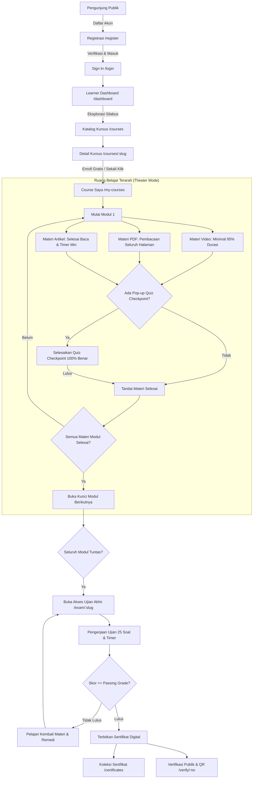

# Digital Learn Platform — Learning Management System (LMS)

### Platform Manajemen Pembelajaran Digital Vokasi Industri Terstruktur

[](https://www.php.net/)
[](https://codeigniter.com/)
[](https://mariadb.org/)
[](https://en.wikipedia.org/wiki/Model%E2%80%93view%E2%80%93controller)
[](LICENSE)
[]()

---

## 📌 Daftar Isi

1. [Tentang Proyek](#-tentang-proyek)
2. [Alur Belajar &amp; Arsitektur Sistem](#-alur-belajar--arsitektur-sistem)
3. [Daftar 14 Layar Kanonik (UI/UX)](#-daftar-14-layar-kanonik-uiux)
4. [Desain Sistem &amp; Komponen Reusable](#-desain-sistem--komponen-reusable)
5. [Fitur Unggulan &amp; Aturan Bisnis (BRD)](#-fitur-unggulan--aturan-bisnis-brd)
6. [Teknologi &amp; Prasyarat Sistem](#-teknologi--prasyarat-sistem)
7. [Panduan Instalasi &amp; Setup Lokal](#-panduan-instalasi--setup-lokal)
8. [Akun Demo &amp; Kredensial Pengujian](#-akun-demo--kredensial-pengujian)
9. [Struktur Direktori Repositori](#-struktur-direktori-repositori)
10. [Daftar Rute &amp; Endpoint RESTful](#-daftar-rute--endpoint-restful)
11. [Keamanan &amp; Standar Kualitas](#-keamanan--standar-kualitas)
12. [Panduan Kontribusi](#-panduan-kontribusi)
13. [Lisensi &amp; Atribusi](#-lisensi--atribusi)

---

## 📖 Tentang Proyek

**Digital Learn Platform** adalah Learning Management System (LMS) modern yang dikembangkan untuk menyelenggarakan pembelajaran vokasi industri terstruktur. Platform ini dirancang dengan filosofi **Mastery Learning**: peserta tidak dapat melompati materi sebelum memenuhi kriteria pemahaman terukur, menyelesaikan checkpoint kuis formatif, dan lulus ujian akhir komprehensif.

LMS ini menggabungkan antarmuka *Distraction-Free Theater* untuk ruang belajar, tata letak kartu *Double-Bezel* modern pada katalog, serta sistem penerbitan dan verifikasi sertifikat digital berbasis kriptografis publik dengan dukungan QR Code.

### Tujuan Utama

- **Pembelajaran Terstruktur Berjenjang:** Kurikulum dipecah menjadi Kursus → Modul → Materi Multi-format (Video, PDF Dokumen, Artikel Kaya Teks).
- **Gerbang Pemahaman Adaptif:** Checkpoint Pop-up Quiz formatif yang mengunci progres materi sebelum peserta menjawab dengan benar disertai umpan balik edukatif.
- **Evaluasi Komprehensif:** Mesin ujian akhir 25 soal teracak dengan batas waktu, navigasi status 4-warna, penanda ragu-ragu, dan auto-submit.
- **Kredensial Digital Terverifikasi:** Penerbitan sertifikat berseri unik (`CERT-YYYY-XXXXX`) dengan snapshot data permanen dan halaman verifikasi publik yang dapat diakses instansi/industri tanpa autentikasi.

---

## 🔄 Alur Belajar & Arsitektur Sistem

Berikut adalah alur perjalanan peserta (*Learner Journey*) dari registrasi awal hingga penerbitan sertifikat:



---

## 🖥️ Daftar 14 Layar Kanonik (UI/UX)

Seluruh antarmuka aplikasi dibangun berdasarkan referensi desain piksel-presisi dari `design.pen` dan prototipe HTML di folder [design-reference/](file:///c:/laragon/www/lmsstmi/design-reference):

| #            | Nama Layar                        | URL Rute                  | File View Terkait                 | Deskripsi & Fokus Pengalaman                                                                                                                 |
| ------------ | --------------------------------- | ------------------------- | --------------------------------- | -------------------------------------------------------------------------------------------------------------------------------------------- |
| **01** | **Landing Page**            | `/`                     | `views/home/landing.php`        | Hero banner vokasi digital, 3 kartu fitur keunggulan, grid 6 katalog kursus unggulan, alur sertifikasi 4 langkah, dan footer resmi.          |
| **02** | **Sign In**                 | `/login`                | `views/auth/login.php`          | Tata letak split 50/50, formulir login email & password, proteksi CSRF, validasi inline, dan tautan reset password.                          |
| **03** | **Sign Up**                 | `/register`             | `views/auth/register.php`       | Formulir registrasi peserta, persetujuan Syarat & Ketentuan, validasi kompleksitas kata sandi.                                               |
| **04** | **Learner Dashboard**       | `/dashboard`            | `views/dashboard/index.php`     | 4 kartu metrik utama (Kursus Aktif, Selesai, Sertifikat, Jam Belajar), banner kursus aktif dengan bilah progres, dan daftar kursus berjalan. |
| **05** | **Course Saya**             | `/my-courses`           | `views/my_courses/index.php`    | Tab filter status (Semua, Sedang Berjalan, Selesai), grid 3 kolom kartu kursus terdaftar dengan indikator progres real-time.                 |
| **06** | **Katalog Course**          | `/courses`              | `views/catalog/index.php`       | Pencarian instan, filter kategori (Design, Development, Data, Product), kartu kursus berestetika*Double-Bezel*, dan pagination numerik.    |
| **07** | **Detail Course**           | `/courses/(:any)`       | `views/catalog/detail.php`      | Ikhtisar silabus lengkap, daftar modul & materi berjenjang, profil instruktur, prasyarat, dan tombol aksi "Mulai Belajar" / "Daftar".        |
| **08** | **Materi Video**            | `/learn/(:any)/video`   | `views/learn/video.php`         | Theater mode 60px topbar, pemutar video HTML5 responsif, drawer playlist materi (396px), tab ringkasan & diskusi, pelacak retensi 95%.       |
| **09** | **Quiz Checkpoint**         | `/learn/(:any)/quiz`    | `views/learn/quiz.php`          | Kuis formatif interaktif penentu kelulusan materi, stepper soal multi-tahap, feedback visual jawaban seketika, dan penjelasan edukatif.      |
| **10** | **Materi PDF**              | `/learn/(:any)/pdf`     | `views/learn/pdf.php`           | Dokumen viewer dokumen kerja/modul, kontrol navigasi zoom & halaman, pelacak pembacaan dokumen, tombol unduh resmi.                          |
| **11** | **Materi Artikel**          | `/learn/(:any)/article` | `views/learn/article.php`       | Tipografi bacaan ramah mata (*editorial typography*), estimasi waktu baca, blok catatan callout, dan checklist konfirmasi pemahaman.       |
| **12** | **Ujian Akhir**             | `/exam/attempt/(:num)`  | `views/exam/attempt.php`        | Ruang ujian bebas distraksi, countdown timer mundur, kisi 25 navigasi soal 4 status (Belum, Ragu-ragu, Terjawab, Aktif), tombol submit.      |
| **13** | **Sertifikat & Verifikasi** | `/verify/(:any)`        | `views/certificates/verify.php` | Kanvas sertifikat resmi berbingkai ganda, status verifikasi publik aman, QR Code verifikasi, dan tombol unduh PDF resmi.                     |
| **14** | **Koleksi Sertifikat**      | `/certificates`         | `views/certificates/index.php`  | Galeri sertifikat yang telah diraih peserta, detail tanggal terbit, nomor register unik, dan tautan langsung ke verifikasi publik.           |

---

## 🎨 Desain Sistem & Komponen Reusable

Aplikasi ini menggunakan sistem desain kustom yang didefinisikan secara modular tanpa ketergantungan framework CSS pihak ketiga yang berat:

### Token Desain (`tokens.css`)

- **Palet Warna Utama:**
  - `Primary Blue`: `#2872fa` (Hover: `#1559ed`, Dark: `#175d9b`, Soft: `#e8f1fa`)
  - `Emerald Success`: `#059669` (Soft: `#f0fdf4`, Border: `#86efac`)
  - `Amber Warning / Flag`: `#8a6100` (Bg: `#fefce8`, Border: `#fde047`)
  - `Rose Timer / Danger`: `#dc2626` (Bg: `#fef2f2`, Border: `#fecaca`)
  - `Neutral Palette`: `#0f172a` (Slate 900), `#1d2530` (Body), `#667085` (Muted), `#f8fafc` (Background App)
- **Tipografi:** Google Font **Plus Jakarta Sans** (Weights: 400, 500, 600, 700, 800).
- **Ikonografi:** **Phosphor Icons** (Garis bersih, presisi 20–24px).

### Komponen Reusable (`views/partials/`)

1. **`course_card.php`**: Komponen kartu cerdas yang secara adaptif mendukung mode katalog (*Double-Bezel frame* dengan metadata kategori, level, rating, dan instruktur) serta mode *Enrolled* (lengkap dengan progress bar persentase dan tombol lanjut belajar).
2. **`playlist_drawer.php`**: Komponen laci kurikulum 396px di halaman belajar dengan status item interaktif (Selesai centang hijau, Sedang Aktif biru, dan Terkunci gembok abu-abu).
3. **`exam_drawer.php`**: Laci ujian dengan timer hitung mundur JavaScript, indikator progres soal, ringkasan status jawaban, dan grid navigasi 25 nomor.
4. **`certificate_canvas.php`**: Kanvas sertifikat berestetika tinggi dengan border ganda, ornamen medali, nomor seri resmi, dan metadata kompetensi.
5. **`sidebar_user.php`**: Navigasi samping 260px konsisten dengan status menu aktif dan kartu profil peserta di bagian bawah.
6. **`pagination.php`**: Navigasi halaman numerik bersih dan ramah aksesibilitas.

---

## ⚖️ Fitur Unggulan & Aturan Bisnis (BRD)

Sistem mengimplementasikan seluruh aturan bisnis kanonik (`BR-01` sampai `BR-20`) sesuai spesifikasi Business Requirements Document (BRD):

| Kode            | Aturan Bisnis          | Implementasi Teknis                                                                                                                                                                                                                                           |
| --------------- | ---------------------- | ------------------------------------------------------------------------------------------------------------------------------------------------------------------------------------------------------------------------------------------------------------- |
| **BR-01** | Autentikasi & Akun     | Email unik case-insensitive, kata sandi di-hash menggunakan algoritma`PASSWORD_BCRYPT`, persetujuan Terms/Privacy saat registrasi.                                                                                                                          |
| **BR-02** | Pemisahan Hak Akses    | Otorisasi berbasis role (`user` vs `admin`) di level controller; peserta diblokir dari seluruh rute manajerial `/admin/*`.                                                                                                                              |
| **BR-05** | Progressive Unlocking  | Modul$N+1$ hanya terbuka jika Modul $N$ telah berstatus `completed`. Item dalam modul harus diselesaikan secara berurutan.                                                                                                                              |
| **BR-06** | Penyelesaian Materi    | **Video:** Menonton $\ge 95\%$ durasi (validasi bucket 5 detik) + lulus pop-up quiz.**PDF:** Membuka dan menelusuri seluruh halaman dokumen.**Artikel:** Membaca sampai akhir dan melampaui batas waktu minimum (*minimum dwell time*). |
| **BR-07** | Kalkulasi Progres      | Persentase kursus dihitung otomatis:$\text{Progress} = \lfloor(\text{Modul Selesai} / \text{Total Modul}) \times 100\rfloor\%$.                                                                                                                             |
| **BR-09** | Pop-up Quiz Checkpoint | Kuis formatif wajib dengan umpan balik instan; peserta tidak dapat memajukan materi sebelum berhasil menjawab benar.                                                                                                                                          |
| **BR-11** | Mesin Ujian Akhir      | Waktu mundur otomatis, acak soal & opsi jawaban, status bendera ragu-ragu, dan auto-submit saat timer habis.                                                                                                                                                  |
| **BR-15** | Verifikasi Sertifikat  | Rute publik`/verify/(:any)` dapat diakses tanpa login. Menggunakan snapshot data permanen agar sertifikat tidak terdistorsi jika data kursus berubah di masa depan.                                                                                         |

---

## 🛠️ Teknologi & Prasyarat Sistem

Aplikasi ini dibangun dengan batasan kompatibilitas ketat untuk memastikan stabilitas di lingkungan server pendidikan vokasi:

- **Bahasa Pemrograman:** PHP strictly **7.3.33** (Bebas dari sintaks PHP 7.4+ seperti *typed properties*, *arrow functions*, atau operator `match`).
- **Framework Web:** **CodeIgniter 3.1.13** (Arsitektur MVC murni tanpa dependensi library modern yang merusak kompatibilitas CI3).
- **Database Server:** **MariaDB 10.4.34** atau **MySQL 5.7+** (Engine: `InnoDB`, Collation: `utf8mb4_unicode_ci`).
- **Web Server:** Apache 2.4+ dengan modul `mod_rewrite` aktif.
- **Frontend Stack:** HTML5 Semantic, Custom Vanilla CSS Design System, Vanilla ES6 JavaScript, Phosphor Icons via CDN.

---

## 🚀 Panduan Instalasi & Setup Lokal

Ikuti langkah-langkah di bawah ini untuk menjalankan repositori di mesin lokal (contoh menggunakan lingkungan **Laragon** pada Windows):

### 1. Clone Repositori

Pastikan direktori tujuan berada di dalam folder web root Laragon (`C:\laragon\www\`):

```bash
cd C:\laragon\www
git clone https://github.com/FajarPramudika/lmsstmi.git
cd lmsstmi
```

### 2. Konfigurasi Web Server (Virtual Host / Apache)

Pastikan modul `mod_rewrite` di Apache telah aktif. File [.htaccess](file:///c:/laragon/www/lmsstmi/.htaccess) bawaan telah dikonfigurasi untuk menghapus `index.php` dari URL:

```apache
RewriteEngine On
RewriteCond %{REQUEST_FILENAME} !-f
RewriteCond %{REQUEST_FILENAME} !-d
RewriteRule ^(.*)$ index.php/$1 [L]
```

Aplikasi dapat langsung diakses melalui URL:
`http://localhost/lmsstmi/`

### 3. Konfigurasi Basis Data

Buka MariaDB/MySQL dan buat database baru untuk platform:

```sql
CREATE DATABASE lmsstmi CHARACTER SET utf8mb4 COLLATE utf8mb4_unicode_ci;
```

Sesuaikan kredensial koneksi di file [application/config/database.php](file:///c:/laragon/www/lmsstmi/application/config/database.php):

```php
$db['default'] = array(
    'dsn'          => '',
    'hostname'     => 'localhost',
    'username'     => 'root',
    'password'     => '',
    'database'     => 'lmsstmi',
    'dbdriver'     => 'mysqli',
    'dbprefix'     => '',
    'pconnect'     => FALSE,
    'db_debug'     => (ENVIRONMENT !== 'production'),
    'cache_on'     => FALSE,
    'cachedir'     => '',
    'char_set'     => 'utf8mb4',
    'dbcollat'     => 'utf8mb4_unicode_ci',
    'swap_pre'     => '',
    'encrypt'      => FALSE,
    'compress'     => FALSE,
    'stricton'     => FALSE,
    'failover'     => array(),
    'save_queries' => TRUE
);
```

### 4. Konfigurasi Base URL

Buka [application/config/config.php](file:///c:/laragon/www/lmsstmi/application/config/config.php). Konfigurasi telah disiapkan secara otomatis dinamis atau dapat di-hardcode jika diperlukan:

```php
$config['base_url'] = 'http://localhost/lmsstmi/';
$config['index_page'] = '';
```

---

## 👤 Akun Demo & Kredensial Pengujian

Gunakan akun berikut untuk melakukan pengujian alur fungsional sistem:

| Peran (Role)                | Email                        | Password        | Hak Akses                                                                     |
| --------------------------- | ---------------------------- | --------------- | ----------------------------------------------------------------------------- |
| **Peserta (Learner)** | `raihan@digitallearn.test` | `password123` | Akses Dashboard, Katalog, Belajar Materi, Kuis, Ujian, & Koleksi Sertifikat.  |
| **Administrator**     | `admin@digitallearn.test`  | `admin123`    | Akses Pengelolaan Kursus, Modul, Bank Soal, Pemantauan Peserta, & Verifikasi. |

---

## 📂 Struktur Direktori Repositori

```text
lmsstmi/
├── application/
│   ├── config/              # Konfigurasi aplikasi, database, rute, dan autoload
│   ├── controllers/         # Kontroler MVC (Auth, Dashboard, Catalog, Learn, Exams, Verify, dll.)
│   ├── core/                # Ekstensi kontroler inti (MY_Controller)
│   ├── helpers/             # Helper fungsi bantu UI, label, dan format
│   ├── libraries/           # Library bisnis (Auth, Kalkulasi Progres, Sertifikat)
│   ├── models/              # Model data interaksi basis data
│   └── views/               # Tampilan antarmuka
│       ├── auth/            # Halaman Login & Registrasi
│       ├── catalog/         # Katalog & Detail Kursus
│       ├── certificates/    # Koleksi & Halaman Verifikasi Sertifikat
│       ├── dashboard/       # Dashboard Utama Peserta
│       ├── exam/            # Antarmuka Pengerjaan Ujian Akhir
│       ├── home/            # Halaman Depan Publik (Landing Page)
│       ├── layouts/         # Master layout (public, auth, app, classroom)
│       ├── learn/           # Ruang Belajar (Video, PDF, Artikel, Quiz)
│       ├── my_courses/      # Kursus yang Sedang Diikuti Peserta
│       ├── partials/        # Komponen modular reusable (kartu, drawer, canvas, dll.)
│       └── styleguide/      # Dokumentasi spesifikasi sistem desain
├── assets/
│   ├── css/                 # Desain sistem modular (tokens.css, base.css, layout.css, components.css)
│   ├── img/                 # Aset ilustrasi dan fotografi beresolusi tinggi
│   └── js/                  # JavaScript vanilla untuk interaktivitas UI
├── design-reference/        # 14 file HTML referensi desain piksel-presisi
├── system/                  # Core Framework CodeIgniter 3.1.13
├── .editorconfig            # Standar indentasi dan pengkodean editor
├── .htaccess                # Konfigurasi URL rewriting Apache
├── composer.json            # Manajemen dependensi Composer
├── DESIGN.md                # Dokumentasi spesifikasi token & node desain
├── TASKS.md                 # Matriks tugas pengembangan & aturan bisnis lengkap
└── README.md                # Dokumentasi resmi repositori proyek
```

---

## 🌐 Daftar Rute & Endpoint RESTful

Berikut adalah pemetaan rute utama pada [application/config/routes.php](file:///c:/laragon/www/lmsstmi/application/config/routes.php):

| Metode HTTP        | Alamat URI                | Controller & Action     | Tingkat Akses              |
| ------------------ | ------------------------- | ----------------------- | -------------------------- |
| `GET`            | `/`                     | `Home::index`         | Publik                     |
| `GET` / `POST` | `/login`                | `Auth::login`         | Guest (Tamu)               |
| `GET` / `POST` | `/register`             | `Auth::register`      | Guest (Tamu)               |
| `POST`           | `/logout`               | `Auth::logout`        | Terautentikasi             |
| `GET`            | `/dashboard`            | `Dashboard::index`    | Peserta                    |
| `GET`            | `/my-courses`           | `My_courses::index`   | Peserta                    |
| `GET`            | `/courses`              | `Catalog::index`      | Terautentikasi             |
| `GET`            | `/courses/(:any)`       | `Catalog::detail/$1`  | Terautentikasi             |
| `GET`            | `/learn/(:any)`         | `Learn::index/$1`     | Peserta Terdaftar          |
| `GET`            | `/learn/(:any)/video`   | `Learn::video/$1`     | Peserta Terdaftar          |
| `GET`            | `/learn/(:any)/quiz`    | `Learn::quiz/$1`      | Peserta Terdaftar          |
| `GET`            | `/learn/(:any)/pdf`     | `Learn::pdf/$1`       | Peserta Terdaftar          |
| `GET`            | `/learn/(:any)/article` | `Learn::article/$1`   | Peserta Terdaftar          |
| `GET`            | `/exam/attempt/(:num)`  | `Exams::attempt/$1`   | Peserta Terdaftar          |
| `GET`            | `/certificates`         | `Certificates::index` | Peserta Terdaftar          |
| `GET`            | `/verify/(:any)`        | `Verify::show/$1`     | Publik (Verifikasi Global) |
| `GET`            | `/_styleguide`          | `Styleguide::index`   | Developer & Desainer       |

---

## 🛡️ Keamanan & Standar Kualitas

Sistem dibangun dengan mematuhi prinsip *Security by Design* dan *Clean Code*:

1. **Proteksi Pemalsuan Permintaan Antarsitus (CSRF):**
   Seluruh formulir mutasi (POST) dilindungi dengan token CSRF unik yang diverifikasi otomatis oleh kernel CodeIgniter.
2. **Pencegahan SQL Injection:**
   Semua manipulasi data memanfaatkan CodeIgniter Active Record / Query Builder dengan binding parameter terenkapsulasi secara ketat.
3. **Penyaringan Cross-Site Scripting (XSS):**
   Setiap data dinamis yang dirender ke peramban dieksekusi melalui fungsi pembersih `html_escape()`.
4. **Proteksi Rahasia Kunci Jawaban:**
   Kunci jawaban kuis maupun ujian tidak pernah dikirimkan ke DOM browser. Evaluasi jawaban dilakukan 100% pada layer server.
5. **Akses File Materi Privat:**
   Dokumen kurikulum dan video pembelajaran tidak disajikan melalui URL publik statis, melainkan dialirkan melalui otorisasi controller untuk mencegah pengunduhan ilegal.

---

## 🤝 Panduan Kontribusi

Kontribusi kode selalu disambut dengan gembira. Silakan ikuti konvensi git commit berikut:

1. Lakukan *Fork* repositori ini.
2. Buat branch fitur baru:
   ```bash
   git checkout -b feat/nama-fitur-baru
   ```
3. Lakukan commit perubahan dengan konvensi [Conventional Commits](https://www.conventionalcommits.org/):
   - `feat(...)`: Penambahan fitur atau layar baru.
   - `fix(...)`: Perbaikan bug atau penyesuaian fungsional.
   - `refactor(...)`: Restrukturisasi kode tanpa mengubah perilaku sistem.
   - `docs(...)`: Pembaruan dokumentasi atau panduan teknis.
4. *Push* ke branch Anda:
   ```bash
   git push origin feat/nama-fitur-baru
   ```
5. Buat *Pull Request* baru dengan deskripsi perubahan yang jelas.

---

## 📜 Lisensi & Atribusi

Proyek ini dirilis di bawah lisensi resmi [MIT License](LICENSE).

Dikembangkan dan dikelola untuk:
**Digital Learn Platform**
Politeknik STMI Jakarta — Badan Pengembangan Sumber Daya Manusia Industri (BPSDMI)
**Kementerian Perindustrian Republik Indonesia**
*Membangun SDM Industri Digital Unggul, Kompeten, dan Siap Kerja.*
